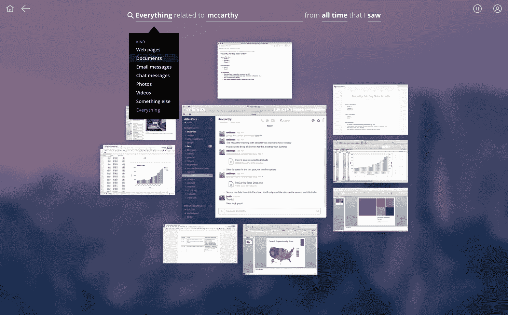

# 不到一年后，Atlas Informatics 宣布退出

> 原文：<https://web.archive.org/web/https://techcrunch.com/2017/10/18/atlas-informatics-calls-it-quits-after-less-than-a-year/>

# 不到一年后，Atlas Informatics 宣布退出

Atlas Informatics，其 Atlas Recall 承诺提供一种直观而强大的方法来索引您在许多服务中的所有信息，在推出后不到一年就关闭了。不会有很长的日落期:下周五，27 号，所有用户数据都会被删除。

去年 11 月，我写了一篇关于西雅图公司的文章。这个想法是为每封电子邮件、网站和无聊的对话创建一种个人搜索引擎，按名称和主题组织，同时保持简单和安全。因此，你可以搜索“与我的银行贷款相关的 pdf 文件”,然后就出现了——将“pdf 文件”改为“联系人”,然后就出现了你的财务顾问、银行的客户服务人员等等。

 对我来说，这似乎是一个很棒的主意，但我从未尝试过——回忆仅限于 MAC 和 iOS，这两者我都没有全职使用。如果完美的回忆只涵盖了你所见所闻的一半，那它还有什么意义呢？计划中的 Windows 和 Android 版本从未实现。对于一个面向专业领域(更不用说企业)的产品来说，这是一个很大的盲点。

该公司在给用户(以及像我这样的人)的一份声明中写道:“我们加入了这场斗争，因为我们认为信息过载是一项正义的事业，但我们面临着无时不在的筹款挑战。”。“在剩余少量资金的情况下，该公司选择有序关闭业务，以确保员工和用户数据得到公平对待。”

该公司去年 11 月筹集了 2070 万美元，但也许西雅图不断上涨的租金对他们来说太多了。祝这个团队在下一次旅程中好运——希望是一次更长的旅程。