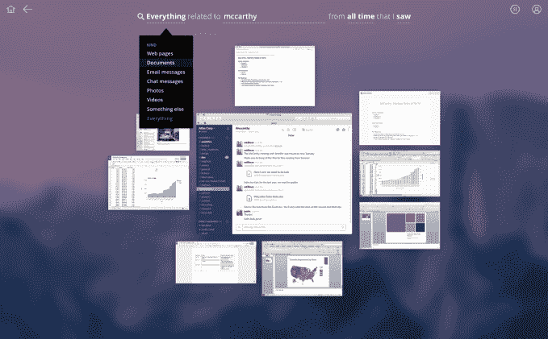

# 为你的整个数字生活提供搜索引擎的 Atlas Recall 获得了公开测试版和 2000 万美元的支持 

> 原文：<https://web.archive.org/web/https://techcrunch.com/2016/11/02/atlas-recall-a-search-engine-for-your-entire-digital-life-gets-an-open-beta-and-20m-in-backing/>

电脑有完美的记忆力。那么为什么在上面找东西这么难呢？可能是因为我们自己的记忆不一样。 [Atlas Recall](https://web.archive.org/web/20221030004901/https://www.atlas.co/) 旨在通过“一个搜索就能统治所有人”来解决这一问题，将你在所有设备上看到和做的一切编入索引，但以非常人性化的方式进行组织。这项服务今天进入公开测试。

发布前，我在西雅图的办公室会见了 Atlas Informatics 首席执行官 Jordan Ritter 和营销副总裁 Travis Murdock。里特，前纳普斯特，以及其他公司，解释了公司和产品的起源。从本质上说，开放式基金给了他追求下一次创业的全权委托，他立即开始走上了改善搜索的道路。

“我所记得的东西在我拥有的每台设备上都是流动的，”他说——然而，正如我们都毫无疑问经历过的那样，不同的服务和搜索引擎可以访问的内容是非常具体的。

谷歌搜索公共互联网；脸书跟踪你的私人照片和朋友；Outlook 有您的联系人、电子邮件和约会。Spotlight 了解您的本地文件；Spotify 有你的音乐和播放列表——清单还在继续。

即使你知道你的数据在哪个筒仓里，你还是得去那里翻来翻去才能找到你要找的东西——我们把会议时间放在哪个闲置空间里了？哪个线程有那个附件？我室友说要查哪个播放列表？

“搜索的房子实际上是两个房子，”里特说。“一是，给我找一些我从未见过的东西。另一个是，给我找一些我肯定见过的东西。”

Atlas Recall 旨在更好地填补第二个角色。它可以索引和搜索你在电脑和手机上遇到的所有东西——是的，所有的东西。在网络上，在脸书，在 Outlook，在你的电脑上，*一切*。但在你抓狂之前:

*   不，它不需要访问这些服务或它们的 API
*   是的，它总是加密的
*   是的，你可以很容易地阻止，删除，或者控制它记住的东西

它不仅跟踪所有这些项目及其内容，而且知道它们的上下文。它知道你什么时候看了它们，你以什么顺序看了它们，你同时打开了什么其他窗口和应用程序，当你访问它的时候你在哪里，它以前与谁分享过，以及大量其他元数据。

结果是，一个模糊的搜索，比如说“海鹰游戏”，将立即产生与其相关的所有数据，不管它碰巧在哪个筒仓中，并且首先呈现最相关的东西。在这种情况下，可能是你通过电子邮件收到的门票，然后在附近，你和朋友通过电子邮件制定的到达那里的计划，你发出的脸书邀请，你阅读的关于球队的文章，你的梦幻足球页面。点击其中任何一个，它会直接带你去那里。

也许你还记得在机场看到一篇你想看却没想保存的文章——搜索“LAX ”,就能找到你在机场时做过或看过的所有事情。也许你想给同事发送幻灯片和所有相关媒体，但这些项目分散在你的笔记本电脑、台式机、Google Docs 和 Dropbox 上——搜索项目并选择你需要的所有内容。

有针对内容类型、日期范围等的过滤器，以备您深入查看。你也可以告诉它*而不是*记住某些网站或应用程序，你可以在报税、写秘密诗歌等时暂时禁用它。

当你看到它的作用时，很容易想象它变得必不可少的速度。我碰巧记性很差，但即使我没有记性，谁会想在工作中浏览四个不同的网络应用程序来寻找那一个 PDF 呢？只要输入一个项目名称，所有与它相关的东西——来自你*和同事*——都会立即弹出，而不管它“住”在哪里，这不是很好吗？

主界面出现在你的电脑上，但同样的东西也会出现在手机上。你可以选择将 Atlas 与谷歌、Spotlight 和其他引擎整合，这样当你进行普通搜索时，相关的内容也会出现。

[https://web.archive.org/web/20221030004901if_/https://www.youtube.com/embed/fGev9Zo6y-I?feature=oembed](https://web.archive.org/web/20221030004901if_/https://www.youtube.com/embed/fGev9Zo6y-I?feature=oembed)

视频

当然，所有的数据都被备份到了云上，这可能会让一些人感到紧张，因为在别人的电脑上有如此详细的在线生活记录。里特承认需要建立信任，但作为一名前安全工程师，他说他认真对待这方面的事情。

[至于隐私](https://web.archive.org/web/20221030004901/https://www.atlas.co/privacy-promise/)，公司不*想*看你的资料。谷歌和脸书通过出售基于对你活动的深入了解的广告来赚钱。Atlas 将采用免费增值模式，广告不在考虑范围之内；没有隐私的保证，谁会首先使用这项服务呢？因此，他们很清楚谁拥有你的数据(你)，他们可以访问哪些数据(元数据，而不是内容)，以及你是否可以离开那里，不留任何痕迹(是的)。

微软、纳森·梅尔沃德和 Aspect Ventures 为 Ritter 和他的同事提供了 2070 万美元，以实现“我们数字生活中可搜索的照片记忆”的梦想你可以在这里注册的[公开测试版，正如你所料，旨在消除错误，改进界面，了解用户喜欢、不使用、永远找不到的功能，等等。它现在适用于 macOS 和 iOS，Windows 10 和 Android 也即将推出。](https://web.archive.org/web/20221030004901/https://www.atlas.co/register/)

付费版本将增加额外的功能——比如在工作组之间共享，或者管理工具——但是 Atlas Recall 的基本功能将保持免费。

在接下来的几周里，我将对此进行测试，看看它的效果如何，性能如何，以及它是否让我感到害怕。亲自尝试一下——这很有可能成为下一个重要的数字工具。