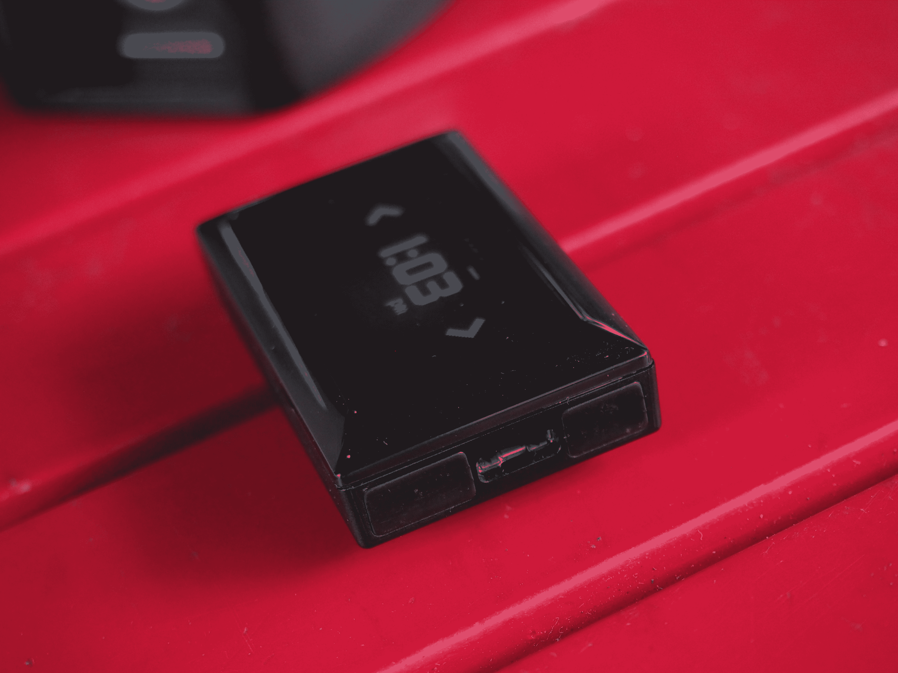
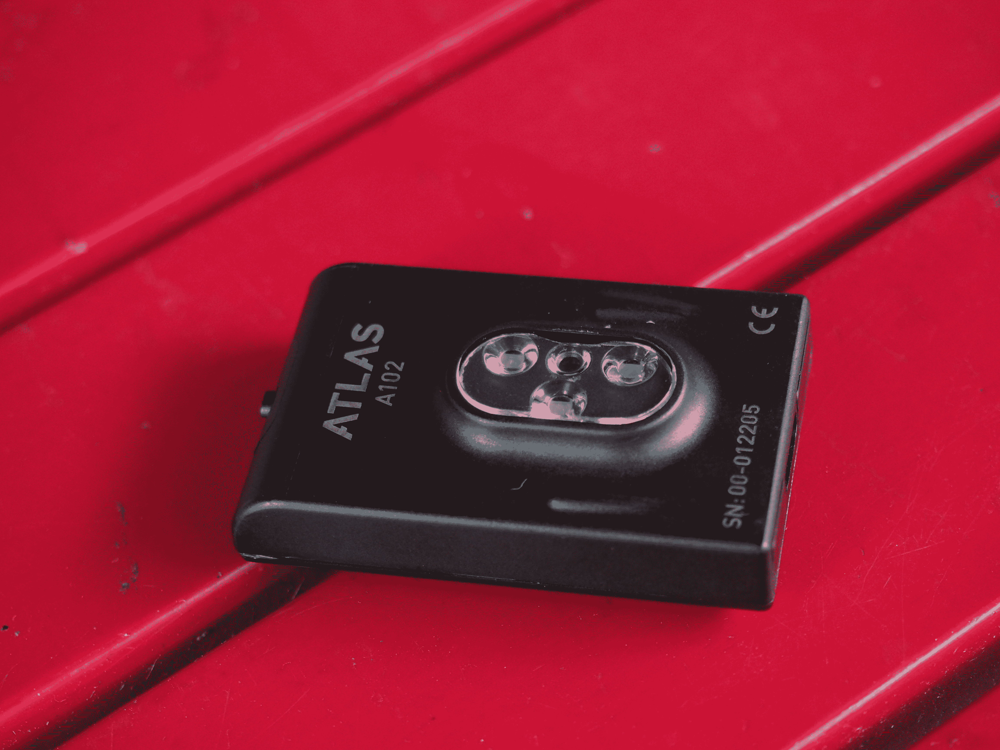
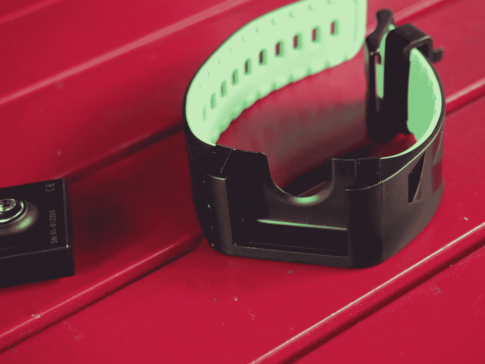
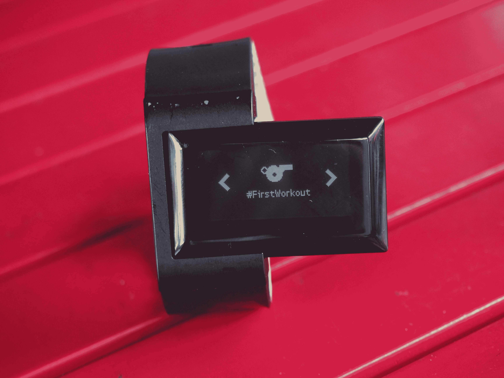

# Atlas 腕带 2 在健身追踪器上提供了有趣但有限的旋转 

> 原文：<https://web.archive.org/web/https://techcrunch.com/2016/07/06/atlas-wearables-hands-on/>

在日益拥挤的健身追踪者世界中脱颖而出很难。不过，公平地说，从人群中脱颖而出从来就不是 Atlas 可穿戴设备的问题之一。这是一个看起来很奇怪的东西。这种事情，即使在这个无处不在的可穿戴设备的开明时代，人们看着腕带 2 也有点不相信。

这是一个看起来很奇怪的东西。该设备由一条结实耐用的表带组成，表带顶部有一个插槽，模块化设备可以通过磁铁滑入并咬合到位。这款小型模块化设备的尺寸为 0.36 x 2 x 1.2 英寸，与大多数智能手表和健身追踪器相比，这是一个很大的尺寸。

在佩戴了一段时间后，我联系了这家[公司的首席执行官李铨](https://web.archive.org/web/20221208042621/https://beta.techcrunch.com/video/atlas-way-more-than-a-fitness-tracker/519399365/)，他解释说……不寻常的尺寸是有意的，他说:“我们标志性的宽屏显示器让我们有别于许多‘肖像’风格的设备，以便更好地查看更长的运动名称。”现在开始称这个东西为“标志性的”可能还为时过早，但它确实很突出。

纵向方向非常适合即时阅读大量文本。虽然屏幕本身并不像乍看上去那么安静，但四周都有相当大的边框。单色 128×64 像素 PMOLED 屏幕实际显示的内容有限，但它非常清晰。

触摸屏也是如此，它通过几个大的点击区域操作，而不是更复杂的界面。左侧还有一个按钮，既可以滚动菜单，也可以打开和关闭设备。在该设备的背面是一个稍微突出的心率监视器，为该设备已经很高的外形增加了一点点。

令人惊讶的是，腕带也很舒适。我戴着它走了很长一段时间，只是为了看看这种可穿戴设备有多笨拙。它太笨重了，不能穿长袖，但该公司很快指出，这不是一整天都可以穿的。与在某种程度上设计为在后台工作的 Fitbits 不同，Atlas 的产品旨在当需要流汗时爆发。120 毫安时的电池反映了这一事实。

至于为什么该公司选择使产品模块化，这里的李再次说:“我们还没有宣布任何事情，但今天，模块化使它非常容易交换频段。”所以，请继续关注。

虽然它看起来或多或少与上一个版本完全一样，但腕带 2 确实对其前身进行了一些升级，其中最值得注意的是，3 倍的内存升级，用于存储额外的练习。然而，车上仍然没有手动同步。当你完成一项锻炼后，点击 Atlas 移动应用程序上的一个按钮，两个设备将通过蓝牙交换信息。

Atlas 腕带肯定是一个令人信服的想法。除了大多数手腕佩戴的可穿戴设备的简单步数跟踪之外，肯定有一个设备的位置。有限的使用可能会让更多的休闲用户失去兴趣，但该产品在主流吸引力方面的不足在有针对性的锻炼中得到弥补，它带有一组内置传感器，能够根据运动识别一系列不同的锻炼活动。

用户可以设置引导式锻炼，此时产品会告诉你要做哪些锻炼(包括休息倒计时)，也可以设置自由式锻炼，用户输入他们计划做的锻炼，设备会单独跟踪它们。这款手机应用也很好地分解了具体的锻炼项目，包括卡路里、持续时间和参与的肌肉群。

我发现 Atlas 对一些运动的跟踪比其他人更好，尽管李告诉我这可能与我的形式有关，所以这可能是因为我从未学习如何做可量化的仰卧起坐。李指出，如果你遇到这种情况，你可以观看视频，了解如何以“正确”的方式进行锻炼，或者教系统如何跟踪你的独特形式。

该公司已将其要价从 249 美元降至更容易管理的 200 美元，但对于临时用户来说，这可能仍会因成本过高而望而却步，尤其是对于一个打算每天最多使用几个小时的设备。就目前情况而言，该产品对我们大多数人的吸引力相当有限，但有一些关键的要点可能最终有助于创建一个更全面的设备。