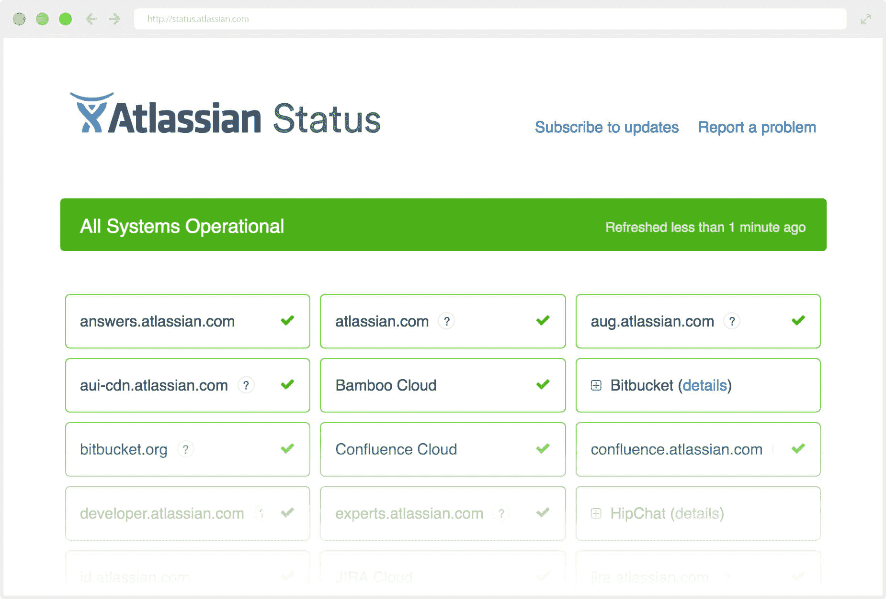

# Atlassian 收购 status page 

> 原文：<https://web.archive.org/web/https://techcrunch.com/2016/07/14/atlassian-acquires-statuspage/>

[Atlassian](https://web.archive.org/web/20230130100805/https://www.crunchbase.com/organization/atlassian) 今天[宣布](https://web.archive.org/web/20230130100805/http://blogs.atlassian.com/2016/07/atlassian-acquires-statuspage/)它已经收购了 [Statuspage](https://web.archive.org/web/20230130100805/https://www.statuspage.io/) ，一个 Y Combinator- [孵化的](https://web.archive.org/web/20230130100805/https://techcrunch.com/2013/07/16/statuspage-lets-anyone-communicate-with-customers-about-errors-and-outages/)服务，允许在线企业让他们的用户了解他们在线服务的最新状态。交易的财务细节没有披露。

这标志着 Atlassian 自去年 12 月上市以来的首次收购。增加三年前推出的 Statuspage 这样的服务似乎是 Atlassian 的天然选择。该公司长期以来一直认为，毕竟每个公司现在都是软件公司，这意味着几乎每个公司现在都需要一种服务，以便在事情不如预期时让用户了解情况。

正如 Atlassian 总裁 Jay Simons 告诉我的，Statuspage 是最早采用 [HipChat](https://web.archive.org/web/20230130100805/https://www.crunchbase.com/organization/hipchat) 的公司之一，Atlassian 早在 2012 年就收购了该公司，Atlassian 还在 Statuspage 上拥有自己的[状态页面](https://web.archive.org/web/20230130100805/http://status.atlassian.com/)。“我们对他们的领导地位感到非常兴奋，”西蒙斯在谈到 Statuspage 时说。"他们已经确立了自己作为这些服务的首要提供者的地位。"

Statuspage 目前将 [New Relic](https://web.archive.org/web/20230130100805/https://www.crunchbase.com/organization/new-relic) 、 [Intuit](https://web.archive.org/web/20230130100805/https://www.crunchbase.com/organization/intuit) 、 [Venmo](https://web.archive.org/web/20230130100805/https://www.crunchbase.com/organization/venmo) 和 Citrix 列为其“数以千计的客户”。

Simons 还提到，他看到了 Atlassian 的 JIRA 项目管理服务和 Statuspage 之间的自然整合。

Statuspage 的联合创始人斯科特·克莱恩(Scott Klein)指出，他的公司做得相当不错。然而，Atlassian 将让 Statuspage 获得 Atlassian 更大的用户群，并允许该公司加快其产品开发周期。在他们今天的官方声明中，Statuspage 的联合创始人还指出，当团队探索收购时，“我们在三件重要的事情上保持一致:我们互补的文化，我们将 S tatuspage 作为独立产品提供的愿望，以及我们对软件未来的共同愿景。”

对此，西蒙斯补充说，“推动这场婚姻的另一个方面是，像 Atlassian 一样，Statuspage 真的专注于达到财富 50 万。”毕竟，像康卡斯特这样的公司有资源建立自己的状态警报系统。"但是如果你不是财富 500 强的一员，你需要一个像 Statuspage 这样的服务."

收购后，Statuspage 确实仍将是一个独立的产品，Simons 告诉我，Atlassian 目前没有计划改变这项服务的定价(起价为每月 29 美元)。目前，当前的 Statuspage 用户也不会注意到任何变化。