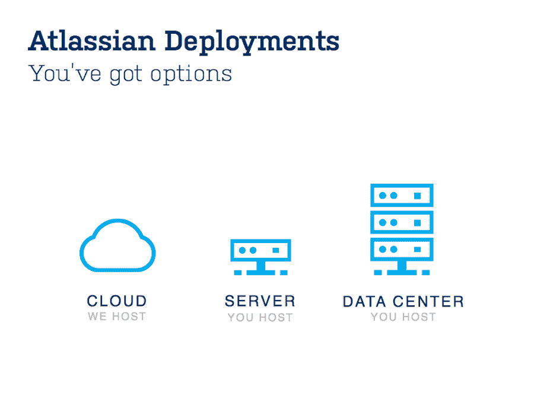

# Atlassian 通过 JIRA 和融合数据中心扩展其企业产品 

> 原文：<https://web.archive.org/web/https://techcrunch.com/2014/07/03/atlassian-expands-its-enterprise-offerings-with-jira-and-confluence-data-center/>

# Atlassian 通过 JIRA 和 Confluence 数据中心扩展其企业产品

[Atlassian](https://web.archive.org/web/20230214192202/https://www.atlassian.com/) ，开发者协作工具如、 [Confluence](https://web.archive.org/web/20230214192202/https://www.atlassian.com/software/confluence) 和 [HipChat](https://web.archive.org/web/20230214192202/https://www.atlassian.com/software/hipchat) 的幕后公司，长期以来一直在企业中强势存在[，但该公司今天宣布了两款专门针对该市场的新产品。](https://web.archive.org/web/20230214192202/http://www.atlassian.com/enterprise)

下周，Atlassian 将推出 JIRA 数据中心，这是其 JIRA 项目管理软件的最新版本，具有高级客户支持产品和技术账户管理，以及在多个节点上运行服务的支持。JIRA 数据中心将于 7 月 9 日启动。今年夏天，它的 Confluence 团队协作服务也将加入这个新的“数据中心”产品家族。

该公司表示，约有 25，000 家公司及其 850 万名员工每天都在使用 JIRA。有了数据中心版本，大型公司将能够获得最新版本的 JIRA。这包括更好地支持跨多个节点扩展服务，以提高性能和可伸缩性。为了确保这一点，管理员将能够将某些应用程序、团队或地理位置路由到集群中的特定节点。可以实时添加额外的节点和集群技术，共享文件系统与大多数行业标准技术相集成。

对于这些企业客户，Atlassian 也增加了服务项目。除了现有的合作伙伴和技术客户管理计划之外，该公司现在还提供高级工程师团队来处理客户服务请求，以及入职帮助和加急 SLA。

想要实现 JIRA 或融合数据中心的公司将不得不[每年支付 24，000 美元](https://web.archive.org/web/20230214192202/http://www.atlassian.com/enterprise)以获得涵盖一种产品和多达 1，000 名员工的许可证。高级服务的年费为 35，000 美元，技术客户管理费用为 60，000 美元。

