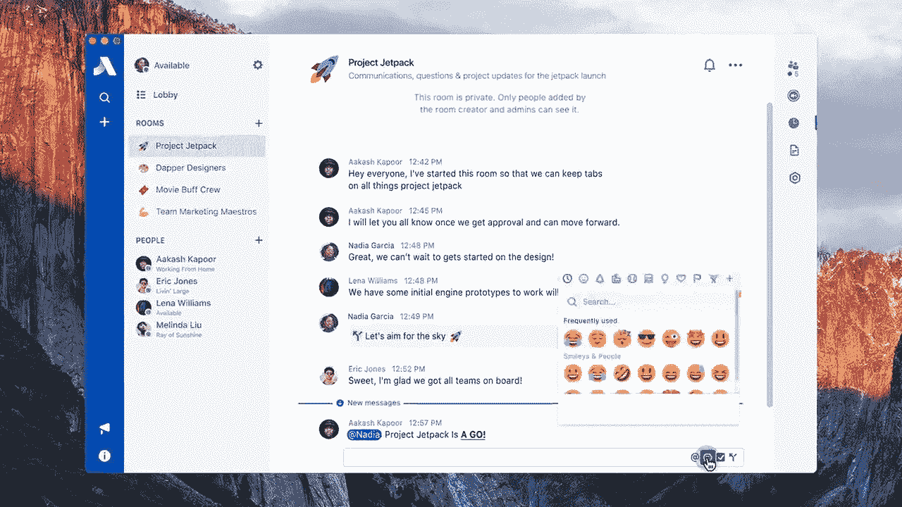
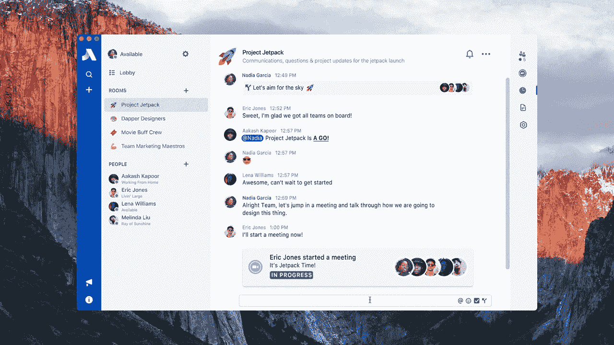

# Atlassian 推出 Stride，它的 Slack 竞争对手 

> 原文：<https://web.archive.org/web/https://techcrunch.com/2017/09/07/atlassian-launches-stride-its-slack-competitor/>

Atlassian 是吉拉、Trello 和 Bitbucket 等流行工具的开发者，该公司也长期以 HipChat 的形式提供团队交流服务。在过去的几年里，Slack 对这个领域产生了巨大的影响，Atlassian 团队决定重新开始，看看 Slack 式的团队工作场所交流服务会是什么样子。结果就是今天发布的 [Stride](https://web.archive.org/web/20230130100805/http://stride.com/) 。

正如团队告诉我的那样，Stride(将在所有主要平台上提供)背后的想法是将 Atlassian 从 HipChat 和竞争产品中学到的东西提炼出来，成为它显然认为是一种优秀的产品。这里的总体想法是，当前的通信解决方案不一定能让用户更有效率。例如，很难跟上所有不同的渠道，很难做出决策和跟进，很难从聊天转向视频会议来做出最终决策。

因此，Stride 团队开始构建一个单一的工具，它包括一个智能的基于文本的消息服务和一个全功能的视频和音频会议服务(部分基于 Atlassian[对 Jitsi](https://web.archive.org/web/20230130100805/https://techcrunch.com/2015/04/21/atlassian-acquires-open-source-video-conferencing-company-bluejimp-to-power-hipchats-video-chat/) 的收购)，可以在不需要安装任何插件的情况下实现无摩擦会议。

与所有 Atlassian 产品一样，Stride 是“积极的免费增值”，即使是免费版本也支持无限量的用户、群组音频和视频，以及对机器人和第三方集成的支持。这里的主要限制是，免费版本只能存储最后 25，000 封邮件，并且只能获得 5GB 的文件存储空间。对于每个用户/月 3 美元，这些限制完全消失，您还可以获得对访客访问、屏幕共享和高级用户管理的支持。

所有这些听起来好像我们基本上在谈论一个简单的 Slack 克隆——甚至 Stride 的布局也会支持这一想法(尽管该团队确实指出 Slack 在推出时看起来也很像 HipChat)。你没有错，但 Atlassian 团队也在服务中内置了许多真正智能的功能。

其中最有趣的是*动作*和*决策*。这里的想法是克服 Slack 中的常见问题，当你度假回来(甚至只是一个长周末)，不知道你不在的时候发生了什么。行动和决策位于 Stride 侧边栏中，允许群组对话中的任何人将特定用户的行动项目和关于群组决策的注释固定到房间中(点击这些会将您带入做出决策的聊天历史)。有了这一点，当你试图赶上一次谈话时，你不必再翻遍堆积如山的信息和 gif。

该团队还通过 Stride *Focus Mode* 增加了对打盹通知的处理，这允许你在需要完成一些实际工作时将自己设置为“离开”。这只会让所有通知静音，当你一两个小时后回来时，它会向你展示所有新的重要信息、行动和决定，而这些都是在你完成一些真正的工作时做出的。

[gallery ids="1536792，1536793，1536795，1536796，1536797，1536798"]

该服务还提供了你所期望的所有常见通信功能，包括支持在文档甚至代码上的协作，以及使用 Markdown 编写消息的能力。当然，还有表情符号和 Giphy 支持。

不出所料，Stride 还提供了与 Atlassian 其余工具的深度集成(以及第三方集成)，这肯定会成为该服务的主要卖点之一。

通过 Stride，Atlassian 现在为其客户提供了 Slack(许多人可能已经在使用)的简单替代方案，它与他们现有的工具很好地集成在一起，提供了许多智能的新功能，他们的用户可以使用他们现有的 Atlassian 帐户登录。它肯定不会伤害 Stride，因为它也比 Slack 及其竞争对手便宜得多。