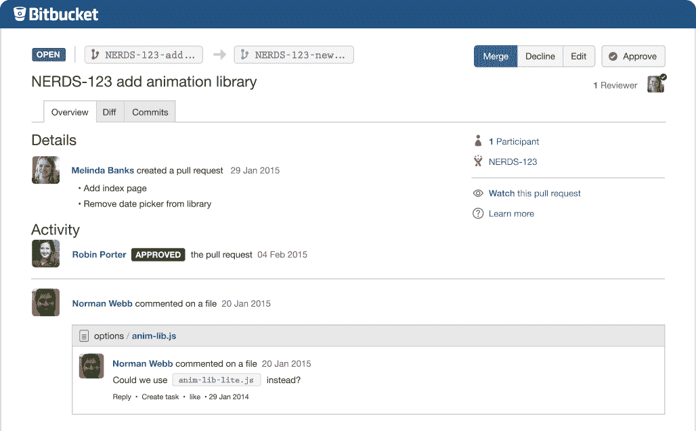
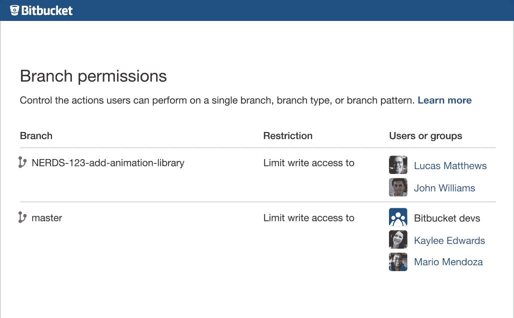

# Atlassian 更新了它的 Git 服务，将它们合并到 Bitbucket 品牌 TechCrunch 下

> 原文：<https://web.archive.org/web/https://techcrunch.com/2015/09/22/atlassian-updates-its-git-services-combines-them-under-the-bitbucket-brand/>

# Atlassian 更新了它的 Git 服务，将它们合并到 Bitbucket 品牌下

长久以来，Atlassian 一直在为那些需要基于云或者内部代码管理服务的开发者提供基于 Git 的开发服务，这些服务分别以 [Bitbucket](https://web.archive.org/web/20230130100805/https://bitbucket.org/) 和 [Stash](https://web.archive.org/web/20230130100805/https://www.atlassian.com/software/stash) 为品牌。然而现在，该公司正在将这些品牌合并到 Bitbucket 名下，并为其基于 Git 的服务推出许多新功能。

正如 Atlassian 开发工具部门的总经理 Eric Wittman 告诉我的那样，该公司目前看到了围绕其 Git 产品的巨大势头。他说，该公司上一财年的 Bitbucket 客户增长率为 80%，现在有三分之一的财富 500 强公司在使用 Bitbucket。Wittman 强调，他认为该公司在企业中的势头至少部分是由于 Atlassian 对专业开发人员团队的关注。“我们的优势和重点一直是帮助团队协作，”他说。

不过，值得注意的是，Bitbucket 现在与 GitHub Enterprise 和其他企业 Git 服务竞争。毕竟，即使是微软，现在也在其 Team Foundation Server 产品中提供了 Git 支持。

随着今天的更新，Atlassian 不仅结合了 Stash 和 Bitbucket 品牌，而且还改变了开发这些产品的方式。Wittman 告诉我，这两个团队现在将在这些产品中共享更多组件。从历史上看，服务器团队总是更大，并且首先发布创新。他还承认，虽然公司在两年前为 Stash 投入了大量精力，但 Bitbucket 在这些努力中有些迷失。

Atlassian 还宣布了 Bitbucket 的三个主要新特性。第一个是 Git 镜像，这将使分布式团队使用 Git 更加容易和快速。第二个是对大文件的支持——Git 长期以来一直在努力解决这个问题——第三个是对项目的支持，这将使组织复杂的 Git 存储库变得容易得多。

