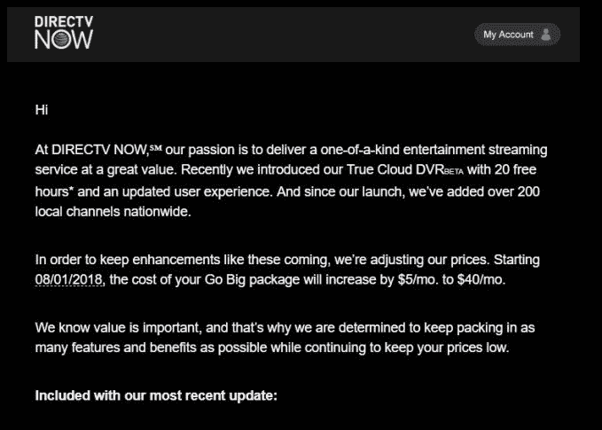

# 美国电话电报公司将直播电视价格每月提高 5 美元 

> 原文：<https://web.archive.org/web/https://techcrunch.com/2018/07/02/att-raises-directv-now-pricing-by-5-per-month/>

继上周推出其低成本流媒体电视服务 Watch TV 后，AT T 现在将其最初的高端服务 DirecTV Now 的价格每月提高 5 美元。这意味着，新服务将从每月 40 美元开始，而不是从每月 35 美元开始，为其拥有 60 多个频道的基本“生活一点”层。其他层每月也上涨 5 美元。

这意味着“恰到好处”的 80+频道套餐将为 55 美元/月，“做大”的 100+频道套餐将为 60 美元/月，“必须拥有”的 120+频道套餐将为 70 美元/月。

这条新闻是由[脐带钳新闻](https://web.archive.org/web/20221025222306/https://www.cordcuttersnews.com/att-is-raising-the-price-of-directv-now/)在周末首次发现的。在 [Reddit](https://web.archive.org/web/20221025222306/https://www.reddit.com/r/DirecTVNow/comments/8v6ffk/live_a_little_price_increased_from_35_to_40month/) 上也有关于价格变化的讨论。

虽然人们对 AT & T 的其他业务提价有所担忧，但这并不是最近几个月第一个提价的电视流媒体服务。YouTube TV 也将其服务费用每月提高了 5 美元，从三月份的每月 35 美元涨到 40 美元。就在几天前，Dish 的 [Sling TV 改进了其服务](https://web.archive.org/web/20221025222306/https://techcrunch.com/2018/06/28/sling-tv-revamps-its-service-with-a-price-hike-new-free-tier-a-la-carte-channels/),自行调整了价格，从每月 20 美元的基本套餐价格上涨到每月 5 美元的 25 美元。

与此同时，40 美元/月符合索尼 PlayStation Vue 的最便宜计划，也符合 Hulu 的直播电视服务。

美国电话电报公司将其决定归因于流媒体电视市场的这些变化。

“自推出以来的 18 个月中，我们一直在不断改进 DirecTV Now 产品，以服务于这一新的客户群，并与我们的竞争对手相媲美。一位发言人[说](https://web.archive.org/web/20221025222306/https://www.cordcutters.com/directv-now-increasing-prices)为了继续为新老客户提供最佳的流媒体体验，我们将这项服务的价格与市场接轨——起价为 40 美元。

这些变化是通过电子邮件向现有用户宣布的，结果可能会导致一些 DirecTV Now 的早期用户逃离。Reddit 上的评论者抱怨美国电话电报公司的服务质量，包括流媒体和 DVR 的问题。与此同时，其他人认为 AT & T 的频道阵容仍然物有所值，即使价格有所上涨。

*上图:DirecTV Now 电子邮件–来源:[脐带钳新闻](https://web.archive.org/web/20221025222306/https://www.cordcuttersnews.com/att-is-raising-the-price-of-directv-now/)*

由于价格上涨，现在提供低成本流媒体电视的服务已经所剩无几。吊带电视，甚至现在每月 25 美元的 T7 仍然是最实惠的之一，此外还有更加有限的观看电视和缺乏运动和当地人的菲洛每月 16 美元的服务。

美国电话电报公司告诉我们，新价格将于 7 月 26 日对新客户生效，基于他们的账单日期。

*更新:美国东部时间 2018 年 7 月 2 日上午 11 点:发布了从& T* 开始的生效日期价格更新