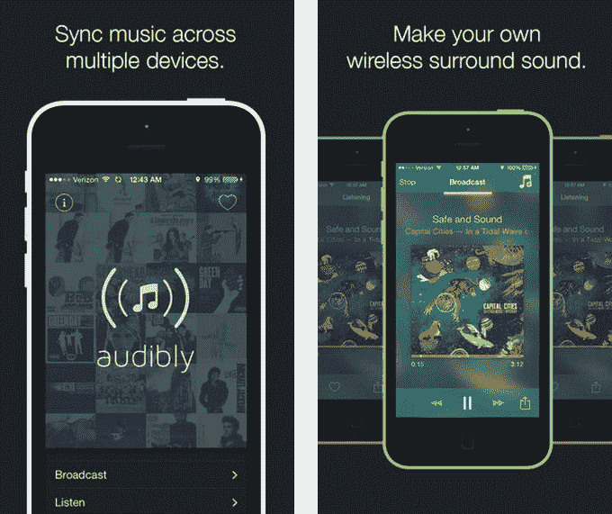
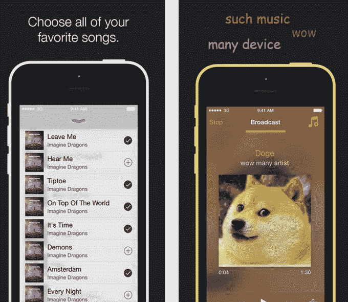

# 将多台 iOS 设备变成无线环绕声系统

> 原文：<https://web.archive.org/web/http://techcrunch.com/2014/06/11/audibly-turns-multiple-ios-devices-into-a-wireless-surround-sound-system/>

由于一款名为[audible](https://web.archive.org/web/20230324214215/https://itunes.apple.com/us/app/audibly-make-your-music-heard./id882170258?ls=1&mt=8)的手机应用，一个由三名年轻程序员组成的团队想出了一种将你的 iPhone 扬声器变成无线环绕声系统的方法。

这款应用程序非常适合聚会，或者在没有像样的扬声器时播放音乐，它使用较新设备(运行 iOS 7 或更高版本)上的技术，以便同时将歌曲同步到多人的 iPhones 或 iPads 上，有效地将它们变成一个特设的环绕声系统。

Audibly 的联合创始人第一次见面是在去年的 WWDC 2013 上，当时他获得了苹果提供给学生程序员的众多奖学金中的一项，否则他们将无法负担门票价格。2013 年，[苹果邀请](https://web.archive.org/web/20230324214215/https://itunes.apple.com/us/app/audibly-make-your-music-heard./id882170258?ls=1&mt=8) 150 名学生参加其年度开发者大会，但今年，该公司将人数扩大至 200 人。有声读物的联合创始人 Veeral Patel 是一名来自新泽西的 17 岁高中生，他解释说，参加 WWDC 最大的好处之一就是可以结识志同道合的人。

他说:“我们在这个地区不认识任何开发商，WWDC 给了我们机会去结交和我们一样的朋友。”。

帕特尔和其余的团队成员尼克·弗雷(Nick Frey)和克里斯·加尔泽拉诺(Chris Galzerano)正在 WWDC 参加一个关于多点连接的会议，当时他们正在 iOS 7 中介绍这款应用程序，他们产生了这个想法。事实上，他们开始时非常兴奋，甚至没有完成会话。相反，当他们开始编码时，他们跑到 WWDC 的实验室寻求苹果工程师的帮助。

到会议结束时，他们甚至已经有了他们想法的工作原型。

在接下来的一年中，在不同州(爱荷华州的弗雷和匹兹堡的加尔泽拉诺)上高中的创始人继续完善他们的想法。他们通过 Facebook Messenger 聊天，中途休息了一会儿，专注于学校。

最初，他们让应用程序将整首歌从一部手机传输到另一部手机，但发现这花费了太多时间。所以他们决定用流媒体播放这首歌。换句话说，在 iPhone 上保存了这首歌的实体副本的人，可以通过点击应用程序中的“广播”按钮，使用音频将其传输到朋友的设备上。

那些想要接收信息流的人将会发出声音，点击他们朋友的名字进行连接。然后，流式传输人员批准该请求，并–*tada！*–临时无线扬声器。

帕特尔承认，这个依赖点对点无线网络的系统并不总是完美的。例如，如果信号不好，数据流可能会有一秒钟不同步。他们也没有真正地“压力测试”过设备之间的距离能有多远。(但他说，那些共处一室的人应该没问题。)

另外，当你听一首共享的歌曲时，你可以用心去喜欢它。稍后，你可以返回到你的收藏列表，在 Spotify 或 Rdio 中再次播放这些歌曲，或者在 iTunes 上为自己购买歌曲。

既然音频已经直播，团队正在研究下一步的工作:与更多服务的集成。现在，你必须有这首歌的实体副本才能开始播放，但他们正在寻找其他服务的 API，如 Spotify 或 Beats，也可以通过云音乐服务分享歌曲。他们还在努力整合 YouTube，让一个人粘贴一个 YouTube URL，让接收者听到该视频的音频流。

两位联合创始人也刚刚在今年的 2014 年 WWDC 上第二次会面，他们现在已经学会了另一个方便的技巧:赚钱。在未来的版本中，他们将实现一种联盟模式，允许他们从通过他们的应用程序购买的 iTunes 商品中抽取一定的比例。

与此同时，[可以在 iTunes](https://web.archive.org/web/20230324214215/https://itunes.apple.com/us/app/audibly-make-your-music-heard./id882170258?ls=1&mt=8) 上免费下载。我们被告知，它可以与多达 6 个设备一起可靠地工作，但你可以使用更多。

[YouTube https://www.youtube.com/watch?v=Y_rLITnBzvk]