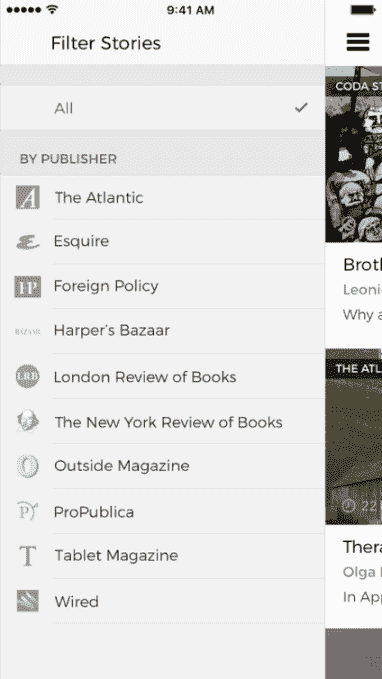

# Audm 将长篇印刷新闻转化为专业的数字音频

> 原文：<https://web.archive.org/web/http://techcrunch.com/2017/07/14/audm-turns-long-form-print-journalism-into-professionally-narrated-digital-audio/>

消费者经常使用 Instapaper 和 Pocket 等服务来保存他们没有时间立即阅读的较长新闻文章，这两种服务都为时间紧迫的人提供了某种形式的叙述。然而，一家名为 [Audm](https://web.archive.org/web/20230326080309/https://www.audm.com/) 的初创公司认为，有一种更好的方法可以将长篇新闻转化为实际上令人愉快的音频内容——通过使用专业的配音演员来朗读内容。

该公司的移动应用程序去年悄悄推出，但他们没有正式宣布。这家初创公司目前正在参加 Y Combinator 的暑期班，并在完成项目期间暂停了融资。

令人惊讶的是，Audm 的创意并非来自有媒体背景的创始人。

联合创始人[瑞安·韦格纳](https://web.archive.org/web/20230326080309/https://www.linkedin.com/in/ryantwegner/)和[克里斯蒂安·布林克](https://web.archive.org/web/20230326080309/https://www.linkedin.com/in/christianpbrink/)都是哥伦比亚大学 2007 届毕业生，分别拥有心理学和软件开发背景。但是他们在大学里彼此不认识，尽管他们有一个更广泛的网络，通过个人朋友和家人松散地联系在一起。

然而，两人都对创业感兴趣，当他们最终在 2014 年相遇时，一个音频新闻应用的想法出现了。

布林克和韦格纳都喜欢听播客，他们意识到今天的一些伟大的故事讲述者并没有以这种形式出现——他们为杂志写作。但布林克解释说，“他们的故事适合音频。”。

[gallery ids="1514896，1514897，1514898，1514899"]

最初，他们尝试使用众包叙事，但很快发现人们更喜欢高质量、专业的叙事。所以他们改变了他们的商业模式。

创始人认为，那些使用 Pocket 和 Instapaper 等服务来阅读长篇文章的人之间存在一些交叉，但通过 Audm，他们希望提供比这些服务提供的自动文本到语音转换语音更好的体验。

“没有人对此感到满意，”布林克正确地指出。

如今，Audm 与包括 Wired、The Atlantic、Esquire、Harper's Bazaar、Foreign Policy、New York Review of Books、Outside Magazine、ProPublica、London Review of Books、Backchannel 和其他几家出版商合作。

Audm 利用一个配音演员网络将长篇文章(即超过 3000 字的文章)转换成音频。

重点更多的是那些经得起时间考验的文章，而不是那些关注最近新闻的文章。布林克说，这意味着很少有报道日常政治或最新科技新闻的文章。

该公司从其出版商合作伙伴那里挑选最好的长篇故事，用于 Audm，并在这项服务上每周发布约 5 至 9 篇文章。这相当于每周三到五个小时的内容。

这些故事的音频版本只能以每月 6.99 美元的价格订阅，收入与出版合作伙伴分享。

虽然目前没有任何机制可以让 Audm 更直接地与 Instapaper 这样的服务竞争，但该团队确实有一个愿景，即在未来为其应用程序添加更多内容——在 Audm 自己没有选择文章的时候。

Audm 计划增加一个按钮的分布，该按钮出现在出版商网站上手边内容的旁边，这将有效地允许用户请求将某个给定的作品添加到其服务中。该公司也可能会选择在以后提供一个浏览器插件来达到同样的目的。

当一篇文章收到大量请求时，Audm 可以在短短四五个小时内非常快速地转变叙述方式，假设他们已经与出版商签订了合同，并且有音频演员可供阅读。目前，Audm 正在与大约 12 名叙述者的精选小组合作，尽管迄今为止它已经与大约 24 名叙述者合作过。

Audm 应用程序目前仅在 iOS 上可用。虽然它需要订阅，但应用程序本身是免费下载的。