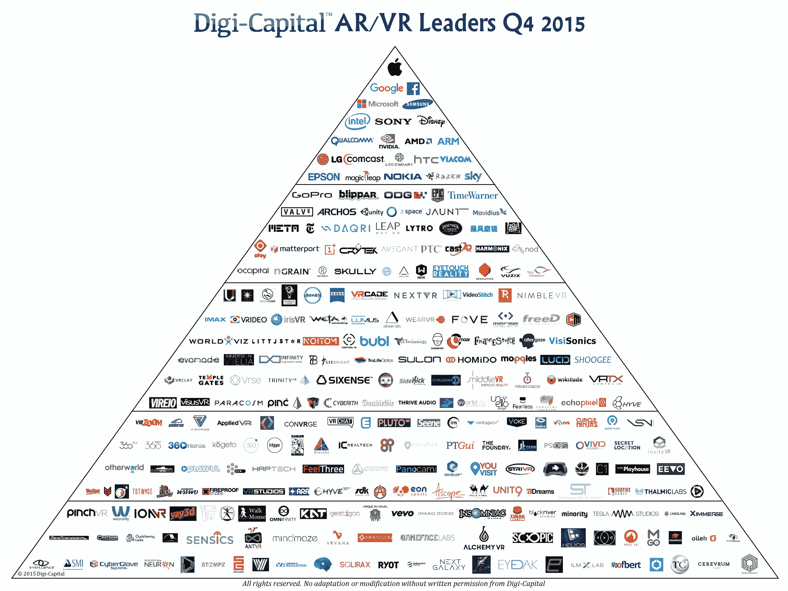

# 增强和虚拟现实 1.0 - 2016 预览版 

> 原文：<https://web.archive.org/web/http://techcrunch.com/2015/12/10/augmented-and-virtual-reality-1-0-2016-preview/>

More posts by this contributor

三星/Oculus 的 [Gear VR 发布会](https://web.archive.org/web/20230128102208/https://techcrunch.com/2015/11/20/samsung-gear-vr/)是 AR/VR 1.0 的发令枪，那么明年我们可以期待什么？戴上你的魔法护目镜，沉浸时间到了。

## 消费者虚拟现实 1.0

你不能错过今年为 VR 牺牲的电子([数码](https://web.archive.org/web/20230128102208/https://techcrunch.com/2015/04/06/augmented-and-virtual-reality-to-hit-150-billion-by-2020/#.ohyy7ax:R0vA)和[电视](https://web.archive.org/web/20230128102208/http://video.cnbc.com/gallery/?video=3000387732)和[树](https://web.archive.org/web/20230128102208/http://www.fool.com/investing/general/2015/10/21/for-the-new-york-times-co-a-very-real-bet-on-virtu.aspx))。虽然 20 世纪 90 年代的 VR 是一个糟糕的测试版，但这一次真的不同了。

新浪潮包括[脸书](https://web.archive.org/web/20230128102208/https://techcrunch.com/2014/07/21/facebooks-acquisition-of-oculus-closes-now-official/) / [Oculus](https://web.archive.org/web/20230128102208/https://techcrunch.com/2015/09/24/ready-to-rift/#.ohyy7ax:BcbB) 、三星[、HTC/Valve](https://web.archive.org/web/20230128102208/https://techcrunch.com/2015/03/04/htc-and-valve-have-cracked-the-vr-code/#.ohyy7ax:ZvLs) 、[索尼](https://web.archive.org/web/20230128102208/https://techcrunch.com/2015/09/15/sonys-project-morpheus-virtual-reality-headset-is-now-just-playstation-vr/)和[谷歌](https://web.archive.org/web/20230128102208/https://techcrunch.com/2015/05/28/googles-cardboard-vr-now-works-very-well-with-iphone/)等等(甚至可能是[任天堂](https://web.archive.org/web/20230128102208/http://nerdist.com/virtual-reality-nintendo-nx-nerdist-news/)？).[苹果买了 Metaio](https://web.archive.org/web/20230128102208/https://techcrunch.com/2015/05/28/apple-metaio/) 。这些家伙是认真的，这不是他们的第一次竞技。

高端 PC VR (Oculus，HTC Vive，其他)将在明年向早期采用者提供最佳的 VR 体验，但 CPU/GPU 要求将使其价格超出普通消费者。摩尔定律和疲软的寻求增长的个人电脑市场可能会使大众消费者在 2017 年之前能够实现这一目标。

移动 VR(有数十家创业公司)和索尼的 PlayStation VR for console 将在 2016 年创造第一个广阔的 VR 消费市场。然而，我们可能需要等到 2017/2018 年具有完全位置跟踪功能的第二代移动虚拟现实(如下所述)才能成为真正的大众市场。

(注:母公司仅包括在收购中，如脸书/Oculus)。

## 企业 AR 1.0

我们将讨论引导到 [AR 如何扰乱移动](https://web.archive.org/web/20230128102208/http://www.digi-capital.com/news/2015/04/augmentedvirtual-reality-to-hit-150-billion-disrupting-mobile-by-2020/)并在 2020 年成为 VR 的四倍。因为 VR 目前在消费者市场准备程度上领先 AR 12-18 个月，AR 玩家主要关注 2016 年的企业市场。在消费者 AR 进入 2017 年之前，[微软](https://web.archive.org/web/20230128102208/https://techcrunch.com/2015/10/06/microsoft-to-ship-hololens-development-kits-for-3000-in-first-quarter-of-2016/#.ohyy7ax:g8RY)和 [ODG](https://web.archive.org/web/20230128102208/https://techcrunch.com/2015/01/15/odg-wants-to-put-android-on-your-face-for-less-than-1000-later-this-year/) 等领导者正在与[企业](https://web.archive.org/web/20230128102208/http://www.usatoday.com/story/tech/2015/07/25/meet-osterhout-and-its-2700-ar-glasses/30627861/)和[政府](https://web.archive.org/web/20230128102208/https://techcrunch.com/2015/01/21/nasa-and-microsoft-using-hololens-to-make-it-possible-to-work-remotely-on-mars/)客户合作。

## 新年决心

Digi-Capital 的 [AR/VR 技术基准](https://web.archive.org/web/20230128102208/http://www.digi-capital.com/news/2015/10/arvr-technical-benchmarks-show-how-far-weve-come/)为 VR 找到了当前最佳的视野，每只眼睛的对角线达到了惊人的 136 度。任何超过 90 度的角度都能提供身临其境的体验，这是非常巨大的。随着这一点的实现，提高屏幕分辨率将成为明年 VR 的一个主要战场(尽管 [Oculus](https://web.archive.org/web/20230128102208/https://techcrunch.com/2015/06/11/oculus-rift-consumer/#.ohyy7ax:l0Lr) 和其他公司已经在解决[屏幕门效应](https://web.archive.org/web/20230128102208/http://www.theverge.com/2015/6/17/8794907/oculus-rift-touch-virtual-reality-hands-on-e3-2015))。

> 戴上你的魔法护目镜，沉浸时间到了。

AR 已经从像 [ODG](https://web.archive.org/web/20230128102208/https://www.youtube.com/watch?v=fyl6TlEJTQA) 这样的领导者那里产生了非常高的分辨率，但是明年 AR 的一个战场将是视野。大多数 AR(像 [HoloLens](https://web.archive.org/web/20230128102208/http://www.pcworld.com/article/2945932/microsoft-finally-gets-real-about-hololenss-field-of-view.html) )目前都在对角线 20-40 度的标准范围内，对于移动计算来说已经足够了。2016 年，大型(40-90 度)视野将开始出现在娱乐领域，但我们可能需要等待一段时间，让行业带我们越过沉浸式[混合现实](https://web.archive.org/web/20230128102208/http://www.digi-capital.com/news/2015/07/the-7-drivers-of-150-billion-augmentedvirtual-reality/)的神奇 90 度大关——这是 AR 的珠穆朗玛峰。

## 梦的光场

AR 的第一个商业“数字光场”可能在 2016 年问世，尽管这可能会推迟到明年。什么是“光场”？现实世界中的模拟等价物是在你能看到的每个点上向每个方向传播的所有光线。换句话说，这是一种描述你的眼睛在现实世界中看到的东西的四维方式——三维(X、Y 和 Z 位置)，第四维表示方向。你每次睁开眼睛都会看到光场。

数字光场通过提供至少 5 个数字光场阵列来模拟其模拟同类。因此，对于用户可以看到的空间中的每个光点，至少有 5 个额外的方向维度呈现在眼睛面前。

这使用户的眼睛和大脑相信他们在周围世界中看到的虚拟物体是真实的(对于混合现实来说)。我看到的数字光场原型已经在模拟模拟光场方面做了令人信服的工作，并且 [Magic Leap](https://web.archive.org/web/20230128102208/https://techcrunch.com/2015/10/21/magic-leap-demo/#.ohyy7ax:9LZS) 不是唯一一家这样做的公司(尽管它是[资金最好的](https://web.archive.org/web/20230128102208/https://techcrunch.com/2015/11/27/breaking-down-billion-dollar-arvr-investment-in-the-last-12-months/?ncid=rss))。

## 位置，位置，位置

旋转跟踪(你看的地方)是虚拟现实的标准，但高端空间跟踪(你的头在哪里)和手跟踪(你的手在哪里)可以将虚拟现实从环境带到沉浸式体验，让你感觉你真的在那里(行业术语中的“存在”)。

> 电影虚拟现实最终可能会与《侠盗猎车手》有更多的共同点，而不是《驾驶戴西小姐》。

房间尺度的最佳空间追踪将来自 HTC Vive 和 [Lighthouse](https://web.archive.org/web/20230128102208/http://uploadvr.com/valve-and-htc-have-fully-revived-virtual-reality-hands-on-with-the-vive/) ，Oculus、PlayStation VR 和其他公司在更小的空间做类似的事情。明年 PC/控制台 VR 手部追踪将主要基于控制器，Oculus [Touch](https://web.archive.org/web/20230128102208/https://techcrunch.com/2015/06/11/watch-our-first-look-at-the-new-oculus-rift-and-touch-controller-hardware/) 是一个优秀的解决方案。 [Leap Motion](https://web.archive.org/web/20230128102208/https://www.leapmotion.com/) 等将致力于走“免提”手跟踪主流。

由于智能手机传感器有限，移动虚拟现实通常还没有征服空间跟踪。谷歌的[项目 Tango](https://web.archive.org/web/20230128102208/https://techcrunch.com/2014/02/20/google-launches-project-tango/) 解决了这个问题，智能手机制造商敏锐地意识到了这一点。空间追踪将出现在移动虚拟现实中，但这可能要到 2017 年才能成为主流。

对于 AR，微软、ODG、 [DAQRI](https://web.archive.org/web/20230128102208/https://techcrunch.com/2015/05/13/daqri-acquires-ar-pioneer-artoolworks/) 和其他公司将提供出色的空间跟踪，特别是 HoloLens 提供强大的“免提”手跟踪能力。正如今天所有的手部跟踪一样，AR 玩家正在努力提高可用性。

## (虚拟)好莱坞万岁

[好莱坞对虚拟现实感到兴奋，但迄今为止主要制作了](https://web.archive.org/web/20230128102208/http://www.thewrap.com/why-virtual-reality-could-generate-150-billion-for-hollywood-by-2020/) [简短形式的体验](https://web.archive.org/web/20230128102208/https://techcrunch.com/2015/11/27/moments-are-selling-the-promise-of-vr-right-now/)。来自像 NextVR 这样的人的体育视频将在 2016 年成为第一个消费级 VR 视频市场。新闻和其他类型的新闻将紧随其后。长篇形式的电影虚拟现实可能要到 2017 年才能实现，因为好莱坞电影公司明年在虚拟现实营销体验上的投资将超过独立资产。

随着虚拟现实安装基础的增长，神童导演必须学会如何在非线性媒体中讲述线性故事。电影虚拟现实最终可能会与《侠盗猎车手》有更多的共同点，而不是《驾驶戴西小姐》。

## 现实应用 1.0

AR/VR 游戏和视频非常适合将早期用户带入市场，但需要更广泛的应用程序。这对于作为通用计算平台的 AR 来说尤为重要。

在 [Eyetouch Reality](https://web.archive.org/web/20230128102208/http://www.eyetouchreality.com/) 和其他地方，初创公司明年将开始打破现实，推出只有在 AR/VR 中才可能出现的新应用类型。解决硬件挑战至关重要，但引人注目的应用将把 AR/VR 从有前途的技术转变为不可或缺的平台。

*你可以在 Digi-Capital 的增强/虚拟现实报告* *[中找到更多关于该行业发展方向的信息。](https://web.archive.org/web/20230128102208/http://www.digi-capital.com/)*