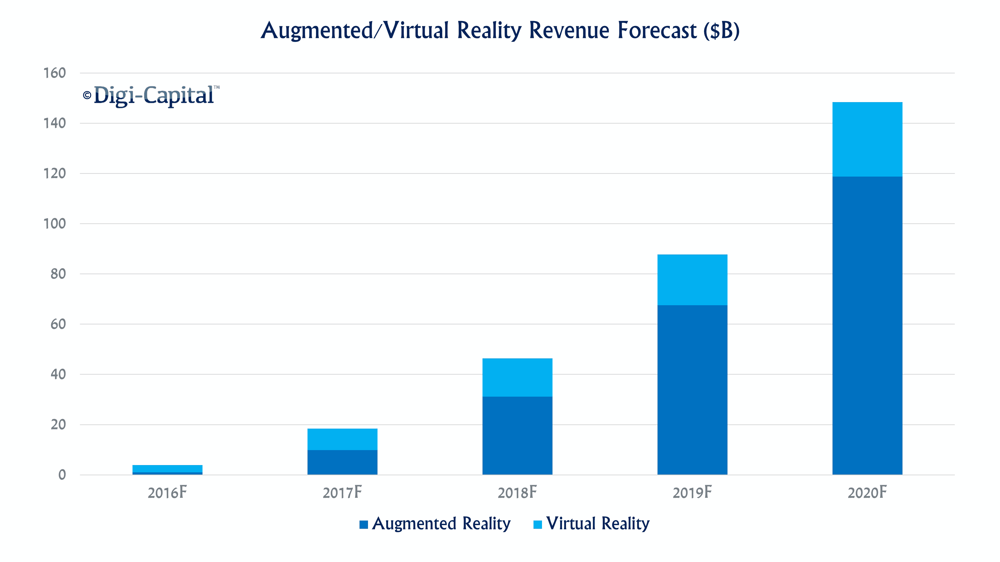

# 增强和虚拟现实将达到 1500 亿美元，到 2020 年颠覆移动技术 

> 原文：<https://web.archive.org/web/https://techcrunch.com/2015/04/06/augmented-and-virtual-reality-to-hit-150-billion-by-2020/>

More posts by this contributor

**编者按:** *蒂姆·梅雷尔是* *[Digi-Capital](https://web.archive.org/web/20230107225214/http://www.digi-capital.com/) 的董事总经理。*

虚拟现实和增强现实令人兴奋——谷歌眼镜来来去去，[脸书 20 亿美元收购 Oculus](https://web.archive.org/web/20230107225214/https://techcrunch.com/topic/subject/facebook-acquisition-of-oculus-vr/) ，谷歌[5.42 亿美元进入 Magic Leap](https://web.archive.org/web/20230107225214/https://techcrunch.com/2014/10/21/magic-leap-tech/) ，更不用说微软 [HoloLens](https://web.archive.org/web/20230107225214/http://www.microsoft.com/microsoft-hololens/en-us) 了。有令人惊叹的早期平台和应用，但 2015 年的 VR/AR 感觉有点像 iPhone 之前的智能手机市场。我们在等待有人说“还有一件事……”，让每个人都认为“这就是市场的走向！”

对今天的 VR/AR 市场进行纯粹的定量分析是具有挑战性的，因为还没有太多的跟踪记录可供分析。我们将在下面讨论方法，但这一分析是基于 VR/AR 如何在明年市场真正启动后发展新市场并蚕食现有市场。

## AR 来自火星，VR 来自金星

VR 和 AR 耳机都提供立体 3D 高清视频和音频，但有很大的区别。VR 是封闭的，完全沉浸式的，而 AR 是开放的，部分沉浸式的——你可以看透它，也可以看到它的周围。虚拟现实将用户放入虚拟世界，让他们沉浸其中，而增强现实将虚拟事物放入用户的现实世界，增强他们的能力。

你可能会认为这种区别是吹毛求疵，但这种区别可能会让 AR 不仅比 VR 更有优势，而是比整个智能手机和平板电脑市场更有优势。这对苹果、谷歌、微软、脸书和其他公司都有重大影响。

## 牛肉在哪里？

虚拟现实非常适合游戏和 3D 电影——这就是它的设计初衷。然而，它主要是一个客厅，办公室或坐着的体验，因为如果你戴着耳机走在街上，你可能会撞到东西。它仍然是一项伟大的技术，在游戏机、PC 和 MMO 游戏玩家中拥有数千万随时准备和等待的用户群，这些人更喜欢 3D 而不是 2D 电影，以及小众企业用户(例如医疗、军事、教育)。这吸引了 Unity、Valve、Razer 等早期玩家周围不断增长的应用/游戏生态系统。

AR 对于游戏来说非常有趣，但当需要真正的沉浸感时，可能没有 VR 有趣——想想移动游戏和主机游戏。但对于游戏玩家来说，这种可能的弱点正是为什么 AR 有可能在我们的生活中扮演与拥有数亿用户的手机相同的角色。你可以穿着它去任何地方做任何事情。其中 VR 就像是在脸上戴了一个控制台(Oculus)，AR 就像是在上面戴了一个透明的手机(Magic Leap，HoloLens)。

## 可视电话

AR 可以在跨部门的移动中发挥类似的作用，以及许多还没有人想到的用途。你可以用 AR 做的事情包括电子商务(我们刚刚发明了电子商务和移动商务的新表亲)、语音通话、网络浏览、传统 2D 的电影/电视流媒体以及 3D、企业应用、广告、消费应用、游戏和主题公园游乐设施。因此，虽然游戏在大多数 AR 演示中占据显著地位，但它们只是 AR 的众多潜在用途之一。点击此处查看行业[的完整分析。](https://web.archive.org/web/20230107225214/http://www.digi-capital.com/reports/)

## 真实美元

我们预测，到 2020 年，AR/VR 的收入可能达到 1500 亿美元，其中 AR 将占据大约 1200 亿美元的最大份额，VR 将达到 300 亿美元。

那么这些大数字从何而来呢？

我们认为 VR 的可寻址市场主要是核心游戏和 3D 电影，加上小众企业用户。VR 可能拥有数千万用户，硬件价位类似于主机。我们预计消费软件/服务经济将类似于当前的游戏、电影和主题公园，但不希望 VR 带来大量额外的数据或语音收入。可能会有有意义的企业 VR 收入，但我们认为 AR 可能会占据更多市场。

我们认为 AR 的目标市场类似于智能手机/平板电脑市场。因此，AR 可能拥有数亿用户，硬件价格与智能手机和平板电脑类似。这可能会给设备制造商带来巨大的硬件收入。

AR 软件和服务可能与今天的移动市场具有相似的经济效益，因为它们都在蚕食和发展移动市场。从脸书到优步，再到《部落冲突》,庞大的 AR 用户群将成为电视/电影、企业、广告和消费应用的主要收入来源。亚马逊和阿里巴巴将拥有一个面向大众销售的全新平台。再加上还没有人想到的创新应用，AR 的规模可能会为移动网络的语音和数据业务带来滚滚财源。有人必须为所有的移动数据付费。

从 2016 年开始，各市场的行业预测在[这里](https://web.archive.org/web/20230107225214/http://www.digi-capital.com/reports/)有详细介绍，下面是 2020 年市场的可能情况。从现在到那时，随着更多数据的可用，我们将定期进行改进，并预计会有很多关于市场走向的辩论。

## 吐槽现实和玻璃洞

这不全是虚拟的吃喝玩乐，因为一些虚拟现实应用会让人晕车，围绕谷歌眼镜的隐私问题引发了很多审查。因此，随着两个市场都成为现实，技术和社会问题都需要解决。

## 还有一件事…

从目前的巨头来看，有利有弊。脸书早期押注于 Oculus，这可能会赢得 VR，但不会解决更大的 AR 市场。谷歌借鉴了 Glass，有远见的投资了 Magic Leap。HoloLens 可以让微软重获过去十年输给苹果的荣耀。而苹果呢？我们希望看到一个增强的“还有一件事…”

完整的分析是[这里的](https://web.archive.org/web/20230107225214/http://www.digi-capital.com/reports/)。