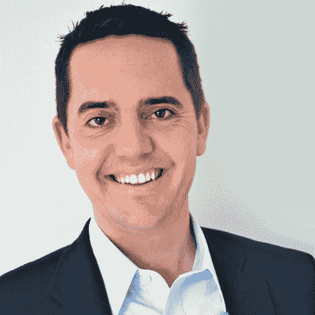
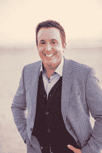

# 增强现实头盔初创公司 Daqri 逮捕了前 SpaceX、高通和维珍集团高管 

> 原文：<https://web.archive.org/web/https://techcrunch.com/2016/02/05/augmented-reality-helmet-startup-daqri-nabs-former-spacex-qualcomm-and-virgin-group-execs/>

# 增强现实头盔初创公司 Daqri 逮捕了 SpaceX、高通和维珍集团的前高管

增强现实空间很热，而且越来越热，尤其是在寻求重新设计未来现场员工体验的企业公司中。

迈克·林奇

帕特里克·阿洛

罗伊·阿肖克

AR 智能头盔初创公司 Daqri 今天在继续测试其设备的同时，大幅增长了其领导力董事会。该公司今天将增加三个新的高管职位:迈克·林奇(Mike Lynch)，他最近在 SpaceX 负责人才收购和人力资源，将加入 Daqri，担任首席人力潜力官；高通前产品管理负责人罗伊·阿肖克将出任首席产品官；来自维珍集团的营销负责人 Patrick Alo 将被任命为首席营销官。

这些最新的招聘将提高 Daqri 的灵活性，因为它希望积极招聘顶尖人才，并扩大公司在企业社区的品牌存在。

除了为工业工人提供“混合现实工作指令、安全信息、地图等”之外，该设备本身还可以充当安全头盔和一套安全眼镜。这种头盔已经在一些大公司进行测试，包括 Autodesk、GE、Topcon、Hyperloop 和 KSP 钢铁公司。

这家总部位于洛杉矶的初创公司在 CES 2016 上发布了其专注于企业的增强现实头盔，成为头条新闻。我们自己的 [Sarah Lane 与 Daqri 团队](https://web.archive.org/web/20221007071349/https://beta.techcrunch.com/video/daqris-smart-helmet-hands-on/519393284/)坐下来讨论该设备的潜在用例以及 AR 技术在工作场所的未来。

Daqri 创始人兼首席执行官布莱恩·穆林斯在一份声明中表示:“罗伊、帕特里克和迈克都是各自领域的专家，他们来自世界上一些最具创新性的公司。”。“他们在关键时刻加入，因为我们正在 AR 技术和全息摄影方面取得巨大进步，这将对行业产生改变游戏规则的影响。我们专注于通过部署 Daqri 智能头盔来改变工作面貌的使命，并让团队做好准备。”