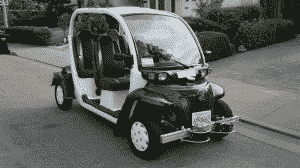

# 奥诺机器人公司正在大学校园测试无人驾驶穿梭系统

> 原文：<https://web.archive.org/web/https://techcrunch.com/2015/08/13/auro-robotics-yc-s15-is-building-a-driverless-shuttle-system-for-college-campuses/>

# 奥诺机器人公司正在大学校园测试无人驾驶穿梭系统

大学生可能很快就会在班级之间和他们需要去的校园其他地方自主穿梭。

Y Combinator 支持的奥诺机器人公司目前正在几所大学测试他们的无人驾驶班车系统，实际上已经开始在圣克拉拉大学的校园里部署班车。

该公司还计划扩展到其他市场，如游乐园、退休社区和小岛，这些领域的一些项目已经准备在“今年下半年”启动

奥诺选择关注这些小型、封闭的环境，主要是因为它们由私营公司控制，因此不受政府的严格监管，而谷歌和其他公司的无人驾驶汽车却落后了。

目前的航天飞机原型来自奥诺机器人公司，由纳林·古普塔、Jit Ray Chowdhury 和 Srinivas Reddy 创建。

奥诺机器人公司首席执行官纳林·古普塔说:“这一战略给我们带来的独特优势是，我们现在就可以调动航天飞机，而不是等到未来五年或十年才能通过法律。”

古普塔告诉我，在这种地区设计自动驾驶汽车的主要挑战是建造一辆能够智能安全地在繁忙的行人交通中行驶的汽车，他说他们的团队已经精心设计了一段时间。

该团队实际上创建了一个他们部署航天飞机的环境的三维地图，以便车辆能够尽可能地响应和意识到他们的周围环境。

有这么多独特的因素要考虑，效率对该集团来说确实是至关重要的，因为它希望在自主航天飞机领域取得突破，成为主导者之一。古普塔和他的团队正在迅速改进他们车辆的部件，使它们尽可能智能化。该集团依靠 Polysync 等第三方技术来缩短汽车上市时间。

该公司目前正在开发两种不同型号的穿梭巴士，因此，根据该地区的需求，这些车辆要么可以沿着一条带有预定义停靠站的闭环路线行驶，要么可以按需接送用户，并在他们定义的位置放下他们。

无人驾驶汽车可能离成为主流还有一段路要走，但似乎未来的校园已经上路了。