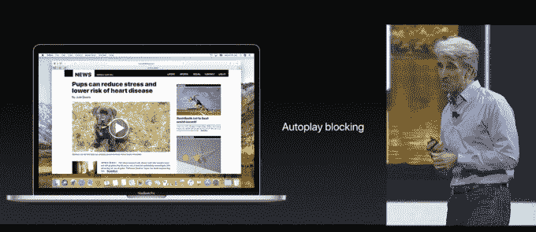

# 苹果在桌面 Safari 中增加了自动播放视频功能 

> 原文：<https://web.archive.org/web/https://techcrunch.com/2017/06/05/auto-play-block/>

# 苹果在桌面 Safari 中增加了自动播放视频功能

讨厌网站用自动播放视频轰炸你？好吧，苹果公司正在猛扑过去，为其即将推出的 macOS High Sierra 桌面操作系统的新 Safari 浏览器增加了自动播放视频阻止功能。今天在 WWDC 宣布，这个选项可以让你保持自动播放视频暂停，直到你选择取消暂停。该功能将于 6 月下旬在 High Sierra 的公共测试版中推出。

苹果为用户提供了很好的服务，同时也让内容发布者的日子更加难过。

自动播放视频在可预测的情况下会很方便，并且只在视频出现在屏幕上时才会发生，就像在一些社交应用程序中一样。但是，当一篇文字新闻文章突然开始播放侧边栏中广告或自动播放视频播放器的声音时，这令人愤怒，是对我们注意力的滥用。

出版商已经对谷歌和脸书采取这些敌视用户的策略来吸走他们的广告收入做出了反应。因此，当苹果对用户体验的关注让 Safari 碾压这种媒体格式时，除了这些渠道之外，很少有人会抱怨。

在对广告行业剥削端的另一次攻击中， [Safari 推出了一款跟踪拦截器](https://web.archive.org/web/20221207101133/https://beta.techcrunch.com/2017/06/05/apple-adds-a-tracker-blocker-to-desktop-safari/)，它使用机器学习来检测和阻止这些系统，以保护您的隐私。

没有消息表明这些功能是否会进入手机版的 Safari，但这些举措表明，苹果为了客户的利益，毫不犹豫地欺骗广告商。

*你可以通过在这里观看或者关注[直播博客](https://web.archive.org/web/20221207101133/https://beta.techcrunch.com/2017/06/05/live-from-apples-wwdc-2017-keynote/)* 来了解 [WWDC 发生的一切](https://web.archive.org/web/20221207101133/https://beta.techcrunch.com/2017/06/05/apple-wwdc-keynote-live-stream-livestream-ipad-ios-macos-mad-seo-skillz/)