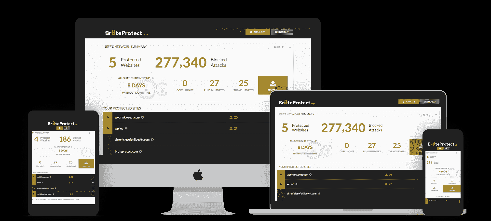

# Automattic 收购 BruteProtect 以帮助保护 WordPress 用户的安全

> 原文：<https://web.archive.org/web/https://techcrunch.com/2014/08/26/automattic-acquires-bruteprotect-to-help-keep-wordpress-users-safe/>

# Automattic 收购了 BruteProtect 来帮助保护 WordPress 用户的安全

WordPress 现在为如此多的网站提供支持，难怪它是黑客最喜欢的目标。为了保证用户的安全，automatic——WordPress.com 和开源 WordPress 项目背后的公司——今天[宣布](https://web.archive.org/web/20230404054542/http://jetpack.me/2014/08/26/automattic-bruteprotect/)已经收购了[的 BruteProtect](https://web.archive.org/web/20230404054542/https://bruteprotect.com/) ，这是一款 WordPress 的安全和管理工具。

BruteProtect [插件](https://web.archive.org/web/20230404054542/http://wordpress.org/plugins/bruteprotect/)目前[在大约 110，000 个网站上使用](https://web.archive.org/web/20230404054542/https://bruteprotect.com/)，但是通过这次收购，WordPress 不仅将免费提供 BruteProtect 的高级服务，还将把它包含在其 [Jetpack 服务](https://web.archive.org/web/20230404054542/http://jetpack.me/)中。Jetpack 允许拥有自主网站的 WordPress 用户访问 WordPress 为其用户提供的许多云托管服务。

首先也是最重要的，BruteProtect 保护网站免受[恶意登录企图](https://web.archive.org/web/20230404054542/https://bruteprotect.com/bruteprotect-free-features/)(顾名思义)，但它也确保你的 WordPress 安装和你使用的所有插件和主题都是最新的。该服务还提供正常运行时间监控，在宣布收购之前，BruteProtect 还在[开发用于恶意软件扫描的](https://web.archive.org/web/20230404054542/https://bruteprotect.com/upcoming-features/)工具。

BruteProtect 是由 Parka 的[团队开发的。收购之前，Parka 的联合创始人萨姆·霍奇基斯写道，该公司正在与 Automattic 创始人马特·莫楞威格讨论融资事宜。然而，Mullenweg 没有为这个项目提供资金，而是认为收购这个项目是更好的选择。](https://web.archive.org/web/20230404054542/http://getparka.com/)

他指出，Automattic 可能因其像 WordPress.com 这样面向消费者的产品而闻名，但“它们背后的基础设施是冰山的底部。”Automattic 表示，它现在每天从全球 9 个数据中心推送惊人的 450 数据，因此，该公司在运行网络规模的服务方面获得了相当多的专业知识。