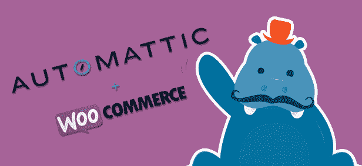

# Automattic 收购 WooCommerce，这是一个将 WordPress 转变为商店的流行插件

> 原文：<https://web.archive.org/web/https://techcrunch.com/2015/05/19/automattic-buys-woocommerce-the-popular-plugin-for-turning-wordpress-into-a-store/>

# Automattic 收购了 WooCommerce，这是一个将 WordPress 转变为商店的流行插件

如果你想把你的 WordPress 网站变成一个在线商店，有一个选择是至高无上的:WooCommerce。凭借大约 750 万次下载，它无疑是最受欢迎的电子商务 WordPress 插件——见鬼，它是最受欢迎的 WordPress 插件之一。

现在它正式成为了 WordPress 家族的一员。WordPress.com 背后的公司 Automattic 刚刚收购了 WooCommerce。

Automattic 没有透露收购的价格，但告诉我这是迄今为止“Automattic 最大的收购”当然，我们会继续挖掘更多的细节。

那么，为什么 Automattic 会抢走一个电子商务插件呢？因为这是人民想要的。

“我记得几年前我参加了一个(WordPress 会议)，”WordPress 创始人马特·莫楞威格在宣布收购的视频[中说道。“有人在 Q & A 站起来问我‘你什么时候能让在线发布商店像发布网站一样简单？’…观众自发地鼓掌。人们喜欢这个想法。"](https://web.archive.org/web/20230317174446/https://www.youtube.com/watch?v=xJOfTB8-daA&feature=youtu.be)

如果电子商务是 WordPress 的下一步，这次收购将帮助他们在这些领域掀起巨大的波澜:WooCommerce 已经为大约 60 万家基于 WordPress 的店面提供服务。

那么什么是 WooCommerce 呢？简而言之，它把 WordPress 变成了一个商店——因为它是由一个曾经专注于制作 WordPress 主题的团队建立的，所以它在 WordPress 中感觉非常自然。

添加产品就像添加一篇新的博客文章。想接受付款吗？它自带 PayPal 支持。想用 Stripe/亚马逊支付/等。反而？就拿一个他们的分机。优惠券代码？它会做到的。这将有助于运输物流。和库存管理。和分析。如果这是经营一家商店的关键部分，他们已经把它做好了。

下面是 WooCommerce 的演示视频，展示了它的功能集:

https://vimeo.com/60440851

这并不是 Automattic 第一次从自己的插件商店里买东西——就在一年前，它[收购了 WordPress 安全插件 BruteProtect](https://web.archive.org/web/20230317174446/https://techcrunch.com/2014/08/26/automattic-acquires-bruteprotect-to-help-keep-wordpress-users-safe/) 。

Automattic 告诉我，它预计收购将在下个月内完成。