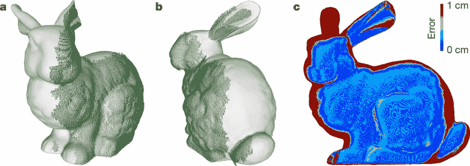
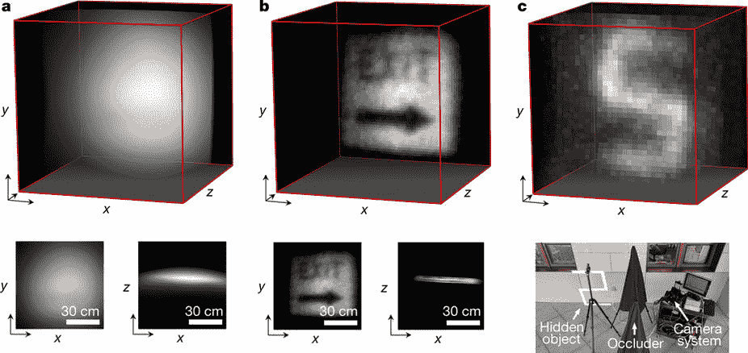

# 自动驾驶汽车可以通过反弹激光偷窥角落 

> 原文：<https://web.archive.org/web/https://techcrunch.com/2018/03/05/autonomous-cars-could-peep-around-corners-via-bouncing-laser/>

自动驾驶汽车收集了大量关于周围世界的数据，但即使是最好的计算机视觉系统也无法看穿砖块和砂浆。但是通过仔细监测从附近表面反射回来的激光反射光，他们可能能够看到周围的角落——这是斯坦福大学工程师最近发表的研究背后的想法。

基本想法是我们以前见过的:通过将激光或结构光照射在附近的表面上并分析光如何散射，可以辨别障碍物远端的物体形状。当一些脉冲比其他脉冲返回得更快时，或者由于与看不见的物体相互作用而改变时，模式就会出现。

这不容易做到。例如，反射的激光很容易消失在大白天的噪音中。如果你想重建一个足够精确的物体模型，以判断它是一个人还是一个停车标志，你需要大量的数据和处理这些数据的能力。

这是斯坦福大学研究人员的第二个问题，他们来自该校的计算成像小组(T1)，在《自然》杂志(T3)上发表的一篇新论文(T2)中提出了这个问题。

“尽管最近取得了进展，但由于现有重建算法的内存和处理要求过高，以及多重散射光的信号极其微弱，因此[非视线]成像仍然不切实际，”摘要部分写道。

“非视线成像的一个重大挑战是找到一种有效的方法，从嘈杂的测量中恢复隐藏物体的三维结构，”研究生大卫·林德尔说，他是论文的合著者，[在斯坦福大学的新闻稿](https://web.archive.org/web/20221209194324/https://news.stanford.edu/2018/03/05/technique-can-see-objects-hidden-around-corners/)中。

当激光扫描一个表面时，数据收集过程仍然需要很长时间——想想几分钟到一个小时，尽管这对于这种类型的技术来说仍然是偏低的。光子做它们自己的事情，在另一边反弹，一些回到它们的原点附近，在那里它们被高灵敏度的探测器拾取。

探测器将其数据发送到计算机，计算机使用研究人员创造的精密算法对数据进行处理。他们的工作使这一部分进行得非常快，只需一两秒钟的处理就可以相对高保真地重建场景。

白色模型是看不见的项目的实际形状，绿色网格是系统检测到的(当然，只是从一侧)。

由此产生的系统也不容易受到干扰，允许它在间接阳光中使用。

从外部激光重建的标志示例。

当然，如果要花一个小时才能检测到一个人在墙的另一边，那就没什么用了。但是研究人员使用的激光设置与激光雷达系统中的高速扫描激光非常不同。他们构建的算法应该与这些算法兼容，这将大大减少数据采集时间。

“我们相信计算算法已经为激光雷达系统做好了准备，”该论文的共同首席作者马修·奥图尔(Matthew O'Toole)说(与实验室负责人戈登·韦茨斯坦(Gordon Wetzstein)一起)。"关键问题是当前激光雷达系统的硬件是否支持这种类型的成像."

如果他们的理论是正确的，那么这种算法可能很快就会使现有的激光雷达系统以一种新的方式分析他们的数据，甚至在可见之前就可能发现正在靠近十字路口的移动汽车或人。这还需要一段时间，但在这一点上，这只是一个智能工程的问题。