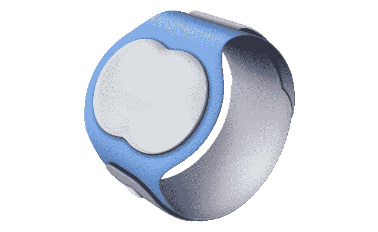

# 艾娃是一款手镯，旨在预测女性最有可能怀孕的日子

> 原文：<https://web.archive.org/web/https://techcrunch.com/2015/09/22/ava-is-a-bracelet-that-aims-to-predict-the-most-likely-days-for-women-to-get-pregnant/>

# 艾娃是一款手镯，旨在预测女性最有可能怀孕的日子

艾娃是一款女性健康跟踪手环，它收集荷尔蒙和其他数据，以预测女性的月经和她最有可能怀孕的月份。

这种手镯通过监测女性体内轻微的荷尔蒙变化来工作，这种变化通常是女性看不到或感觉不到的。艾娃表示，它每天晚上收集超过 300 万个与这些变化相关的数据点，然后确定女性在月经周期中的位置，以预测她最容易受孕的日子。它从 10 个不同的传感器收集这些数据——尽管不清楚这些传感器是什么。这家初创公司希望在晚些时候披露这些信息。

这家瑞士公司的四位创始人 Pascal Koenig、Peter Stein 和 Lea Von Bidder 都因各种原因被这个项目吸引，但他们都觉得有一种比在应用程序上记录更好的方法来监控和预测生育。

新老技术都试图在生育跟踪和[日历避孕方法](https://web.archive.org/web/20230320160940/https://en.wikipedia.org/wiki/Calendar-based_contraceptive_methods)方面占据一席之地，包括历史上公认的 Rythm 方法，该方法要求女性监测自己的月经周期，以确定特定的生育日期。但这并不能保证防止或创造婴儿。

艾娃试图通过可穿戴设备为这个古老的难题添加一些科学。在这方面，它并不孤单。 [Tempdrop](https://web.archive.org/web/20230320160940/http://tempdrop.xyz/) 监测体温，以确定造宝宝时间所需的正确基础体温。Duofertility 是另一款海外可用的生育监测器(网站称即将登陆美国)

另一件应该考虑的事情是，艾娃反对与其他健康跟踪设备共享手腕空间。理想情况下，它位于手腕上适合或不适合闪光的部位。联合创始人 Pascal Koenig 将这款手环比作 Fitbit，但这是为了女性健康。

总体而言，可穿戴设备还存在终身价值问题。有多少人用耐克跑鞋、Fitbit 或其他正在抽屉里积灰的设备阅读这篇文章，请举手。超过三分之一的设备佩戴者报告说他们在六个月后不再佩戴它。

柯尼希对此并不担心，他告诉 TechCrunch，他从几名女性那里听说，她们继续戴着艾娃手镯，因为它给她们的感觉和数据。“即使她们怀孕了，”柯尼希说。

艾娃手环将于 2016 年初推出，零售价为 249 美元，外加每月 5 美元的应用订阅，最长可达一年。这家初创公司告诉我，它也非常接近完成 230 万美元的种子融资。

[gallery ids="1214432，1214431，1214430，1214429"]