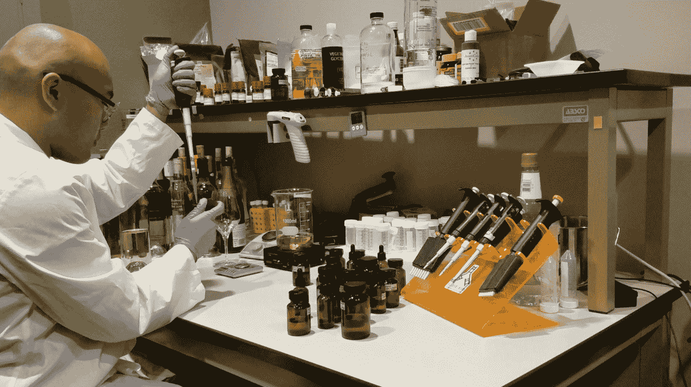

# 艾娃承诺不用任何葡萄克隆高端葡萄酒 

> 原文：<https://web.archive.org/web/https://techcrunch.com/2016/07/14/ava-wants-to-molecularly-replicate-high-end-wines-no-grapes-necessary/>

你听说过把水变成酒，但亚历克·李和他的生物工程创始团队已经在旧金山实验室把分子变成酒。

“我们酿造的葡萄酒不含任何葡萄、酵母或任何发酵成分，”艾娃酒厂的创始人李告诉 TechCrunch。

艾娃通过分析精选葡萄酒的分子特征并将其重建为与更昂贵葡萄酒的生物识别匹配来做到这一点，比如 11，000 美元的 [1973 年蒙特勒纳夏顿埃葡萄酒](https://web.archive.org/web/20221208143057/http://www.decanter.com/wine-news/judgment-of-paris-montelena-fetches-us11325-53483/)、**，这基本上使新世界葡萄酒在行业地图上出现。**

葡萄酒行业的 AVA 代表“美国葡萄栽培区”，这家初创公司的名字就像是在美国实验室酿造的葡萄酒。声称从一组键合的原子中酿酒听起来有点像炼金术，但李发誓他的产品是真货。

“本质上这只是一个很大的化学问题，”他在准备今天在 IndieBio SF 演示日的演讲前告诉我。“我们不需要炼金术就能把一种分子变成另一种。比如，你可以解构水，并在实验室里复制它。”

现在，这家初创公司正专注于复制三种葡萄酒——一种莫斯卡托葡萄酒、一种唐培里侬葡萄酒，他们刚刚开始研究一种黑皮诺葡萄酒。

但是直接量化是很难做到的。李告诉我，最大的挑战是计算出不同分子的浓度。每种葡萄酒都含有 80 到 200 种具有协同和反协同效应的化合物，所有这些都在发挥作用，使它的味道、感觉和外观都符合它的风格。

“我们的目标是达到这样一个程度，你只需要一个玻璃杯就可以识别分子，”Lee 说。

艾娃在三藩市的葡萄酒克隆实验室。

他认为艾娃最终会涉足其他奢侈品，比如巧克力和咖啡，但世界上有很多不同的葡萄酒，目前主要关注的是克隆高端好酒。

监管将是这家初创公司面临的另一个障碍。李甚至不确定他是否能被允许将自己的产品贴上葡萄酒的标签。“这是一个监管舞蹈，即使它本质上是酒，生物起源的酒，”他说。

这家初创公司目前正在努力获得销售该产品的适当许可，但表示这将需要大约六个月的时间。该团队可能会走直接面向消费者的路线，并告诉我他们也在与酒类行业的一些大型分销商和零售商洽谈，有可能将他们的葡萄酒销往世界各地。

艾娃最近从在该领域有经验的机构投资者那里筹集了 250 万美元的资金，但不愿透露这些投资者是谁。

在今天的 IndieBio SF 演示日，创始人首次向投资者、生物技术爱好者和媒体展示他们的产品——顺便说一下，你可以在 TechCrunch 上观看活动的直播。他们将加入一批创业公司，生产从更好的咖啡泡沫到蘑菇服装的各种产品。

“在很高的水平上，后代制造食物的方式将是通过人工合成，”李说。“反过来说是不可持续的。葡萄酒是我们合法化合成食品的一个非常独特的机会，因为我们可以很快进入市场。水涨船高，酒是我们开始的好地方。”