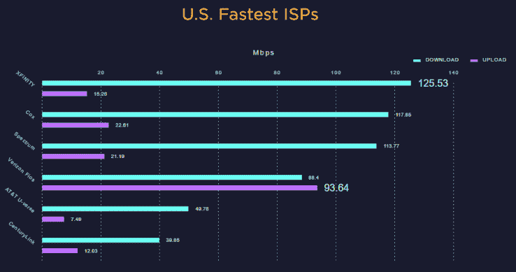
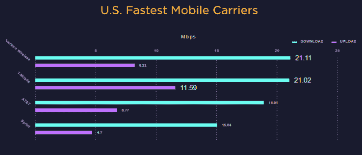

# 美国平均宽带速度首次超过 50 兆 

> 原文：<https://web.archive.org/web/https://techcrunch.com/2016/08/03/average-broadband-speed-in-us-rises-above-50-megabits-for-the-first-time/>

Speedtest 发布了年中宽带速度报告，实际上有相当多的好消息。尽管行业内有阴谋诡计，速度仍在稳步提高，事实上美国的平均速度首次超过了 50 兆。

每秒 54.97 兆比特的平均速度比去年同期高出 42%，上传速度更快——18.88 兆比特比去年同期高出 51%。顺便说一下，这些都是基于 Speedtest 的网站和应用程序上进行的大约 800 万次日常测试，所以数据相当可靠。

康卡斯特 Xfinity 获得了平均最快速度的荣誉，但其 125 兆位并不比竞争对手高多少:考克斯 118 兆位，频谱 114 兆位。

【T2

那个姓没有让你想起什么吗？Spectrum 是 Charter、时代华纳有线电视和 Bright House Networks 在今年早些时候第一家[收购了另外两家](https://web.archive.org/web/20221206190934/https://beta.techcrunch.com/2016/04/26/time-warner-charter-merger-given-go-ahead-by-federal-communications-commission/)后成立的新公司。

“大型互联网服务提供商的市场整合通常对创新和速度的提高不是好兆头，”Speedtest 评论道，尽管 TWC 和 Bright House 在过去的 6 个月中确实看到了性能的提高，所以这可能是一个例外。

像谷歌和威瑞森(顺便说一下，它拥有美国在线，后者拥有 TechCrunch)这样的光纤提供商正在继续铺设他们的网络，推动使用传统连接的服务，以提供有竞争力的速度——并且，关键的是，将坚实的宽带带到了几十年来很难实现的偏远地区。

在移动方面，威瑞森和 T-Mobile 以 21 兆的平均下载速度并列第一，尽管后者以平均 11.59 兆的上传速度遥遥领先于竞争对手。不过，冲刺很差。

Speedtest 指出，移动世界在过去几年中经历了激烈的竞争，消费者是赢家，因为所有网络都投资于自己的网络，并在价格上相互推动。

这是好东西，但不要忘记我们的速度仍然落后于许多其他国家的事实，许多公司对城市或社区施加持续的束缚。大量的工作要做！