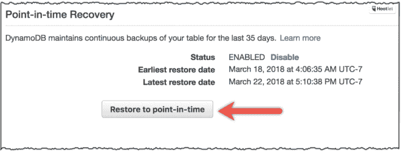

# AWS 为 dynamo db TechCrunch 增加了自动时间点恢复功能

> 原文：<https://web.archive.org/web/https://techcrunch.com/2018/04/04/aws-adds-automated-point-in-time-recovery-to-dynamodb/>

# AWS 为 DynamoDB 增加了自动时间点恢复功能

云计算的乐趣之一是把你的数据交给云供应商，让他们来处理繁重的工作。到目前为止，这意味着他们为您更新了软件或扩展了硬件。今天，当 AWS 宣布 Amazon DynamoDB 连续备份和时间点恢复(PITR)时，它将这一点提升到了另一个水平[。](https://web.archive.org/web/20230104130545/https://aws.amazon.com/blogs/aws/new-amazon-dynamodb-continuous-backups-and-point-in-time-recovery-pitr/)

有了这项新服务，该公司让你只需启用新的备份工具，备份就会自动进行。Amazon 负责剩下的工作，提供 DynamoDB 数据库中所有数据的连续备份。

但它并没有就此停止，它让备份系统充当某种记录。您可以将数据集回滚到过去 35 天内“每秒粒度”的任何时间点。此外，您可以从 AWS 管理控制台、API 调用或通过 AWS 命令行界面(CLI)来访问该工具。

截图:亚马逊

“我们构建此功能是为了防止意外写入或删除。如果一个开发人员针对生产运行一个脚本，而不是 staging，或者如果有人忽略了一个 DeleteItem 调用，PITR 会保护你。亚马逊的兰德尔·亨特[在宣布新功能的博客文章](https://web.archive.org/web/20230104130545/https://aws.amazon.com/blogs/aws/new-amazon-dynamodb-continuous-backups-and-point-in-time-recovery-pitr/)中写道:“我们还为你通常无法预测的场景打造了它。”。

如果您担心 35 天的限制，您不必担心，因为该系统是您定期按需备份的一个附件，您可以根据需要保留它。

亚马逊首席技术官沃纳·威格尔今天在 T4 亚马逊峰会上介绍了这项新服务，他说你有多少数据并不重要。即使只有 1tb 的数据，你也可以使用这项服务。“这是一个真正强大的机制，”沃格尔斯说。

这项新服务目前已在多个地区推出。您可以点击了解地区供货情况和价格选项[。](https://web.archive.org/web/20230104130545/https://aws.amazon.com/dynamodb/pricing/#Continuous_backup_and_point-in-time_recovery)