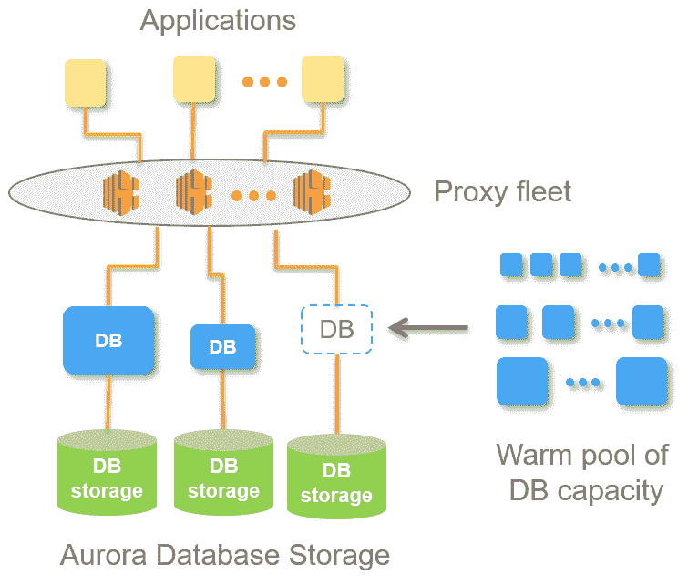

# AWS 宣布推出无服务器数据库服务 

> 原文：<https://web.archive.org/web/https://techcrunch.com/2017/11/29/aws-announces-a-serverless-database-service/>

# AWS 宣布推出无服务器数据库服务

亚马逊的 AWS 云计算部门今天[宣布了](https://web.archive.org/web/20221007025549/https://aws.amazon.com/blogs/aws/in-the-works-amazon-aurora-serverless/)一项新的数据库服务，该服务将使快速启动不需要连续处理数据的关系数据库变得更容易、更便宜。 [Aurora 无服务器](https://web.archive.org/web/20221007025549/https://aws.amazon.com/rds/aurora/)，不出所料，它建立在 AWS 现有的 Aurora 数据库系统之上，基本上是一个无服务器、事件驱动的计算平台的数据库等价物。

这里最巧妙的特点是数据存储和处理是分开的。Aurora 无服务器用户仅在数据库实际工作时支付处理费用(当然，还有存储费用，但这相对便宜)。

该计划是在明年的某个时候推出这项服务，AWS 希望届时能分享更多相关信息。

目前，Aurora Serverless 仅处于预览阶段，但一旦面向所有人推出，它将允许开发人员访问按需提供的无服务器关系数据库，他们不必提供该数据库，并且可以根据需要轻松扩展。当数据库被使用时，用户只按秒付费。目前，要运行一个数据库，你必须启动一台机器来运行它。Aurora Serverless 会为您完成这一切。

这里最巧妙的特点是数据存储和处理是分开的。Aurora 无服务器用户仅在数据库实际工作时支付处理费用(当然，还有存储费用，但这相对便宜)。

该计划是在明年的某个时候推出这项服务，AWS 希望届时能分享更多相关信息。