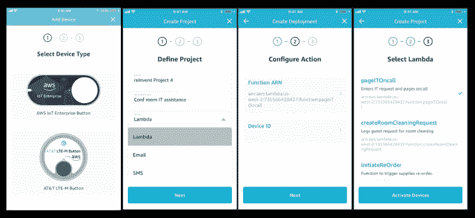

# AWS 推出物联网 TechCrunch 一键式 Lambda 功能应用

> 原文：<https://web.archive.org/web/https://techcrunch.com/2018/05/14/aws-introduces-1-click-lambda-functions-app-for-iot/>

# AWS 推出物联网一键式 Lambda 功能应用

当亚马逊在 2015 年推出 AWS Lambda 时，无服务器计算的概念相对来说还不为人知。它使开发人员无需管理服务器就能交付软件。相反，Amazon 管理这一切，底层基础设施只有在事件触发需求时才会发挥作用。今天，该公司在 iOS 应用商店发布了一款名为 [AWS IoT 1-Click](https://web.archive.org/web/20221207181812/https://aws.amazon.com/iot-1-click/) 的应用，将这一概念向前推进了一步。

名称中的 1-click 部分可能有点乐观，但该应用程序旨在让开发人员更快地访问 Lambda 事件触发器。这些是专为简单的单一用途设备设计的，如徽章阅读器或按钮。当你按下按钮，你可以连接到客户服务或维护或任何有意义的给定场景。

亚马逊[的一个特别好的例子是破折号按钮](https://web.archive.org/web/20221207181812/https://techcrunch.com/2015/10/01/amazons-supply-re-ordering-service-gets-integrated-in-nearly-a-dozen-more-household-devices-from-ge-samsung-oster-and-more/)。这些都是简单的按钮，用户按下这些按钮就可以重新订购像洗衣液或卫生纸这样的商品。按下按钮，通过家庭或企业的 WiFi 将设备连接到互联网，并向供应商发送信号，以便按预先配置的数量订购产品。AWS IoT 1-Click 将这一功能扩展到任何开发者，只要它在受支持的设备上。

要使用新功能，您需要输入您现有的帐户信息。您可以配置您的 WiFi，并可以从预先配置的设备列表和给定设备的 Lambda 功能中进行选择。这一早期版本中支持的设备包括 AWS 物联网企业按钮、Dash 按钮的商业化版本和& T LTE-M 按钮。

一旦你选择了一个设备，你就定义了一个触发 Lambda 功能的项目，或者根据你的喜好发送短信或电子邮件。为事件触发器选择 Lambda，然后触摸下一步进入配置屏幕，在此配置触发器操作。例如，如果按下按钮触发了来自会议室的呼叫，则触发器将向其发送页面，表明在给定的会议室中有求助呼叫。

最后，选择合适的 Lambda 函数，它应该根据您的配置信息正确工作。

所有这些显然都需要不止一次点击，并且可能涉及一些测试和重新配置，以确保您输入的所有内容都是正确的，但是让一个应用程序创建简单的 Lambda 函数的想法可以帮助没有编程背景的人通过一些配置过程的培训来配置具有简单功能的按钮。

值得注意的是，该服务仍处于预览阶段，因此您可以在今天下载该应用程序，但此时您必须申请参与。