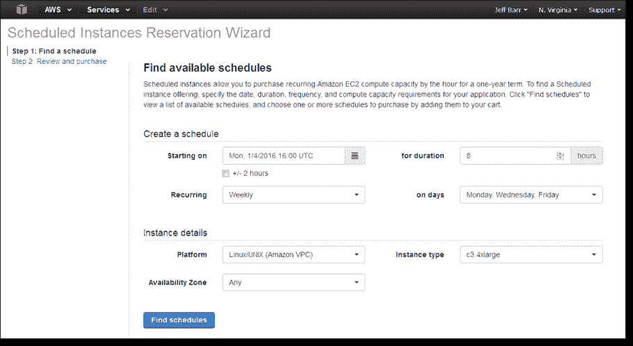
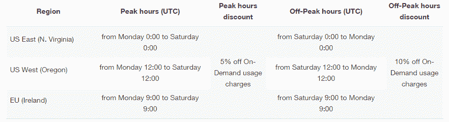

# AWS 启动计划保留实例

> 原文：<https://web.archive.org/web/http://techcrunch.com/2016/01/13/aws-now-gives-a-discount-to-developers-who-reserve-instances-on-a-regular-schedule/>

亚马逊的 AWS 云计算平台[今天推出了](https://web.archive.org/web/20230319213109/https://aws.amazon.com/blogs/aws/new-scheduled-reserved-instances/)一个新的定价等级，这将使其服务对那些只需要在一天中的特定时间或一个月中的特定日子运行基于云的应用程序的客户来说更加[实惠](https://web.archive.org/web/20230319213109/https://aws.amazon.com/ec2/pricing/)。

借助这一名为[预定保留实例](https://web.archive.org/web/20230319213109/https://aws.amazon.com/blogs/aws/new-scheduled-reserved-instances/)的新定价层，AWS 用户可以根据自己的每日、每周和每月计划，在预定义的时间段内保留实例。你只要告诉亚马逊你什么时候需要一台机器，需要多长时间，它就会在那个时候准备好。

要做到这一点，你必须将自己锁定在一年期内，但作为回报，你可以获得折扣，使费率比亚马逊的标准按需费率下降约 5%至 10%。

折扣的大小取决于您使用预定机器的时间。在高峰时段，你可以得到 5%的折扣，在非高峰时段(基本上是周末)，你可以得到 10%的折扣。

新的定价模式目前仅适用于亚马逊美国东部(北弗吉尼亚州)、美国西部(俄勒冈州)和欧盟(爱尔兰)地区的机器。

总的来说，这似乎是一个明智之举。毕竟，许多云工作负载并不是恒定的。例如，也许你只需要在每个工作日的下午运行某个计算。或者您只在每个月的第一天运行您的计费计算。

如果你使用 AWS、Azure 或谷歌的云平台，你会在那些日子里启动一台机器，然后在完成后再次关闭它。到目前为止，在运行这些机器时，您只需支付标准的按需价格。