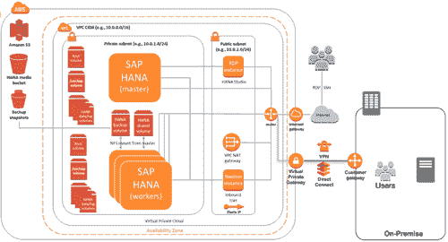

# AWS 现在提供超过 4TB 内存的虚拟机

> 原文：<https://web.archive.org/web/https://techcrunch.com/2017/09/14/aws-now-offers-a-virtual-machine-with-over-4tb-of-memory/>

# AWS 现在提供了一个超过 4TB 内存的虚拟机

今年早些时候，亚马逊的 AWS 团队[表示](https://web.archive.org/web/20230324115539/https://aws.amazon.com/blogs/aws/ec2-in-memory-processing-update-instances-with-4-to-16-tb-of-memory-scale-out-sap-hana-to-34-tb/)正在努力为用户带来 4 到 16TB 内存的实例类型。现在它开始兑现这一承诺，因为该公司今天[推出了](https://web.archive.org/web/20230324115539/https://aws.amazon.com/blogs/aws/now-available-ec2-instances-with-4-tb-of-memory/)迄今为止最大的 EC2 机器(就内存大小而言):x1e.32xlarge 实例，内存高达 4.19TB。以前，EC2 最大的实例只有 2TB 多一点的内存。

这些机器配备运行频率为 2.3 GHz 的四插槽英特尔至强处理器、高达 25 Gbps 的网络带宽和两个 1，920GB 固态硬盘。显然只有少数应用程序需要这种内存。因此，毫不奇怪，这些实例已经过认证，可以运行 [SAP 的 HANA 内存数据库](https://web.archive.org/web/20230324115539/http://docs.aws.amazon.com/quickstart/latest/sap-hana/welcome.html)及其各种工具，SAP 将为在这些实例上运行这些应用提供直接支持。

这些新实例现在在四个 AWS 地区提供:美国东部(北弗吉尼亚)、美国西部(俄勒冈州)、欧盟(爱尔兰)和亚太地区(东京)。当然，运行这些实例并不便宜。例如，美国东部地区的按需定价为每小时 26.688 美元，东京为 38.688 美元。这使得它们成为 AWS 迄今为止最昂贵的机器。

值得注意的是，微软 Azure 目前最大的内存优化机器[超过](https://web.archive.org/web/20230324115539/https://azure.microsoft.com/en-us/pricing/details/virtual-machines/linux/)2TB，谷歌已经宣布放弃 416GB 内存。

