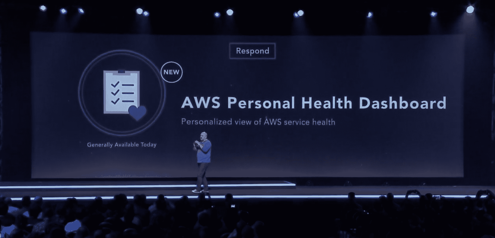

# AWS 个人健康仪表板帮助开发人员监控其云应用程序的状态 

> 原文：<https://web.archive.org/web/https://techcrunch.com/2016/12/01/aws-personal-health-dashboard-helps-developers-monitor-the-state-of-their-cloud-apps/>

# AWS 个人健康仪表板帮助开发人员监控其云应用的状态

DevOps 团队将很高兴听到 Amazon 正在为 Amazon Web Services 推出自己的仪表板。该公司称之为个人健康仪表板，是其从 re:Invent 2016 阶段发布的最新版本，以支持更高级的云应用监控。

该工具将关键基础设施数据放在一个地方。仪表板将自动通知团队失败，并允许他们立即用 Lambda 函数做出响应，如果有什么需要改变的话。

像 Geckoboard 这样的公司也提供类似的服务，但这将是亚马逊第一次提供自己的仪表盘，提供全套通知和实时反应工具。团队以前被迫用第三方服务来增强亚马逊的基本仪表板，以全面监控他们的云应用程序。

通知消除了监控操作数据的又一个障碍。如果出现故障，您将能够比以前更快地将实例移动到其他地方。

对该公司来说，将所有这些信息放在一个地方是一个非常合理的举措。所有这些都将 AWS 定位为启动云应用程序的更完整的工具。

