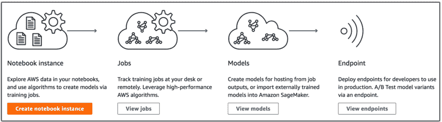

# AWS 发布 SageMaker，使构建和部署机器学习模型变得更容易 

> 原文：<https://web.archive.org/web/https://techcrunch.com/2017/11/29/aws-releases-sagemaker-to-make-it-easier-to-build-and-deploy-machine-learning-models/>

云服务旨在消除与管理特定流程(无论是软件还是基础设施)相关的大量复杂性。如今，机器学习正在迅速吸引开发人员，AWS 希望帮助消除与构建和部署机器学习模型相关的一些障碍。

为此，[该公司宣布了亚马逊 SageMaker](https://web.archive.org/web/20230114112945/https://aws.amazon.com/blogs/aws/sagemaker/) ，这是一项新服务，为开发人员和数据科学家提供了一个框架来管理机器学习模型过程，同时消除了一些通常涉及的繁重工作。

Randall Hunt 在宣布这项新服务的博客文章中写道，这个想法是为加速机器学习融入新应用的过程提供一个框架。“亚马逊 SageMaker 是一种完全托管的端到端机器学习服务，使数据科学家、开发人员和机器学习专家能够快速构建、训练和托管大规模的机器学习模型，”亨特写道。

正如 AWS 首席执行官安迪·杰西(Andy Jassy)在 re:invent 的舞台上介绍新服务时所说，“亚马逊 SageMaker 是一种简单的培训方式，为日常开发人员部署机器学习模型。”

新工具包括三个主要部分。

首先是一个笔记本，它使用标准的 Jupyter 笔记本来查看将作为模型基础的数据。您可以在标准实例上运行第一步，或者选择 GPU 来满足更多处理器密集型需求。

一旦准备好数据，就可以开始训练模型了。这包括模型的基本算法。对于这一部分，你可以带你自己的，如流行的 TensorFlow，或者你可以使用 AWS 为你预先配置的一个。

在他的介绍中，Jassy 强调了 SageMaker 的灵活性。它为您提供开箱即用的工具，或者让您自带工具。无论是哪种情况，该服务都已经被调整为处理最流行的算法，而不考虑其来源。

Constellation Research 副总裁兼首席分析师霍尔格·穆勒(Holger Mueller)表示，这种灵活性可能是一把双刃剑。“SageMaker 大大减少了工作/教育/努力，并将帮助构建这些应用程序。但这也意味着 AWS 正在支持许多型号的“多语言”世界，并且真的希望保持其用户和计算/数据负载。”

他认为，如果 AWS 像 TensorFlow 一样宣布自己的神经网络，那将是一个更大的故事，但这方面还没有任何进展。

无论如何，Amazon 处理运行模型所需的所有底层基础设施，包括任何问题，如节点故障、自动扩展或安全补丁。

一旦你有了自己的模型，Jassy 说你可以从 SageMaker 上运行它，或者在另一个服务上使用它，如你所愿。正如他所说，“这对数据科学家和开发人员来说是一件大事。”

AWS 将从今天开始免费提供这项服务，作为其免费服务层的一部分，但一旦超过一定水平，价格将根据使用情况和地区而定。