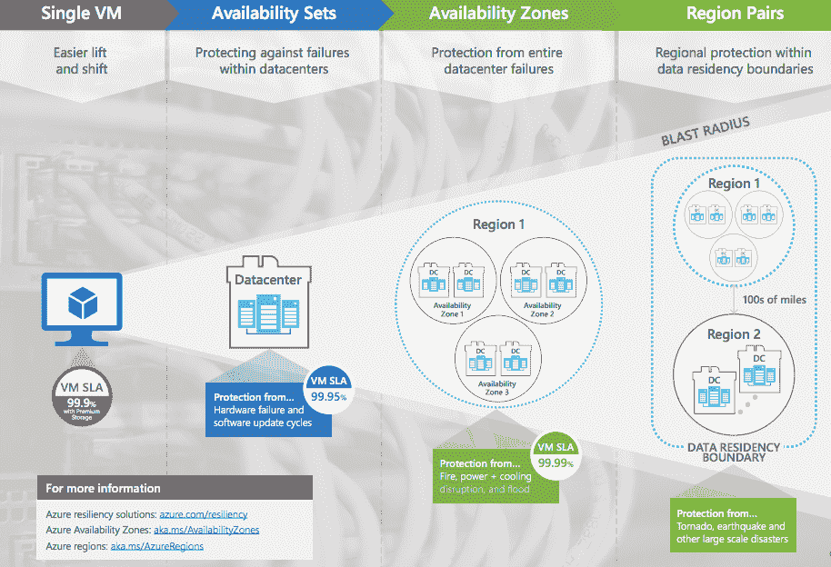

# Azure 的可用性区域现已正式推出

> 原文：<https://web.archive.org/web/https://techcrunch.com/2018/03/30/azures-availability-zones-are-now-generally-available/>

# Azure 的可用性区域现已正式推出

无论您构建什么样的云，如果您想要构建高度可用的东西，您总是会选择将您的应用程序和数据放在至少两个物理上分离的区域。否则，如果一个地区宕机，你的应用也会宕机。所有的[大型](https://web.archive.org/web/20230327192219/https://docs.aws.amazon.com/AWSEC2/latest/UserGuide/using-regions-availability-zones.html) [云](https://web.archive.org/web/20230327192219/https://cloud.google.com/compute/docs/regions-zones/)还在其所在区域提供了一个名为“可用性区域”的概念，为开发人员提供了在同一区域的两个独立数据中心托管其应用程序的选项，以获得额外的弹性。所有的大云，除了 Azure，它在去年九月首次宣布[测试版后，今天才正式推出可用性区域功能。](https://web.archive.org/web/20230327192219/https://azure.microsoft.com/en-us/blog/introducing-azure-availability-zones-for-resiliency-and-high-availability/)

在今天的发布会之前，微软负责 Azure 的公司副总裁朱莉娅·怀特(Julia White)告诉我，该公司数据中心网络背后的设计理念一直是为尽可能多的地区的商业客户提供服务，让他们能够接近自己的客户，并遵守当地的数据主权和隐私法律。这就是为什么 Azure 今天提供的区域比任何竞争对手都多的原因之一，有 38 个普遍可用的区域和 12 个宣布的区域。

“微软开始其基础设施方法，重点是企业组织，并因此建立了许多地区，”怀特说。“我们选择这种区域方法不是因为它容易或简单，而是因为我们相信这是我们的客户真正想要的。”

每个可用性区域都有自己的网络连接和备用电源，因此如果一个区域中的一个区域出现故障，其他区域应该不会受到影响。然而，一场区域性灾难可能会关闭一个地区的所有区域，因此大多数企业肯定会希望将数据保存在至少一个额外的地区。