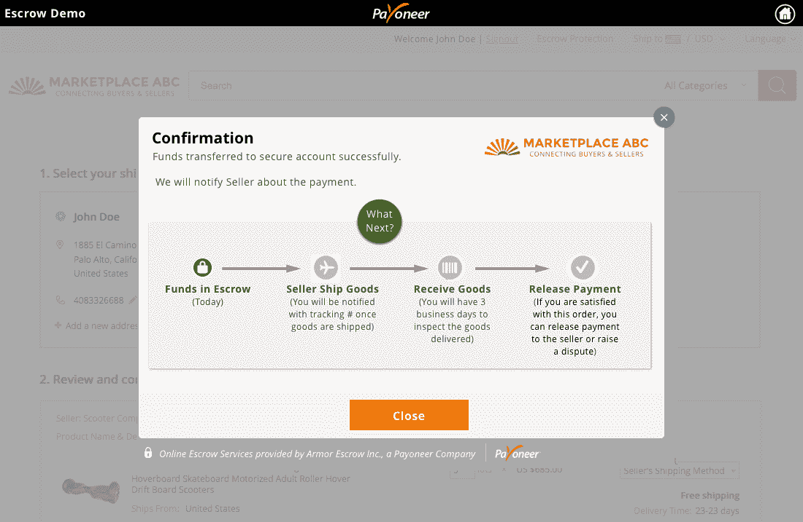
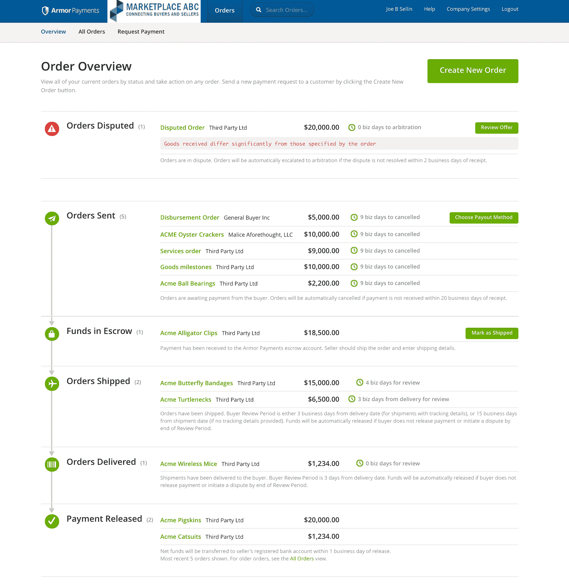

# B2B 支付服务付款人收购托管即服务平台 Armor Payments 

> 原文：<https://web.archive.org/web/https://techcrunch.com/2016/03/15/b2b-payment-service-payoneer-acquires-escrow-as-a-service-platform-armor-payments/>

# B2B 支付服务付款人收购托管即服务平台 Armor Payments

[Payoneer](https://web.archive.org/web/20230129104124/https://www.payoneer.com/en/) 帮助企业和 B2B 市场[跨境转移资金](https://web.archive.org/web/20230129104124/https://www.payoneer.com/en/mass-payout-services/)。它是这个领域最大的公司之一；它的客户包括亚马逊、Fiverr、Airbnb、Upwork 和 Taboola 等。

今天，该公司宣布收购了 [Armor Payments](https://web.archive.org/web/20230129104124/http://www.armorpayments.com/) ，这是一个数字[托管即服务解决方案](https://web.archive.org/web/20230129104124/http://www.armorpayments.com/escrow/how-escrow-works)，旨在使 B2B 支付更加安全。

Payoneer 的服务与 Armor Payments 的托管服务之间存在明显的协同效应，Payoneer 的服务为其客户解决复杂而官僚的全球资金转移问题。

两家公司共同致力于创造一种信用证的替代品，这种信用证仍然控制着许多国际业务的运作方式。  

Payoneer 已经经营了近 10 年，并对其市场，尤其是亚洲市场，有着深刻的了解。盔甲支付仍然是一个相对较新的公司；最初，它的重点是北美，不过收购后这种情况将会改变。

正如盔甲支付公司首席执行官兼联合创始人斯科特·雷诺兹告诉我的，该公司最近卷入了更多的国际交易。“我们的价值主张是降低买方和卖方的风险，”他指出。“在国际上，风险很大，很少有合适的方式获得报酬。”

“从我们第一次见面开始，我们就在谈论我们对世界的看法是多么相似，”Payoneer 首席执行官斯科特·加利特(Scott Galit)说——随着时间的推移，关于合作的讨论变成了收购谈判。

Galit 认为，将盔甲支付的托管服务和支付者的全球影响力结合起来，将使这两家公司能够帮助 B2B 市场更上一层楼。到目前为止，缺乏创新和跨境支付的困难使得 B2B 市场很难成为商家。他们中的大多数人只是停留在列表服务上，因为他们无法使用真正的数字 B2B 支付基础设施。

付款人和盔甲支付将于本周推出他们的第一个综合服务。例如，这意味着卖家将能够从托管账户中获得付款，并将他们的资金直接转移到他们当地的银行。

两家公司拒绝讨论交易的财务细节。

