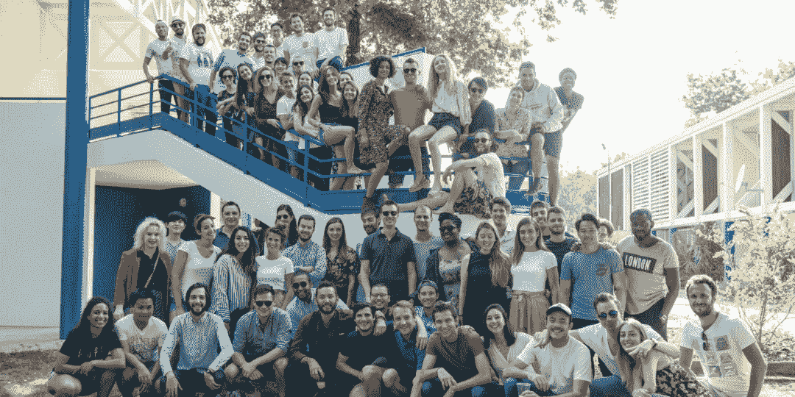

# Back Market 为其翻新设备市场筹集了 4800 万美元 

> 原文：<https://web.archive.org/web/https://techcrunch.com/2018/06/13/back-market-raises-48-million-for-its-refurbished-device-marketplace/>

# Back Market 为其翻新设备市场筹集了 4800 万美元

如果你试图在翻新网站上出售你的旧智能手机，你很可能会看到十几个比较价格的浏览器标签。法国初创公司 [Back Market](https://web.archive.org/web/20221208041518/https://www.backmarket.com/) 正在利用这个分散的行业创建一个市场，并将所有翻新者聚集在一个单一的在线平台上。

这家初创公司刚刚[筹集了](https://web.archive.org/web/20221208041518/https://story.backmarket.fr/back-market-41-millions/4126/)4800 万美元(€4100 万)。Groupe Arnault、Eurazeo、Aglaé Ventures 和 Daphni 参与了今天的这轮融资。

早在 5 月，该公司告诉我，它正在与 270 多家工厂合作。在过去的三年里，Back Market 已经创造了超过 1 . 1 亿美元的商品总量。这项服务现已在法国、德国、西班牙、比利时和意大利推出。该公司刚刚扩展到美国。

“以前，翻新只是精通技术的人和技术博客的事情，”联合创始人兼首席创意官 Vianney Vaute 告诉我。"有了后市场，它成为主流选择."

在定价、故障率和质量保证方面，与多家工厂合作也是一种竞争优势。Back Market 对行业有一个总体的了解，可以选择与一些合作伙伴合作，留下表现不佳的合作伙伴。创业公司需要建立一个消费者可以信任的品牌。

虽然智能手机和笔记本电脑是主页上最突出的产品，但 Back Market 也接受游戏机、电视、耳机、咖啡机等产品。Back Market 也销售苹果自己翻新的苹果产品。

现在智能手机已经成为一个成熟的市场，许多客户不再寻找新的闪亮的设备。一些客户可能会对去年或两年前发布的手机非常满意。这代表着整个后市场和翻新行业的机会。

