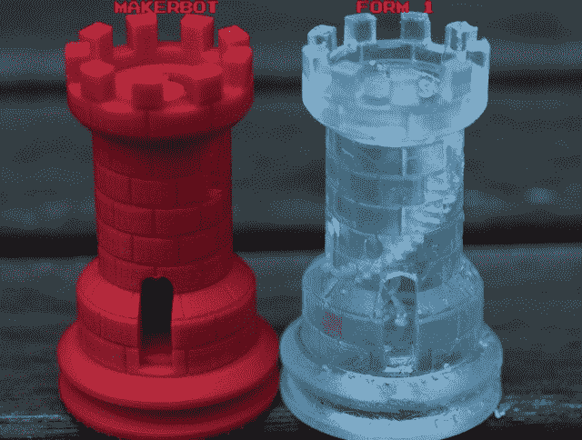

# 回到 Form labs Form 1+TechCrunch 的神奇之处

> 原文：<https://web.archive.org/web/https://techcrunch.com/2014/10/02/back-to-the-magic-with-the-form-labs-form-1/>

我最喜欢的 3D 打印机之一是 Formlabs [Form 1](https://web.archive.org/web/20230315182957/https://techcrunch.com/2013/06/17/living-in-the-future-with-the-form-labs-form-1/) 。Formlabs 的人们使用家庭打印中的一种独特技术，即立体平版印刷术，创造了一种可用、有趣、功能惊人的家用 3D 打印机，可以产生专业质量的照片。现在打印机变得更好了。

首先，我对我最初的[一年级复习](https://web.archive.org/web/20230315182957/https://techcrunch.com/2013/06/17/living-in-the-future-with-the-form-labs-form-1/)做了一点解释。3299 美元的 Form 1+是一种立体平版印刷机，而不是熔融沉积成型(FDM)机，这是一个重要的区别。我们可能都熟悉 Makerbot 这样的机器。这些机器使用 FDM 挤压金属或塑料的小珠，反复“绘制”你正在构建的形状的一部分，直到对象被构建。

形式 1+通过一层树脂将激光照射到金属表面。使用光聚合过程，切片一个接一个地被放下，产生一个固体物体，当它被构建时从树脂中升起。把 Makerbot 想象成一个石笋制造器——材料被放在一个平台上——而 Form 1 是一个钟乳石制造器，物体悬挂在平台上，慢慢向上移动。

因为我们稍后使用激光来“绘制”每一个，所以细节可以精细到 300 微米，层可以薄到 25 微米。Makerbot 最大尺寸为 100 微米。在实际质量中，这意味着 Form 1+对象非常平滑，就像注塑成型的对象一样。FDM 的物品是用小线条排列成的，每一层都是平的。虽然这两种方法都非常适合原型制作，但 Form 1+对于顺利制模和获得更精细、更详细的最终产品来说稍好一些。就当是劳斯莱斯对道奇蝰蛇。这两者都可以让你达到目的，但 Formlabs 专注于质量，而 FDM 打印机专注于毒蛇般的速度。

这个新的模型被称为 Form 1+，看起来几乎和原来的 Form 1 一模一样。它是一个拉丝金属美人，一件放在桌子上看起来很棒的艺术品，机械完全隐藏在底壳内部。一个橙色的罩盖着一个树脂托盘和一个构建板，机器很安静(不是无声的)，占地约一平方英尺。这看起来就像 3D 打印机应该有的样子，也就是说非常像《星际迷航》中的东西。

表现如何？你会记得，最初的 Form 1 花了大约四个小时打印一个测试模型，一个风格化的车，有一个空心和巧妙的旋转楼梯。新型号可以在大约两个小时内打印出同样的东西，这是一个相当大的差别。

质量的提高也让我印象深刻。由于改进的激光和镜子系统，印刷品具有更精细的细节和更好的完整性。他们提供的新测试模型 Twisted Rook 提供了一些令人惊叹的小细节，包括顶部凸起的文字和巧妙的纹理技巧。而且，像最初的 Form 1 一样，印刷件看起来——也确实是——完全实心的。下面你可以看到表格 1 上的原始车印(紧挨着 Makerbot 印)，接下来你可以看到表格 1+上扭曲的车印。

同样改进的还有 Formlabs 的软件 PreForm 所使用的支持系统。该软件现在使用少得多的材料来生产必要的支柱和支撑，与模型的接触点也小得多。虽然我不得不切断表格 1 打印的支持，但表格 1+支持只是突然断开。

现在是坏消息。Formlabs 使用的树脂——有透明、黑色和灰色三种——是一种脏兮兮的东西。打印的物体从一个像沼泽一样的树脂盆中升起，当你用刮刀将它从底部拉出来时，它通常会被树脂覆盖。这意味着在处理未固化的模型时，你应该一直戴着手套。然后，在酒精中浸泡物品 10w 分钟后，你必须把它拿出来进行另一次酒精浸泡。这绝对不是一台适合小学生的打印机，对于不小心的用户来说，事情会变得很快变得一团糟。

[gallery ids="1065382，1065381，1065379"]

简而言之，这是 SLA 的主要问题。这是一项了不起的技术，但仍然很混乱。FDM 是一个简单的过程——打印、完成、庆祝——而 Form 1+增加了几个步骤。这绝不是一个交易破坏者，只是一个考虑。例如，您可能想要一个单独、清晰的工作台来管理您的 SLA 打印件，而 FDM 机器只需要它们所在的空间。

打印机也需要轻触。由于 SLA 印刷的独特性质，你会发现有时印刷应该斜着进行，用支架支撑，而其他时候则直接在构建板上进行。新软件减少了许多这样的问题，但是由于打印过程中的小故障而导致长时间打印失败可能会令人沮丧。

我用这台设备进行了一些打印测试，包括一个困难的“孔和钉”测试，结果一塌糊涂。然而，我不能责怪打印机，因为稍加调整，我肯定它们会工作的。在着手印刷之前要意识到这一点，你会没事的。

[gallery ids="1065384，1065383，1065385"]

这是给谁的？它是为那些想制造一个没有太多麻烦的有凝聚力的塑料零件的设计师和工程师准备的。这不是一台大幅面打印机——它的尺寸约为 4.9×4.9×6.5 英寸——但它做出的东西令人惊叹。

尽管我在解决 SLA 方面存在一些问题，但是，如果你想从 FDM 转学，1+是一个不错的选择。质量无与伦比，打印时间大大提高。这是设计师的梦想机器，一种可以以全分辨率和惊人的细节制作物体的设备。售价 3299 美元，非常昂贵。这不是业余爱好者的打印机。此外，由于树脂不能用于失蜡铸造，因此原型制作之外的用途有限。然而，如果你想要一个完美的产品，完美的印刷，这就是要走的路。