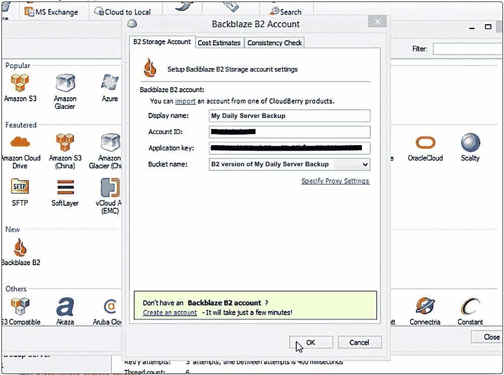

# Backblaze 推出测试版低成本云存储服务 

> 原文：<https://web.archive.org/web/https://techcrunch.com/2016/06/28/backblaze-launches-its-low-cost-cloud-storage-service-and-s3-competitor-out-of-beta/>

Backblaze 仍然以其备份服务而闻名，但该公司也将目光投向了快速增长的云存储市场。虽然在涉及其新生云平台的整体功能集时，该公司无法与亚马逊、微软和谷歌等公司竞争，但 Backblaze 在去年 9 月首次宣布其 B2 云存储服务时，决定大幅降低竞争对手的价格。

今天，B2 从测试版出来，准备投入生产使用。包括 Synology、Cloudberry、OpenIO 和 Cubix 在内的许多合作伙伴今天也宣布，他们现在将为客户提供 B2 作为存储选项。

【T2

Backblaze 表示，自去年私人 alpha 发布以来，已有超过 15，000 名用户注册了这项服务。总共存储了超过 1.25 亿个文件，价值 525TB 的数据。B2 允许用户上传最大 10TB 的文件。鉴于 Backblaze 的统计数据，很少有用户接受该公司的这一提议，但这仍然是亚马逊 S3 服务所允许的两倍。

Backblaze 从其备份服务中学到了很多关于运行高效存储操作的知识，该服务为个人用户提供每月 5 美元的无限制备份。该公司目前正在使用其存储服务器的第六个主要版本，这也是 B2 服务的基础。B2 服务现在也得到了 99.9% SLA 的支持。

Backblaze 存储服务的其他功能包括让该公司通过联邦快递向你发送 USB 硬盘或闪存驱动器上的文件快照(取决于你需要移动的数据量)。最大 110GB 的快照起价为 99 美元，最大 3.5TB 的快照起价为 189 美元

当然，B2 的主要区别在于它的价格。Backblaze 每月收取 0.005 美元/GB 的存储费用，前 10GB/月免费。下载费用为 0.05 美元/GB，第一个 1GB/天免费。

Backblaze 首席执行官 Gleb Budman 告诉我，该公司在测试期间看到了各种各样的使用案例，用户从想要关闭自己的数据中心的大型企业到只想存储少量文件的个人用户。企业特别感兴趣的一个领域是用 B2 取代其长期存储基础架构(通常使用磁带存储)。

Budman 还指出，Backblaze 希望很快开设第二个数据中心，该公司预计在今年年底左右开设第三个数据中心。不过，他确实指出，尽管其竞争对手如今提供了更多的数据中心位置，但大多数用户通常只使用一个。“将数据存储在至少两个区域会使您的成本翻倍。例如，在西海岸和南美洲的 S3 地区存储数据将花费 0.07 美元/GB……比 B2 贵 1500%，”他说。他认为，对于许多 AWS 用户来说，提供冗余存储的最便宜的选择可能是将他们的数据保存在一个 S3 地区和 B2(但他会这么说，不是吗？).