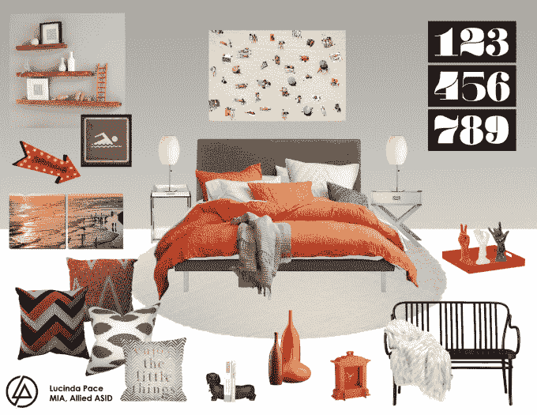

# 在 550 万美元的支持下，Laurel & Wolf 将室内设计带入数字时代 

> 原文：<https://web.archive.org/web/https://techcrunch.com/2015/02/11/backed-by-5-5-million-laurel-wolf-brings-interior-design-into-the-digital-age/>

一家将室内设计行业带入网络时代的公司， [Laurel & Wolf，](https://web.archive.org/web/20221205194225/https://www.laurelandwolf.com/)现在已经为其基于网络的平台筹集了 440 万美元的首轮融资，该平台将专业设计师与客户联系起来，允许他们为住宅和商业空间创造个性化的设计。虽然 Laurel & Wolf 自 2014 年春末才开始运营，但它已经为数千名客户提供了服务，这些客户只需支付少量固定费用，就可以从该公司数百个设计合作伙伴那里获得高质量的设计服务。

新的投资由查尔斯·里弗风险投资公司牵头；Laurel & Wolf 总共筹集了 550 万美元，其中还包括来自 Karlin Ventures、Upside Partnership 和 Draper & Associates 的投资。

Laurel & Wolf 的想法来自洛杉矶的资深专业设计师 Leura Fine。她看到，由于 Pinterest 和 Instagram 等网站上分享的灵感板和图像，以及许多电子商务网站的增长和流行，购物者可以以实惠的价格获得优秀的设计，设计正在发生巨大的变化。

但是没有改变的是室内设计行业本身。

她认识的设计师们仍然经常在努力挣工资和找工作，而他们的潜在客户要么担心设计服务的成本(如果钱是一个因素的话)，要么担心诸如雇佣谁和信任谁之类的事情(如果资金不是问题的话)。

[gallery ids="1118012，1118014，1118013"]

“98%的人负担不起(室内设计服务)，因为它的传统定价方式。或者，如果他们能负担得起，他们会对此感到恐惧，”费恩解释道。“围绕着它的运作方式存在着所有这些问题，因为这是一个非常不透明的行业。所以，这是我在自己的行业中看到需求后真正发展出来的东西，”她说。

有了 Laurel & Wolf，获得设计帮助的过程就简化了。客户支付 299 美元的固定费用，作为回报，他们会收到大约 6 块来自专业设计师的数字风格板，这些设计师会为你的家或办公室创造个性化的外观。这些展板基于您提前提供的服务信息，包括参加风格测验、分享您的空间照片，以及标记您希望在最终设计中保留的项目。

在浏览了设计师提供的 2D 数码风格板后，客户选择他们最喜欢的，然后直接与设计师合作进行修改。使用在线工具，您可以对设计进行评论和注释，提供您喜欢和不喜欢的反馈，或者询问不同的颜色选项，等等。

最终的结果是一个购物清单，帮助你把你的家打扮成图片中的样子，而且它也符合你的预算。这意味着你可以比在当地零售商那里购买包房更节省预算，因为你可以混搭不同商店的商品以获得最佳交易。

“我们绝对是在为真实的人服务，”费恩说，他指出平均单间预算在 5500 美元左右。然而，她补充说，他们也在与更昂贵的设计合作，包括 Airbnb 业主希望升级他们的空间，以便每晚收取更多费用的设计，以及更大的 7000-8000 平方英尺的住宅，甚至 10000 多平方英尺的创业办公室。

【YouTube https://www.youtube.com/watch?v=rRikeviHG80]

Laurel & Wolf 通过保留 20%的平面设计费以及在线销售的附属收入来创收——大多数客户从电子商务零售商而不是当地商店购买他们的清单。今年夏天，该公司还计划推出一个项目，利用其不断增长的足迹为其销售的产品提供折扣，然后给设计师一部分销售额。

此外，该公司还计划通过与第三方信贷提供商的整合引入自己的融资选项，升级其在线设计工具，使其更具互动性，并推出一款原生的移动应用。

[gallery ids="1118021，1118020，1118023"]

初创公司的机会似乎也与电子商务的整体增长密切相关。Laurel & Wolf 已经与至少一家在线商店达成协议，将在其网站上被列为推荐设计服务提供商。

Laurel & Wolf 现在在洛杉矶有一个 20 人的团队，其中包括联合创始人 Brandon Kleinman，Laurel & Wolf 已经为数千名客户提供了服务，并有一个 650 名设计师的团队，他们与该公司在美国和加拿大的客户合作。