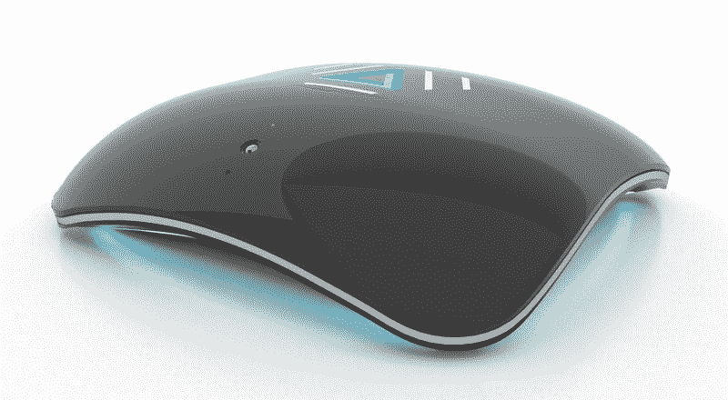
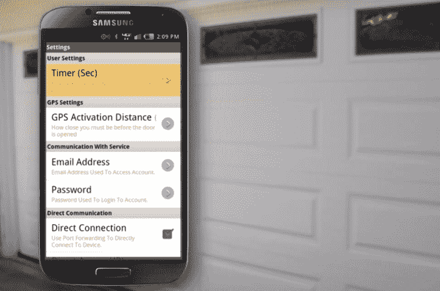
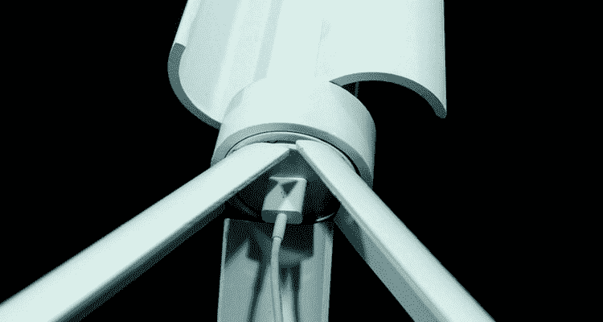

# 众筹的小工具可以和你的家对话，用风力给你的手机充电 

> 原文：<https://web.archive.org/web/https://techcrunch.com/2014/04/19/backerjack-talk-to-your-home-247-garage-door-access-and-wind-powered-charging/>

**编者按:** *[罗斯·鲁宾](https://web.archive.org/web/20221207212139/http://rossrubin/)是科技、媒体和电信咨询公司 [Reticle Research](https://web.archive.org/web/20221207212139/http://www.reticleresearch.com/) 的首席分析师，也是 [Backerjack](https://web.archive.org/web/20221207212139/http://backerjack.com/) 的创始人。他在[techs press](https://web.archive.org/web/20221207212139/http://techspressive.com/)写博客。每周，Backerjack *都会分享三款寻求融资的科技相关产品。**

**与你的家交谈，让它倾听并以 ALYT 回应**

智能家居梦想的一部分一直是能够与居住地对话，并信任它控制气候、安全和感知问题。当然，自从智能家居技术开发以来，它一直在朝着这个目标前进，但从未实现过。

ALYT 是一个 Android 驱动的中心，看起来像是这些问题的解决方案。ALYT 是一个开放平台，可以在几乎所有可以想象的无线数据形式上运行，允许语音和视频识别控制家庭的几乎任何方面——只要开发人员为其创建一个应用程序。ALYT 系统兼容 iOS、Android、蓝牙、NFC、Z-Wave、3.5G 等，其灵活性为各种创新开发打开了大门。

[阅读更多](https://web.archive.org/web/20221207212139/http://www.backerjack.com/talk-to-your-home-and-have-it-listen-and-respond-with-alyt/)

**Open-Me 让你 24 小时随时随地都能打开车库门**

房主经常要问自己关于他们把东西放在哪里的问题。烤箱开着吗？前门锁上了吗？我离开时关了车库门吗？现在，随着一些硬件和一个应用程序的结合，最后一个问题不再是一个问题。

Open-Me 是一种声纳传感器，可以放在车库门上，连接到家庭 Wi-Fi 网络。通过检查应用程序，用户可以确定他们的车库门是否只开了一英尺，并远程打开或关闭它。此外，使用 GPS，该应用程序可以调整为在同步的手机或平板电脑位于用户确定的距离内时自动打开，并在设备超出该范围时自动关闭。

[阅读更多](https://web.archive.org/web/20221207212139/http://www.backerjack.com/open-me-gives-you-24-hour-garage-door-access-from-anywhere-in-the-world/)

**三一是一个微型风力涡轮机，为你的小玩意充电**

我们都经历过。我们的手机没电了，我们没有插座。在公共场合，你总是可以选择在星巴克里钓一条，但对于那些外出露营或徒步旅行的人来说，希望不大。

Trinity 是一款便携式风力涡轮机电源系统，可为您的便携式设备充电。迷你涡轮机使用 15W 发电机为集成电池供电，在没有太多风的日子里，也可以通过 microUSB 充电。它有三条腿，可以折叠成三脚架的形状，也可以平放在地上。三一是白色的，身体有 12 英寸长，11 英寸长。

[阅读更多](https://web.archive.org/web/20221207212139/http://www.backerjack.com/trinity-is-a-miniature-wind-turbine-to-keep-your-gadgets-charged/)