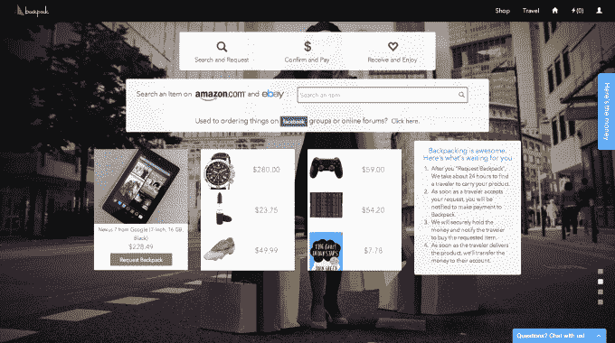
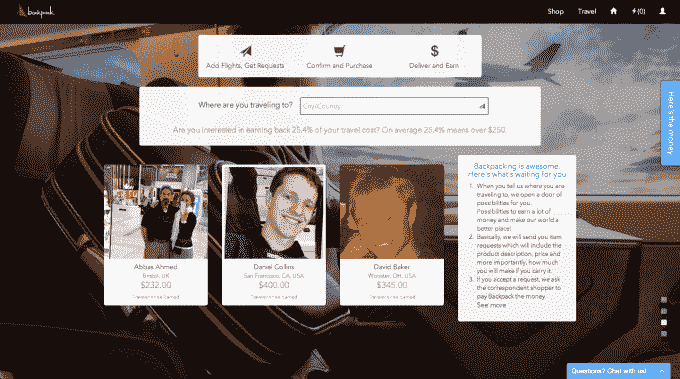

# 背包将您与旅行者联系起来，这样您就可以在其他国家购买物品 

> 原文：<https://web.archive.org/web/https://techcrunch.com/2014/08/13/backpack-connects-you-with-travelers-so-you-can-purchase-items-in-other-countries/>

# 背包将你与旅行者联系起来，这样你就可以在其他国家购买物品

想象一下，如果你需要的某种药物在你的国家买不到，而且运输或购买都很昂贵。许多人依靠前往这些国家的朋友或亲戚带回在他们国家无法购买的物品，无论是 jamon 还是 iPhone。背包将用户与旅行者联系起来，旅行者可以以折扣价带回想要的产品。

[Y Combinator 支持的初创公司 Backpack](https://web.archive.org/web/20221204023959/http://www.crunchbase.com/organization/backpack) ，是一个连接购物者和旅行者的点对点市场，让消费者能够以折扣价购买海外产品。购物者通过向来到他们国家的旅行者支付购买和运送物品的费用来获得外国产品。

Backpack 聚合了你可以通过亚马逊和 Ebay 在网站上搜索的商品，或者你可以手动输入你需要的任何商品的链接和价格。旅行者根据产品的大小和尺寸来赚钱，联合创始人兼首席执行官[法希姆·阿齐兹](https://web.archive.org/web/20221204023959/http://www.crunchbase.com/person/fahim-aziz)说，平均每次旅行，旅行者可以赚到 250 美元，但要交付多个项目。

在网站上，有一个旅游选项和一个购物选项。商店选项让你找到你的产品并申请一个“背包”购物者可以添加商品备注，并指明他们想要的商品来自哪个国家。一旦你的请求进入，旅行者必须审查并确认请求，购物者支付产品成本和旅行者费用，由背包保管。

Backpack 允许购物者通过 Paypal、支票、电汇和本地化的移动支付方式进行支付。

旅行选项允许旅行者共享航班日期和位置。当购物者的请求与旅行者的位置匹配时，旅行者会收到关于产品的通知。旅行者有六个小时的时间来接受或拒绝请求。阿齐兹说，到目前为止，超过三分之二的请求得到了满足，随着更多的旅行者注册，更多的请求将得到满足。

Backpack 自 2 月份开始运营，但其客户群的很大一部分来自孟加拉国，但它正在慢慢渗透到中国。在上线的第一周内，该网站收到了来自 86 个国家的 70，000 次点击，并且每周增长 15%。

该公司正在接受前谷歌员工纳什·伊斯拉姆(T2)的建议，当旅行者确实去购物者的国家旅行时，该公司已经为其他国家提供了某些交易，但他们希望很快扩展到中国、南美和欧洲。

阿齐兹说，如果主人出了什么事，Backpack 会照顾他们，但该公司尚未实施保险政策，正在考虑各种选择。

阿齐兹说:“有些人可能会把它当成送货服务，但我认为它远不止于此。”“我认为它非常强大。”

一旦 Backpack 在更多的市场开放，并有大量的旅行者追随，这项服务对于那些在自己国家买不到东西的人来说似乎是一个简单而又非常有用的工具。