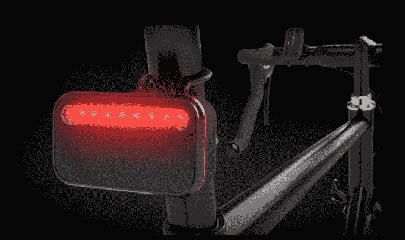

# 回溯帮助骑车人避免被追尾 

> 原文：<https://web.archive.org/web/https://techcrunch.com/2014/07/01/backtracker-helps-bikers-keep-from-being-rear-ended/>

# 回溯帮助骑自行车的人避免被追尾

iKubu 发明了一种东西，可能会拯救一个骑车人的生命。这种被称为[回溯器](https://web.archive.org/web/20221208073124/http://www.backtracker.io/#/the-device)的设备会通知你后面的汽车接近的速度和距离，并通过闪烁灯光做出反应，告诉驾驶者他们即将被撞。

创始人将它描述为一个给乘客和司机的通知系统。弗朗茨·斯特鲁威格说:“它能显示后方接近车辆的速度和距离，并通过越来越频繁的光脉冲提醒驾驶者注意你的位置。”该系统包括自行车的雷达传感器和骑车人的通知器。从后面接近的汽车由缓慢移动的白色灯发出信号，而快速移动的汽车由紧急闪烁灯发出信号。

这个团队位于南非的斯泰伦博斯，从事计算机视觉系统的研究已经有一段时间了。这是他们的第一款自行车产品。他们似乎一切都做得很好，看看他们在 [Dragon Innovation 的平台](https://web.archive.org/web/20221208073124/http://www.dragoninnovation.com/projects/41-backtracker-by-ikubu)上表现如何将会很有趣。

该团队正在寻找 226，000 美元来完成建造，并将于 12 月发货。早期购买者将支付 149 美元，而实际产品将花费 199 美元。鉴于我还没有在市场上看到这些，它可能会受到欢迎。

[维梅奥·https://vimeo.com/98659159]