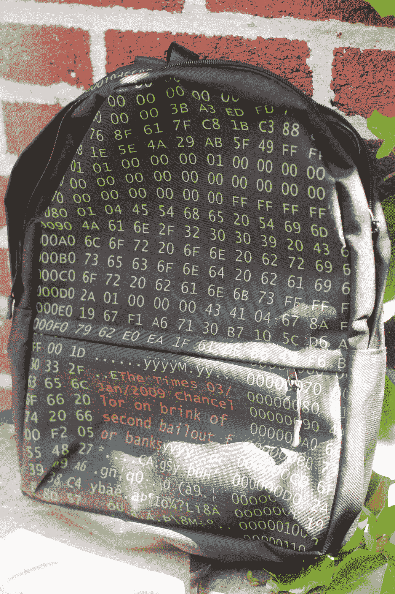

# 2018 年包包周:比特币 Genesis Block 背包将集中你的物品 

> 原文：<https://web.archive.org/web/https://techcrunch.com/2018/06/19/bag-week-2018-the-bitcoin-genesis-block-backpack-will-centralize-your-belongings/>

# 2018 年包包周:比特币 Genesis Block 背包将集中你的物品

*欢迎来到 2018 包袋周。每年，你在 TechCrunch 的忠实朋友都会花整整一周的时间来看包包。为什么？因为包——经常被忽视，但装满了我们重要的电子产品——是我们技术风格的外在表现，我们很少考虑在哪里保存我们最珍贵的财产。*

很难向人们展示你爱区块链。没有酷酷的帽子，没有炫酷的 t 恤，也没有外在的标志——除了一个自由主义者的爱好和挂在你卧室墙上的一张衣着暴露的维塔利克·布特林的海报——告诉世界你喜欢去中心化的货币体系。当然，直到[的比特币创世纪方块背包](https://web.archive.org/web/20221210052752/https://bitcoinshirt.co/shop/backpacks/bitcoin-genesis-block-backpack/)。

不像区块链，这个背包会把你的东西集中在一个相当大、相当标准的背包里。背包本身没有什么独特之处——它是由 100%聚酯纤维制成的固体物品，包括符合人体工程学设计的肩带和一个秘密口袋——但它印有比特币起源块，包括一个关于英国银行救助的标题。简而言之，就是 Merkle tree-riffic。

绿色和橙色的文字看起来有点矩阵 y，但整个事情非常有趣，绝对是一个对话的开始。同样，我怀疑这只会持续几趟马耳他或卢森堡之旅，但这是一个让比特币巨鲸知道你的 ICO 意味着商业的好方法。

这个袋子来自于[bitcoinshir](https://web.archive.org/web/20221210052752/https://bitcoinshirt.co/)，这是一家制造和销售比特币相关产品并接受多种加密货币的公司。虽然这款背包的结构完整性无法承受 51%的攻击，但它是一种有趣而廉价的方式，可以向世界展示你是中本聪的支持者。

因此，当我们一头扎进一个加密的未来时，不要害怕，时尚意识强的智能合同爱好者:比特币创世纪块背包在这里向世界展示你很好，真的很好。去月球！

