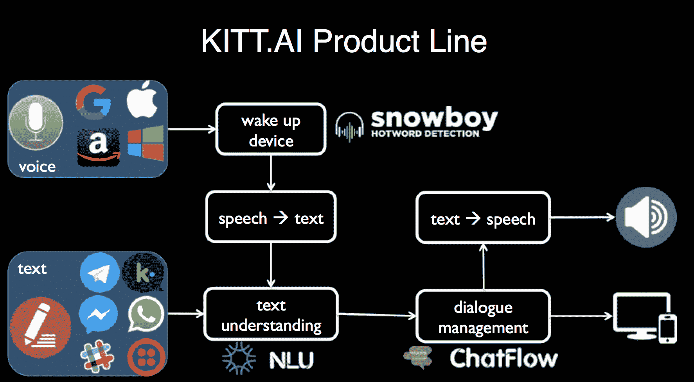

# 百度收购自然语言初创公司 Kitt.ai，它是聊天机器人引擎 ChatFlow  的制造商

> 原文：<https://web.archive.org/web/https://techcrunch.com/2017/07/05/baidu-acquires-natural-language-startup-kitt-ai-maker-of-chatbot-engine-chatflow/>

中国搜索巨头百度又进行了一次收购，以继续推进人工智能，特别是帮助它为自己开辟一个平台，为那些想创建聊天机器人和其他基于自然语言技术的服务的开发者提供平台。

百度已经收购了 [Kitt.ai](https://web.archive.org/web/20230312234756/http://kitt.ai/) ，这是一家总部位于西雅图的盈利创业公司，开发了一个框架来构建和支持跨多个平台和设备的聊天机器人和基于语音的应用程序(可能是以[这个 Kitt](https://web.archive.org/web/20230312234756/https://en.wikipedia.org/wiki/KITT) 命名的)。

百度已经直接向我们确认了这笔交易。这也是在北京百度开发者大会的舞台上宣布的[，在 Kitt.ai 的](https://web.archive.org/web/20230312234756/https://www.myfixguide.com/baidu-announces-to-wholly-owned-acquisition-in-kitt-ai/)[博客文章](https://web.archive.org/web/20230312234756/https://blog.kitt.ai/2017/07/05/kitt-ai-joins-baidu/)中得到证实，并且还通过百度在微博上的[短消息公之于众。百度发言人表示，交易的财务条款尚未披露。](https://web.archive.org/web/20230312234756/https://m.weibo.cn/status/4126102823555490)

Kitt.ai 自 2014 年以来一直存在，但似乎它只披露了一轮[种子融资](https://web.archive.org/web/20230312234756/https://www.crunchbase.com/organization/kitt-ai#/entity)作为一家初创公司，规模不详。它的支持者是亚马逊的 Alexa 基金和总部位于西雅图的 Founders Co-op。

重要的是，该公司正在发展壮大。它在四大洲都有付费用户，“我们是盈利的，”联合创始人陈旭·姚在博客中写道。Kitt.ai 的技术为智能手机、扬声器、电器、网络聊天、汽车、家庭、会议室、办公室、医院甚至电话线的应用提供了动力姚和他的另外两位联合创始人佐贺健二和陈有着不同的学术背景，分别在约翰霍普金斯大学和卡耐基梅隆大学。

该公司已经发布了三款产品，所有产品都将像以前一样继续运营: [Snowboy](https://web.archive.org/web/20230312234756/https://snowboy.kitt.ai/) (“可定制的热门词汇检测引擎”)、 [NLU](https://web.archive.org/web/20230312234756/https://nlu.kitt.ai/) (“多语言自然语言理解引擎”)和 [ChatFlow](https://web.archive.org/web/20230312234756/https://chatflow.kitt.ai/) (我们在这里讨论的多回合对话引擎)，似乎是作为跨平台服务而构建的，提高了其普遍性。

Kitt.ai 的明星随着自然语言应用程序的使用越来越多而崛起，从个人助理和其他基于语音的应用程序，到通过文本操作的聊天机器人，但也依赖计算机和人工智能来“解释”一个人的问题，以便正确回答。

除了盈利和国际化，姚指出 Kitt.ai 现在有超过 12，000 名开发者使用 Snowboy。它没有透露其他应用程序的用户数量，但已经将 ChatFlow 建成了一项付费 B2B 服务。

与美国同行谷歌一样，百度多年来一直在投资建设人工智能专业知识和技术，不仅为自己的服务和计划在移动和计算机等现有平台上的搜索领域采取的任何下一步行动提供支持，还将汽车等全新领域作为其搜索技术的新终端。

在这一领域已经出现了一些挫折，比如今年早些时候吴恩达的离职，他曾创立了谷歌的深度学习部门 Google Brain，并担任百度的首席数据科学家。然而，该公司也一直在招聘一些关键人物，比如来自微软的另一位人工智能专家陆弃；此外，它还进行了其他重大收购，以继续建立自己的专业知识，比如计算机视觉专家 XPerception。

Kitt.ai 是百度第十次披露的收购。