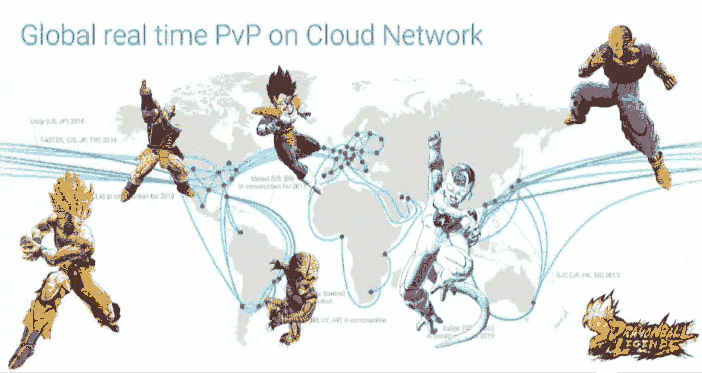

# 万代纳木错押注谷歌云为其新的 PvP 龙珠游戏提供动力

> 原文：<https://web.archive.org/web/https://techcrunch.com/2018/03/20/bandai-namco-bets-on-google-cloud-to-power-its-new-pvp-dragon-ball-game/>

本周，万代纳木错娱乐公司(Bandai Namco Entertainment)宣布了其龙珠游戏系列的最新成员。龙珠传奇是一款玩家对玩家(PvP)手机游戏，来自世界各地的玩家通过使用他们的移动卡实时相互战斗。就我所见，这看起来是一个非常有趣的游戏，尽管我对龙珠一无所知，而且我对卡牌游戏毫无兴趣。然而，让我振作起来的是，当我听说 Bandai Namco 选择使用谷歌的云网络来托管游戏的所有基础设施，并且这个系统的主要组件之一是[云扳手](https://web.archive.org/web/20221007062409/https://cloud.google.com/spanner/)，谷歌的全球分布式数据库。

开发一款实时游戏已经够难了，但是 Bandai Namco 希望来自世界各地的玩家能够互相对战。不过，大多数游戏根据玩家的地理位置将他们分配到不同的地区是有原因的。在实时游戏中，延迟很重要，每个久经考验的 PUBG 玩家都会告诉你，你离游戏服务器越远，延迟可能就越高。

[https://web.archive.org/web/20221007062409if_/https://www.youtube.com/embed/0SAqrLbek1Y?feature=oembed](https://web.archive.org/web/20221007062409if_/https://www.youtube.com/embed/0SAqrLbek1Y?feature=oembed)

视频

正如 Bandai Namco 的 Keigo Ikeda 和 Toshitaka Tachibana 在发布前告诉我的那样，该团队选择将每个游戏秒分成 250 毫秒的间隔，因此尽管这款游戏对用户来说看起来是实时的，但它实际上是一款真正快速的回合制游戏。“从技术上来说，在用户看来，这是实时的，但在服务器上，玩家有自己的机会，”Tachibana 说。通过选择谷歌云平台和云扳手作为数据库来跟踪所有移动，团队在测试中看到的平均延迟是 138 毫秒，这允许有足够的回旋空间。

为了完成所有这些工作，该团队花了将近两年半的时间来构建必要的基础设施，Tachibana 承认，该团队对网络延迟的了解比预期的要多得多。例如，在早期测试中，该团队希望创建一个点对点连接，让玩家相互战斗，但根据运营商的不同，用户体验的差异太大了。该团队还必须学习如何在玩家之间最佳地路由流量，这是大多数游戏开发人员在大多数时候都不必考虑的事情。“我们对每个不是谷歌的人都很失望，”Tachibana 说。

事实上， [Cloud Spanner](https://web.archive.org/web/20221007062409/https://cloudplatform.googleblog.com/2017/02/introducing-Cloud-Spanner-a-global-database-service-for-mission-critical-applications.html) 是这里的核心服务，该团队表示选择它是因为它提供了一个全球分布的强一致性数据库。因为任何变化都会在几毫秒内通过全球网络传播，所以对于需要低延迟和可以在全球玩家群之间分发的真实情况的游戏开发者来说，云扳手实际上是一个非常有趣的选择。Cloud Spanner 并不是一项便宜的服务，尽管该团队承认，正如谷歌云解决方案主管 Miles Ward 指出的那样，提供这项服务也不便宜。“Spanner 从一致性的角度做事情，这是你无法从其他任何人那里得到的，所以这也是我们必须花更多钱的地方，”他说(在我的微软朋友给我发邮件之前:是的， [Cosmos DB](https://web.archive.org/web/20221007062409/https://techcrunch.com/2017/05/10/with-cosmos-db-microsoft-wants-to-build-one-database-to-rule-them-all/) 也提供了可与 Cloud Spanner 媲美的功能，以及更广泛的一致性选项)。

Bandai Namco 团队还指出，谷歌庞大的私人网络是其决定背后的另一个主要因素。因为谷歌拥有自己的网络，数据可以在更少的网络之间跳跃，到达中央数据库和对手。

为了让龙珠传奇顺利运行，该团队还使用 BigQuery 来管理和分析其数据，以及该公司的一些 [Firebase 服务](https://web.archive.org/web/20221007062409/https://firebase.google.com/)。

Tachibana 指出，Bandai Namco 在这款新游戏上下了很大的赌注，但该团队也希望为全球分布式 PvP 游戏建立一个基准。“我们希望当其他开发商看到类似的游戏时，他们会说很难超越，”他说。“此外，从技术角度来看，我们知道行业内的人会理解实现整个过程是多么令人惊叹。”

如果你不是一个开发者，只是想玩一个新的 PvP 龙珠游戏，恐怕你得再等一会儿了。这款游戏将于今年晚些时候登陆苹果应用商店和谷歌 Play 商店。

[gallery ids="1609661，1609662，1609663，1609664，1609665，1609666，1609667，1609668，1609669"]