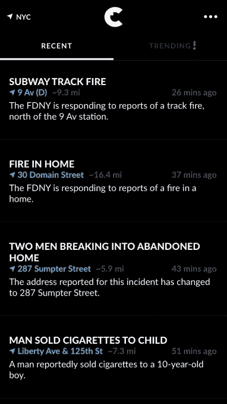
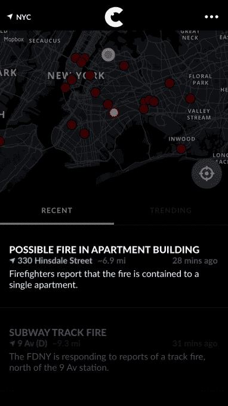
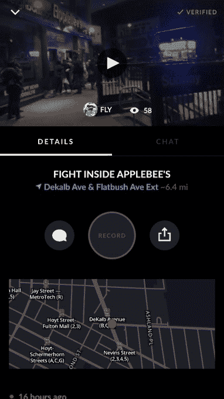
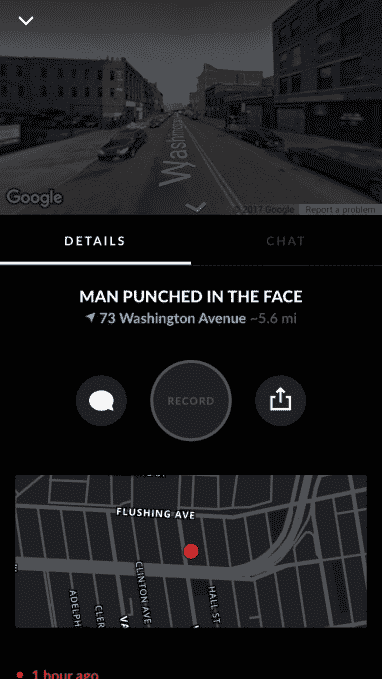
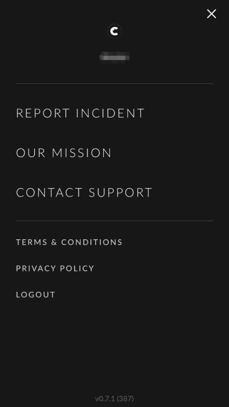
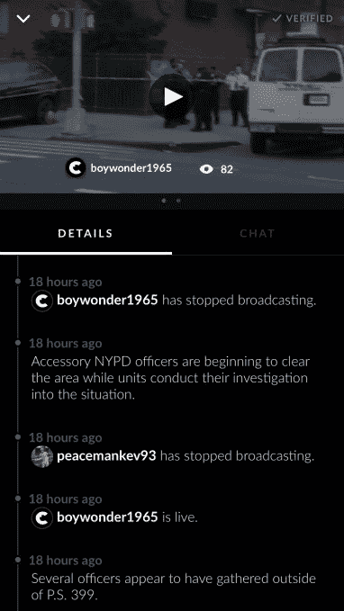
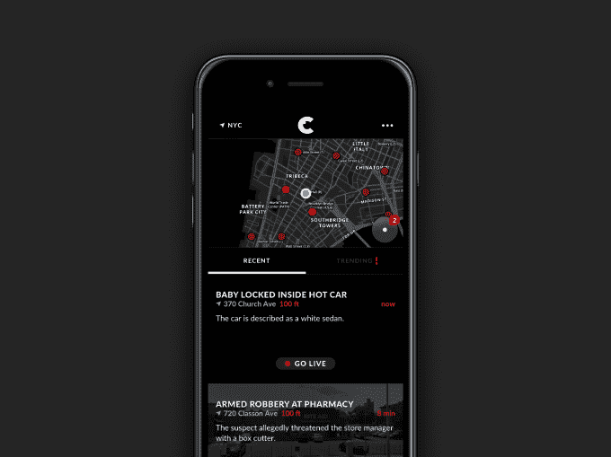

# 被禁的犯罪报告应用 Vigilante 作为公民回归，称其“报告事件”功能将被取消

> 原文：<https://web.archive.org/web/https://techcrunch.com/2017/03/10/banned-crime-reporting-app-vigilante-returns-as-citizen-says-its-report-incident-feature-will-be-pulled/>

记得义务警员吗？备受争议的犯罪报告应用程序在 11 月发布后不久就被踢出了应用程序商店，因为苹果认为它鼓励私人公民参与……*治安维持会*。现在，这款应用以不同的品牌回归。[在纽约运行的新“公民”应用](https://web.archive.org/web/20230225045833/http://www.citizen.com/)，将根据 911 电话向你发送实时犯罪报告，并为用户提供一种直播犯罪的方式，并对其进行评论。

在其发布的博客帖子中，义警应用程序引用了一名前警官的话，他说“普通和普通”公民应该“作为一个群体”来解决犯罪问题。结合该应用程序的名称“义务警员”，似乎存在一种非常真实的危险，人们会将此作为一种方向，将自己置于危险之中，或直接参与犯罪，而无需警察。

新公民应用程序降低了用户直接参与的可能性。相反，Citizen 建议用户直播犯罪和事件，供其他人观看和评论。它还会弹出一个窗口，提供“更强有力的指导”，如该应用程序的描述所述，“永远不要接近犯罪现场，干扰事件，或妨碍警察”。

但目前尚不清楚的是，该应用程序的内容来自精选的 911 电话。

“纽约市每天大约有 10，000 个 911 电话。sp0n 首席执行官安德鲁·弗雷姆说:“我们平均收入 300-400 英镑。(sp0n 是应用的制作者。)

该公司表示，该应用程序只列出那些对“公共安全”构成威胁的电话。

不过，该公司尚未公布其使用的审查标准，称这是一项正在进行的工作。Frame 表示，目前应用程序中不会显示“可疑人员”、“可疑包或行李箱”以及毒品事件的电话。

然而，该应用程序允许用户在地图上以红点的形式查看事件，这可能使它成为一种避免特定区域的工具。这是故意的。

它对犯罪地图的看法与可怕的应用程序[“ghetto tracker”和“SketchFactor](https://web.archive.org/web/20230225045833/http://valleywag.gawker.com/smiling-young-white-people-make-app-for-avoiding-black-1617775138) ”略有不同，后者使用公共数据帮助(白人)避开(非白人)所谓的“危险”社区。然而，Citizen 正在显示向 911 报告的当前事件，并在这些事件发生时通过推送通知提醒您。

这样的话，如果有一场“在苹果蜂的战斗”(是的，这是今天应用程序包含的一个真实事件)，你可以避免马上去那里吃饭。

然而，[The Outline](https://web.archive.org/web/20230225045833/https://theoutline.com/post/1212/crime-video-app-vigilante-relaunches-as-citizen)的一篇文章指出，让用户报告犯罪和事件的功能仍然有效。事实上，今天的应用程序有一个“报告事件”按钮。

Frame 说，并不是所有报道的事件都符合发布到应用程序的条件，而且这个功能很少被使用。但它存在的事实和应用程序的意图都不清楚(*它是否想要用户生成的内容？)*仍是一个问题。

Frame 表示，该应用的下一个版本将取消这个按钮。

“有很多误解。我们需要更好地解释它，”他说。“我们非常谨慎。所以才埋在 app 的另一部分。“如果‘报告事故’是应用程序的核心部分，当你打开它时，会有一个中心感叹号，你会被引诱去按它。”

对于一个局外人来说，在特朗普的美国，人们被鼓励用智能手机报告“选民欺诈”，这似乎是显而易见的，一个让用户能够报告自己对犯罪的解释的应用程序可能会进入一个危险的领域。看看 Nextdoor 发生了什么，在那里[种族偏见变得如此普遍，该产品不得不改头换面](https://web.archive.org/web/20230225045833/http://www.npr.org/sections/alltechconsidered/2016/08/23/490950267/social-network-nextdoor-moves-to-block-racial-profiling-online)来防止它。

“我向你保证，我会删除它，”Frame 谈到用户报告按钮时说，这个功能已经分散了应用程序的核心任务。他认为，这一使命是“减少犯罪，而不是剥削人民”。

但是[大纲还暗示](https://web.archive.org/web/20230225045833/https://theoutline.com/post/1212/crime-video-app-vigilante-relaunches-as-citizen)要求用户直播突发事件也可能导致其他问题。它引用非盈利组织 witness 的项目主管萨姆·格雷戈里(Sam Gregory)的话说，一名关键证人的身份可能会被披露。WITNESS 训练人们如何合乎道德地使用视频来揭露侵犯人权的行为。他还指出,“公民”可能被用来分享“某人被攻击的令人难以置信的羞辱视频”,或者“让某人看起来像是有罪的，而实际上他们可能并没有罪”

Frame 最初对这些问题的回应是，它们只是还没有出现。

在追问细节时，他补充道，“这是一款透明应用。透明消除偏见。透明消除了不安全感和围绕所发生事情的所有误解。透明度的结果，我们无法控制，”他说。

我们还问 Frame 他是否读过戴夫·艾格斯的《[圆圈](https://web.archive.org/web/20230225045833/https://en.wikipedia.org/wiki/The_Circle_(Eggers_novel))他没有。

这本书很快将被拍成电影，书中描述了一家类似谷歌的科技公司，人们一直戴着它的“SeeChange 相机”，包括希望变得“透明”的政客。世界各地的公民也在偷偷安装摄像头。

基本上，它是“1984”的翻版，但“老大哥”变成了众包。

“我们不相信监视无处不在，”Frame 认为。“一旦发生意外，这是你唯一能在这个应用上直播的机会。”

然而，多亏了智能手机，相机在 T2 随处可见。而 Citizen 的前提是，所有威胁公共安全的犯罪都应进行聚合并进行流式处理，后果不堪设想，因为只有这样才能减少犯罪。

不过，可以说减少犯罪的更好途径是通过就业[、更高的工资](https://web.archive.org/web/20230225045833/https://smartech.gatech.edu/bitstream/handle/1853/53294/theeffectsofunemploymentoncimerates.pdf)和[教育](https://web.archive.org/web/20230225045833/https://phys.org/news/2011-12-lowers-crime.html)。

Citizen 得到了 300 万美元种子资金的支持，这些资金来自彼得·泰尔的创始人基金(通过 FF Angel)、Slow Ventures、RRE Ventures、Kapor Capital(通过全美有色人种协进会前任首席执行官本·切热)和其他天使投资者。

> 当技术把好的力量联合起来时，犯罪和腐败还有什么机会呢？
> 
> [公民](https://web.archive.org/web/20230225045833/https://www.facebook.com/CitizenApp/)于 2017 年 3 月 7 日(星期二)发布