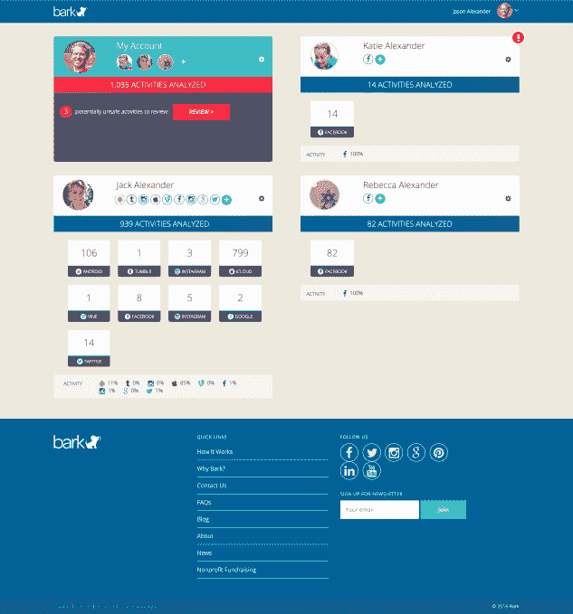
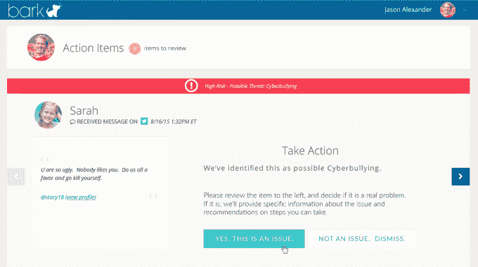

# Bark 帮助父母保护孩子的在线安全，而不会侵犯他们的隐私 

> 原文：<https://web.archive.org/web/http://techcrunch.com/2016/05/10/bark-helps-parents-keep-kids-safe-online-without-invading-their-privacy/>

今天在 TechCrunch Disrupt NY 2016 上发布的是一项名为 [Bark](https://web.archive.org/web/20230130013316/https://www.bark.us/) 的新服务，针对的是希望确保孩子在线安全的父母。与传统的“家长控制”软件或网络保姆式的看门狗应用程序不同，Bark 的目标是在尊重儿童的隐私权和保护他们免受网络掠夺者和网络欺凌之间取得正确的平衡，同时也要注意诸如色情短信或精神健康问题等问题。

树皮的想法来自父母自己的创始团队。

首席执行官 [Brian Bason](https://web.archive.org/web/20230130013316/https://www.crunchbase.com/person/brian-bason) 曾是 YouCast(出售给 SocialChorus)的创始员工，Crowdstream(出售给 RadioIO)的联合创始人，最近是被 Twitter 收购的 Niche 的首席技术官。

Bason 的孩子现在分别是 8 岁和 11 岁，他去年 7 月离开 Twitter，开始从事 Bark 的工作。

“很多社交活动都是通过互联设备进行的。作为父母，这就提出了一个问题，如何让他们在那样的环境中保持安全，但仍然让他们探索和利用技术的力量，”Bason 解释道。

问题是现在还没有很好的解决方案。要么父母不得不安装间谍软件类型的应用程序，记录孩子在网上做的一切，要么他们不得不定期拿起孩子的手机，阅读他们的短信，使用他们的密码登录孩子的账户，基本上要付出巨大的人工努力才能掌握孩子的在线活动和交流。

这个过程对孩子来说也不理想。

Bason 指出:“孩子觉得他们没有隐私，也没有能力脱离父母独立社交。”“这对父母来说很糟糕，因为这非常耗时，”他补充道。

树皮让这个过程变得容易多了。

要使用这项服务，家长们可以在 Bark 网站注册，添加他们的孩子，然后和孩子们一起连接他们的社交账户。这是通过 OAuth 完成的——这意味着你给了软件读取和查看这些账户信息的权限，但你没有给 Bark 无限期地将社交数据存储在自己的服务器上的权限。

在推出时，Bark 支持顶级社交网络和应用程序，包括脸书、Instagram、Twitter、Vine、Flickr、Tumblr、Google+、YouTube 和 GroupMe，以及 Gmail、Hotmail 或雅虎上的电子邮件帐户。此外，与许多家长控制类型的应用程序不同，它还支持 iOS 和 Android 上的短信和彩信。

Bason 解释说，这是 Bark 的“秘方”的一部分，但他说这是通过安装在孩子的 Android 手机上的应用程序以及通过与 iOS 上的 iCloud 的 OAuth 连接来完成的。

一旦设置和配置完毕，Bark 就会使用机器学习技术来寻找危险活动的事件，无论是网络欺凌、色情短信、儿童与可能在挑逗他们的年长陌生人的互动(就像在线掠夺者所做的那样)，还是儿童可能正在经历抑郁症或自杀想法等心理健康问题的信号。

父母可以选择他们想要接收的提醒以及接收的方式——电子邮件和短信提醒都可以。

当 Bark 发现有问题时，它会向家长发送警报，不仅包含相关的对话、发生的时间和地点，还会推荐适当处理问题的方法。

Bark 的顾问委员会包括领先的研究人员和儿童心理学家，以及处理涉及儿童的在线案件的执法专业人员。结合来自 NIH 和其他资源的研究，Bark 努力引导父母在处理这些问题时朝着正确的方向前进。

[gallery ids="1320651，1320652，1320653，1320654"]

该系统也很智能——因为它能够查看对话的上下文，而不仅仅是标记的关键词，它知道什么时候有人开玩笑地说“啊，我讨厌你”(例如，因为孩子刚刚得到了一个新的、很酷的游戏)，什么时候有人真的是这个意思。

自从二月份试运行以来，Bark 已经分析了超过一百万条信息，发现 52%的用户群至少有一个通过软件识别的问题。

还有一点很棒的是，树皮其实是可以买得起的。不管你有几个孩子，它的价格是每月 9 美元，或者每年 99 美元。

Bark 与少数其他解决方案竞争，包括 [VISR](https://web.archive.org/web/20230130013316/https://techcrunch.com/2015/11/03/visr-raises-a-million-for-an-app-that-helps-parents-spot-online-bullying-mental-health-concerns-on-kids-social-media-accounts/) 、[更传统的软件程序](https://web.archive.org/web/20230130013316/http://www.socialschool101.com/7-apps-to-monitor-cyber-bullying/)和网络欺凌专用解决方案，如 [ReThink](https://web.archive.org/web/20230130013316/http://www.rethinkwords.org/) 或 [STOPit](https://web.archive.org/web/20230130013316/http://stopitcyberbully.com/) 。

该公司也是由首席技术官布兰登·希尔克特(Brandon Hilkert)共同创立的，已经从卡琳风险投资公司(Karlin Ventures)和社会启动公司(Social Starts)筹集了 50 多万美元的种子资金。