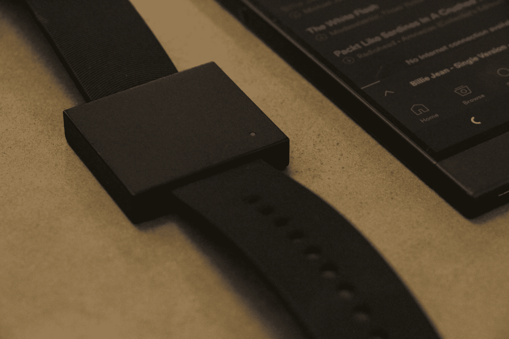
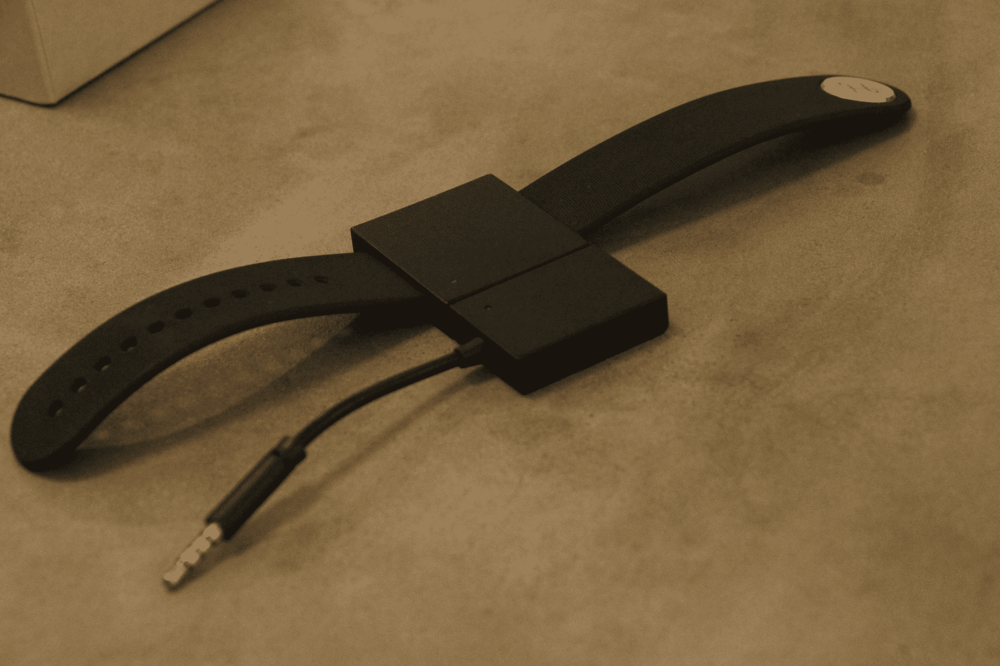
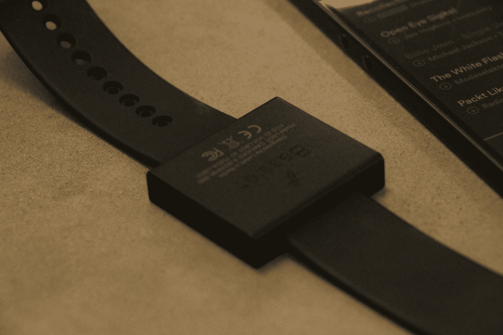

# 手腕不需要低音炮 

> 原文：<https://web.archive.org/web/https://techcrunch.com/2017/02/07/basslet-hands-on/>

有时候最好直截了当地问一家公司，“为什么这是我想要的东西？”这是一个重要的问题——也许是消费电子领域最重要的问题——对于一些公司来说，这个问题似乎变得越来越难以回答。

这是巴斯莱特得到很多的东西。如果你在过去的几年里致力于给这个世界一个腕戴式低音炮，一个小小的黑色可穿戴设备，随着音乐的节奏振动佩戴者的前臂，你也会这样做。Lofelt 是那种你会去见的公司，因为你真的很好奇交易是什么。

答案是沉浸；试图再现现场音乐体验，尽管是在身体的超本地化区域，而不是真正震撼你的真正音乐会。首席执行官丹尼尔·比特纳(Daniel Büttner)告诉 TechCrunch，这个产品的想法是他在演奏竖排贝斯时产生的，竖排贝斯是一个巨大的共鸣空心木块，确实让演奏者感受到了音乐。

我当然还需要被说服，所以我今天早些时候穿上它，唱了一首肯德里克·拉马尔的歌。低音提琴像广告宣传的那样工作。syncinf 运行得很好，它确实使体验更加身临其境。当然，它被限制在一只手臂上，但是人类的身体非常善于欺骗自己去更充分地感受事物。

它的设计也很坚固，触摸起来很好，像一对增加强度的按钮，也可以作为充电端口，这样可穿戴设备和传输加密狗可以一起充电。

这很有趣，也有点令人信服，但我无法想象，对于 Kickstarter 首轮融资之外的大多数用户来说，199 美元有什么吸引力。当然，正如该公司指出的那样，许多音响发烧友愿意为一对扬声器支付一大笔钱，但 Basslet 最终将是一个艰难的销售，因为除此之外还需要几百美元。

我已经用它玩了一会儿了，但我没发现它能进入我正常的听力程序。随着重低音音乐振动手臂的感觉有点疲劳。

实际上，Basslet 感觉更像是一个有趣的第一步，而不是一个成熟的独立产品。这家总部位于柏林的公司致力于制造所谓的“高清触觉”它做得很好，把它缩小成一个紧凑的可穿戴形式，很容易看到它如何能够很好地增加游戏和虚拟现实等需要更多沉浸感的体验——这两者都是该公司积极追求的。

希望 Basslet 能够通过零售分销合作伙伴进入世界市场。这当然值得一试，如果只是为了更好地认识到这项技术在未来可以为谁所用，如果一些游戏合作伙伴想积极开发它的话。

就我个人而言，我只是不认为我的生活中有一个空白需要用一个可穿戴的低音炮来填充。但是如果你被强迫支付 199 美元，你可以从今天开始继续。