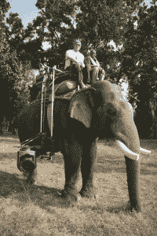

# BBC:然后我们在大象身上绑了一个直升机平台

> 原文：<https://web.archive.org/web/https://techcrunch.com/2016/07/31/bbc-the-hunt-technology/>

想象一下成为英国广播公司自然历史部的一员，环游世界，创作一些世界上最美丽的纪录片。听起来像是梦寐以求的工作，对吧？我和[休·科迪](https://web.archive.org/web/20221025230756/http://www.imdb.com/name/nm2142682/)坐在一起，他是 Beeb 最受欢迎的节目的制作人，了解更多关于这个团队为捕捉动物而部署的技术和设备。

"对不起，先生，您的手提行李必须放入这个行李柜."

“人们总是在开发新设备，”柯迪说，半笑半叹，我想象着他对着堆放在他那毫无疑问堆满了椽子的办公室角落里的一大堆 Peli 箱子挥手，“这对我们来说是完美的。如果你想一想，自从我们开始拍摄自然纪录片以来，野生动物并没有真正改变它们一直在做的事情。相反，我们必须想出新的方式来讲述他们的故事。”

提出创新的东西是他的专长。柯迪最近参与的节目是 [BBC 的狩猎](https://web.archive.org/web/20221025230756/http://www.bbcamerica.com/shows/the-hunt)，该节目目前正在 BBC 美国台播出，其理念是试图捕捉动物如何在野外狩猎。如果你试图拍摄一只蜘蛛把一只苍蝇卷成一个小球，这可能并不复杂，但当你谈论大型动物以每小时 55 英里的速度在大草原上倾斜时，这就完全不同了。

你越野车边上的是电影胶片吗，还是你只是很高兴见到我？

“我们在这个系列中使用的设备中，我最喜欢的是 [Cineflex 陀螺仪支架](https://web.archive.org/web/20221025230756/http://www.cineflex.com/)，”Cordey 说，他指的是通常安装在直升机上的超级稳定、篮球大小、85 磅重的支架。

是的，直升机。如果这听起来有点詹姆斯·邦德，并且你有各种各样的动作序列情感刺激你的蜘蛛感官，看看下面的视频。这是相当史诗。

当然，该团队确实按计划使用了 Cineflex 支架——绑在直升机的一侧——但他们也在其他情况下广泛使用了相机。

你要知道，北极熊是不会拍摄自己的！

“我们能够将摄像机安装在卡车上，在动物狩猎时跟踪它们，”Cordey 说。他解释说，团队确实需要比平时更小心一点；他们绑在卡车上的设备总共花费了大约 50 万美元。

> 所有在 PlayStation 上玩的时间终于有了回报。杰米·麦克弗森

他严肃地补充道；“这是一种追踪野生动物的全新方式；所有的弹跳都被技术从镜头中去除，从头到尾创造了一个流畅的镜头。我们可以以最快的速度追上去，但是如果我们一路上遇到豪猪区，我们就完了。”

以这种方式拍摄也意味着团队能够“真实地”拍摄完整的狩猎，而不是像过去那样做。这……曾经和你想象的差不多。在一些自然纪录片中，你可能会注意到，最后捕捉到的动物看起来略有不同，或者比序列开始时的动物大一点或小一点。当然，这是因为他们拍摄不同的狩猎，通常是在完全不同的日子和不同的地点。

因为你为什么不为世界上最大的陆地动物安装一个为直升机设计的稳定支架呢？

一项创新是建造一个支架，使团队能够从大象身上拍摄。这听起来有点疯狂，但并不完全是“因为我们可以”——事实证明这是拍摄老虎的完美方式，因为与无人机、直升机和有趣的摄影师不同，老虎基本上无视大象。

https://www.youtube.com/watch?v=AvlmnQ1wHts

在上面的视频中，这个团队解释了他们是如何想出创造一个大象架相机的想法的。

“能够在狩猎过程中连续拍摄对我们来说是一个彻底的改变，”Cordey 承认，他的声音中不只是有一点点敬畏。我可以说，这是非常令人兴奋的，即使对于一个有 20 年自然纪录片经验的人来说。

“我们有一个了不起的摄影师，[杰米·麦克弗森](https://web.archive.org/web/20221025230756/http://www.jamiemcpherson.com/Documentary_Cameraman/home.html)。他真的很喜欢所有的技术，一天晚上拍摄结束后，当他指出在他的 PlayStation 上玩的所有时间终于有了回报时，我不得不笑了，”Cordey 说，但更仔细地研究技术可以清楚地看出，他只是在开玩笑。操作 Cineflex 就像玩电子游戏一样。你有一个屏幕和一个遥控器，而不是把相机放在你的肩膀上，这意味着需要稍微不同的技能来操作新的工具包。

就像玩游戏机一样……如果你的游戏机值 50 万美元。

## 带上无人机

新技术是该系列的一个关键方面，使讲故事的全新方面成为可能。

> 当无人机靠近时，大象会立即跑一英里。休·科迪

“我爱无人机；我们一直在使用它们，”Cordey 解释道，并指出松下 GH4 是最受欢迎的。它很轻，但是

[the quality is good enough for use in broadcast](https://web.archive.org/web/20221025230756/https://www.dpreview.com/reviews/panasonic-lumix-dmc-gh4/7)

，这意味着它非常适合用无人机发送。

“不过，我们必须非常小心；无人机听起来像一群愤怒的蜜蜂，这吓坏了一些动物，所以我们不能靠得太近，”科里说，并解释说该团队特别使用无人机进行概览拍摄和风景拍摄。"当无人机靠近时，大象会立即跑一英里。"

尽管有缺点，无人机仍然是最受欢迎的，该团队经常携带无人机，在需要时随时发射，而不是拿出一个[吊臂](https://web.archive.org/web/20221025230756/https://en.wikipedia.org/wiki/Jib_(camera))或呼叫一架直升机。

## 消费级设备，广播质量镜头

过去 20 年的另一个大变化是专业消费设备变得有多好。在过去，你需要专门的设备来拍摄高清电视。该团队显然仍然在很多时候使用高端设备，但商用设备使得今天拍摄节目变得更加容易和便宜。

“对于狩猎，我们经常使用[凸轮](https://web.archive.org/web/20221025230756/http://camblock.com/)和[凯斯勒滑块](https://web.archive.org/web/20221025230756/http://www.kesslercrane.com/camera-sliders/)。柯迪说:“对于我们经常用[佳能 5D MK III](https://web.archive.org/web/20221025230756/https://www.dpreview.com/reviews/canon-eos-5d-mark-iii) 相机拍摄的延时镜头和低光镜头，索尼的 [α7S](https://web.archive.org/web/20221025230756/http://www.sony.com/electronics/interchangeable-lens-cameras/ilce-7s) 在夜间有着非凡的能力。“我们也大量使用微型[照像机](https://web.archive.org/web/20221025230756/http://www.ioindustries.com/advancedimaging/products/camera.html)；它们对于拍摄军蚁的延时镜头非常有价值。”

*如果你还没看过索尼的α7s 在弱光下能做什么，可以看看上面的短片，由月光独家拍摄。如果这没有给你留下深刻的印象，也许是时候出去走走了，你已经上网太久了。*

“最终，你不能说 2000 美元的相机与 50000 美元的相机质量相同，但这是理所当然的。如果我们能使用更便宜的相机，那就太好了，”Cordey 解释道。

另一个巨大的优势是相机陷阱的可用性——很像商业上由 [Camptraptions](https://web.archive.org/web/20221025230756/http://www.camtraptions.com/) 提供的相机陷阱，团队已经建立了自己的设备，由一组电池供电。

“能够一次将相机放在外面几个月，这使得我们有可能捕捉到我们否则无法捕捉的场景。对于像豹子这样非常稀有的动物来说，这是最好的方法，”Cordey 说。有道理；将一台价值 50，000 美元的相机和一个非常昂贵的摄影师留在森林中几个月会很快变得非常昂贵，但值得用价值几千美元的设备冒险，以防你捕捉到值得在系列中使用的镜头。

## 技术的巨大飞跃

过去的 20 年见证了技术的巨大飞跃，这位自然历史小组的老成员反思了发生的变化。

> 你不能在大多数动物身上使用白光。休·科迪

“20 年前，你不能在没有灯光和直升机的情况下拍摄，因为直升机需要靠近动物 50 米以内，”Cordey 解释道。这是一个问题:夜间活动的动物怕光，你可以想象如果你漫不经心地放牧，想着自己的事情，突然一个 10，000 磅重的声音、风和恐惧的地狱开始跟着你，会发生什么。
许多最好的新技术都来自商业机构和军事应用。

有了*和*更简单的自拍方式。

“红外线、热感相机和微光技术都来自军方，”Cordey 列举道。“他们财大气粗，拥有世界上所有的时间。在可能的情况下，我们采用他们的做法，并根据人体工程学进行调整，这样我们就可以把它带到我们需要的地方去捕捉动物。”

安全技术也不止一次派上了用场。

“你不能在大多数动物身上使用白光，”Cordey 说。“但在红外拍摄给人一种非常好的感觉。最重要的是，许多野生动物看不到红外光源，所以我们可以尽可能多地拍摄它们。不好的一面是它将会是黑白的。对于一些镜头，我们现在正在考虑使用下一代索尼 A7 在深夜或清晨拍摄。”

## 还有一段路要走

Cineflex？更像 Eleflex。

并不是每个问题都已经完全解决了。照相机设备制造商，如果你正在注意，这里有如何使你的下一代销售。

“每年，无人机都会变得更好，”Cordey 说，但他补充说，他确实有一个改进的愿望清单。“有了直升机，我们可以飞行几个小时。对于无人机来说，我们必须在六到七分钟内将它们带回来，这还不够。我也希望它们更安静，这样我就可以让它们更靠近动物，我也喜欢更好的稳定和变焦镜头。”

BBC 与技术上可行的边缘相抵触的另一项技术是夜间拍摄。许多夜间活动的动物还没有被很好地记录下来，我有一种非常明显的感觉，Huw Cordey 和他的团队很想做一个完整的系列，专门关注那些只在晚上出现的动物。

“给我一架静音无人机上的陀螺稳定长镜头相机，你就中了大奖，”Cordey 笑着说。

如果你想看完整的狩猎，请收听 BBC 美国频道，周日 9/8c。