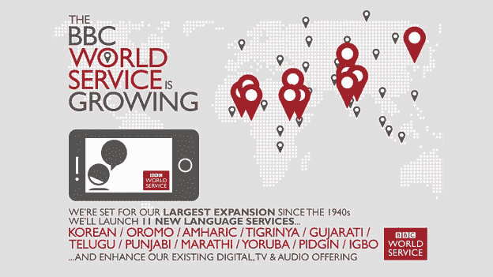

# 英国广播公司正在进行一项重大的全球推广活动，以将其观众人数增加到 5 亿人

> 原文：<https://web.archive.org/web/https://techcrunch.com/2016/11/16/bbc-world-service-500-million/>

# 英国广播公司正在进行一项重大的全球推广活动，以将其观众人数增加到 5 亿

作为到 2022 年受众达到 5 亿的宏伟目标的一部分，英国国家媒体机构 BBC 正在扩大其国际影响力。

这一举措将使英国广播公司的世界服务扩展到 11 种新语言——阿法安奥罗莫语、阿姆哈拉语、古吉拉特语、伊博语、朝鲜语、马拉地语、洋泾浜语、旁遮普语、泰卢固语、提格里尼亚语和约鲁巴语——使其总数达到 40 种。长期计划是为所有这些语言创建视频内容。

除了为新观众本地化现有内容，World Service 还将为许多地区创建定制的新闻、广播和视频节目，包括俄罗斯以及东欧、非洲、中东和韩国的周边地区。这种扩张的一个很好的例子是日本，[英国广播公司去年在日本进行了本地化推广](https://web.archive.org/web/20221208110232/https://beta.techcrunch.com/2015/10/16/bbc-launches-japanese-language-news-site-to-extend-its-global-advertising-reach/)。

英国广播公司还投资于其新闻和公告的数字媒体，如本地化网站，增加社交媒体的存在和合作广播公司的新电视节目。该组织承诺在一些地区雇佣更多记者，目的是创造原创内容，增加分析和报道，“通过解释‘为什么’和‘是什么’来帮助观众了解世界。”

“今天的公告是关于通过投资未来来改变世界服务。我们必须跟随我们的观众，他们以不断变化的方式消费新闻；越来越多的人在电视上观看世界服务，许多服务现在是纯数字的。我们将能够加快我们的数字化转型，特别是对年轻观众，我们将继续投资视频新闻，”BBC 世界服务总监弗朗西丝卡·昂斯沃思在一份声明中说。

BBC 称这是自 20 世纪 40 年代以来最大的一次扩张，是由去年获得的政府财政支持资助的。英国政府承诺在 2016-17 年和 2017-18 年之间每年提供 3400 万英镑(4200 万美元)和 8500 万英镑(1.06 亿美元)，以扩大世界服务的数字、电视和广播覆盖范围。这一资金分配将于 2020 年接受审查。

英国广播公司目前声称覆盖全球近 3.5 亿人，但目标是到 2022 年，即其 100 周年纪念日，覆盖上述 5 亿观众。