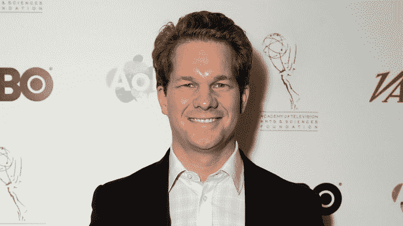
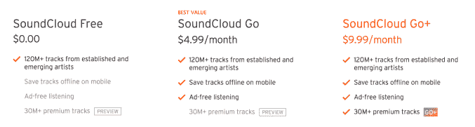
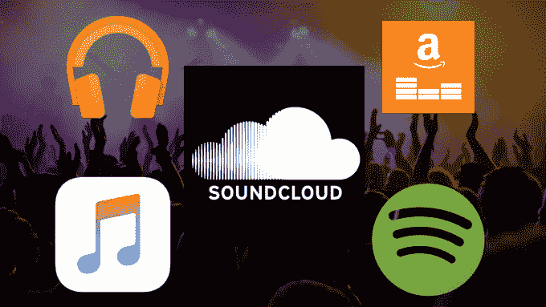

# 要修复 SoundCloud，它必须成为反 Spotify 的 

> 原文：<https://web.archive.org/web/https://techcrunch.com/2017/12/12/be-the-modern-fan-club/>

创业公司死于自杀，而非竞争。这并不是说有人在偷 SoundCloud 的地下说唱歌手、卧室混音师和车库乐队。SoundCloud 跌跌撞撞是因为它忽视了这些铁杆支持者，因为它错误地试图篡夺 Spotify 作为音乐巨星的流媒体家园。

但是四个月前，在[裁掉 40%的员工](https://web.archive.org/web/20221007071408/https://beta.techcrunch.com/2017/07/12/soundshroud/)后，SoundCloud 获得了[1.695 亿美元的生死投资，拯救了公司](https://web.archive.org/web/20221007071408/https://beta.techcrunch.com/2017/08/11/soundcloud-saved/)，并带来了新的首席执行官。现在的问题是，SoundCloud 能否回到最佳状态。我对 SoundCloud 裁员处理不当、方向错误和士气问题发出了警告，所以在批评的同时提出一些建议是很重要的。

SoundCloud 拥有别人没有的东西:世界上最大的用户上传音乐和音频档案——大约 1.2 亿首歌曲。所以这必须是服务的中心。

曾经是这样，但是 SoundCloud 没有加倍投资独立创作者，帮助他们通过广告和商业赚钱，并出售增强的无广告访问的订阅服务，而是浪费了数年时间追逐主要的唱片公司，希望建立一个充满最流行音乐的 Spotify 竞争对手。最终在 2016 年年中，它推出了 9.99 美元的 SoundCloud Go+订阅服务，可以免费获得主流音乐和独立音乐，但这已经落后 Spotify 和 Apple Music 好几年了。

与此同时，这种分心导致了广告规模扩大的进展异常缓慢，无论是在网站上的广告量还是可以获得收入分成的独立艺术家方面。广告并不是 SoundCloud 的主要部分，所以许多用户认为不值得付费来摆脱它们。创作者迷失在 YouTube 和 Patreon 上，投入他们的注意力并驱使他们的观众去赚钱。对创作者已经付费给 SoundCloud 的音乐进行虚假删改，进一步损害了该公司在核心用户中的信誉。

SoundCloud 的新任首席执行官凯瑞·特雷纳(Kerry Trainor)将带领公司前进。我见过他，他比看起来要酷。(托德·威廉姆森/WireImage 摄影)

幸运的是，SoundCloud 现在已经解雇了其前管理团队，用 Vimeo 前首席执行官 Kerry Trainor 取代了 Alex Ljung。这给了 SoundCloud 一个机会，让它与最初让它独一无二的创作者重新调整策略。以下是我们认为它需要做的事情:

## 不要正面对抗 Spotify

SoundCloud 永远不会成为头号流行音乐流媒体平台，它需要接受这一点。它在订阅方面起步太晚，没有 Spotify 作为投资者获得的行业认可，也没有 Spotify 通过收购 Echo Nest 获得的推荐数据，也没有 Apple Music 那样庞大的设备安装基础或战争基金，也没有 YouTube 那样拥有 10 亿用户的庞大广告受众。

因此，SoundCloud 应该从下游入侵，而不是试图直接与大狗竞争。与其向休闲音乐爱好者推销其 10 美元的 SoundCloud Go+订阅，它应该专注于通过其免费层或仅用于用户生成内容的 5 美元 SoundCloud Go 订阅锁定喜欢其独立内容的铁杆听众。然后，它应该向他们推销 10 美元计划，宣传在一个地方听所有音乐的便利，而不是每月支付 10 美元在其他地方听主流音乐。5 美元计划应该是重点，10 美元计划应该是红利。

【2017 年 12 月 14 日更新:SoundCloud 刚刚[重新设计了其主屏幕](https://web.archive.org/web/20221007071408/https://beta.techcrunch.com/2017/12/13/soundcloud-resuscitates-home-screen-with-personalized-playlists/)，以个性化播放列表为特色，可以突出其独特目录中的最佳内容。

## 保护音乐的法律灰色地带

SoundCloud 以牺牲推动其崛起的 DJ 为代价，与各大唱片公司结成伙伴关系。非官方混音和 DJ 台的法律灰色地带是 SoundCloud 不可或缺的原因，但也是它被定罪的原因，有时在标签交易后会被踢出平台。SoundCloud 需要弄清楚如何解决这类内容的版权费用，这样它才能留在平台上。无论这意味着开发自己的权利支付技术，与像杜布斯特这样的支付分配技术提供商合作，还是直接收购它，SoundCloud 都必须是你在其他任何地方都找不到的这些内容的安全之家。否则，SoundCloud 并不特别。

## 成为音乐人粉丝俱乐部平台

众所周知，流媒体音乐平台每次收听只支付一小部分费用。如果你是泰勒·斯威夫特，一年加起来可以有几百万，但通常不足以支撑较小的小众艺术家的生计。但无论规模大小，几乎每个艺人都有一定比例的铁杆粉丝，他们愿意支付远远高于创作者获得的流媒体版税或广告收入分成。

这就是为什么所有类型的艺术家都转向像 Patreon 这样的订阅赞助平台，在那里你不需要数百万粉丝，只需要几千人每月支付一美元。YouTube、Apple Music 甚至 Spotify 都未能深入帮助艺术家进行直接交易。YouTube 正在测试 Patreon 式的赞助，Spotify 在艺术家个人资料上提供一些小商品和音乐会门票选项。

澳大利亚拜伦湾——3 月 27 日:2016 年 3 月 27 日，在澳大利亚拜伦湾举行的 2016 拜伦湾布鲁斯音乐节上，粉丝们对哭泣者乐队现场表演的反应。(图片由马克·梅特卡夫/盖蒂图片社提供)

但 SoundCloud 在这方面有巨大的机会，因为它知道自己的艺术家无法靠版税养活自己，而 SoundCloud 上的听众是严肃的音乐爱好者。SoundCloud 应该为艺术家提供大胆的选择来销售商品和门票，并教他们如何使用数据来创造他们的粉丝想要购买的商品。

这也意味着将艺术家推向新的收入来源，如提供独家体验。帮助艺术家销售电话、见面会、签名纪念品、工作室会议的网络摄像机镜头、独家视频流等。最后，为艺术家提供一个渠道，以比电子邮件和 Twitter 广播更亲密的方式直接与顶级听众交流。

SoundCloud 应该是现代的粉丝俱乐部。在一个你不再“拥有”音乐的时代，该应用的早期潮人观众可能会渴望用他们的钱包，而不仅仅是耳朵，来表达他们对他们最喜欢的艺术家的忠诚。这对每个人都有好处。

让 Spotify 和 Apple Music 成为那些不关心你的超级巨星的非个人化的地方。SoundCloud 可以给听众带来更深刻的体验，给艺术家带来更高的收入，也给拥挤的音乐空间带来利润。凯丽，你打算怎么办？