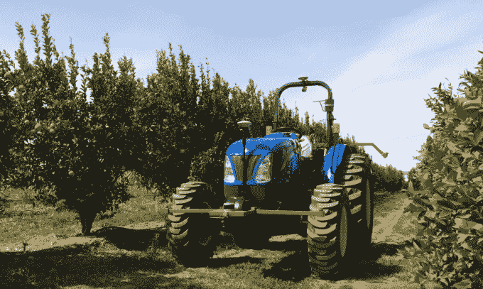

# Bear Flag Robotics 希望出售一款用于农场的自动拖拉机 

> 原文：<https://web.archive.org/web/https://techcrunch.com/2018/03/19/bear-flag-robotics-wants-to-sell-an-autonomous-tractor-for-farms/>

自动驾驶汽车正日益成为硅谷的亮点。但这个机会不仅仅局限于在大都市街道上行驶的汽车，Igino Cafiero 和 Aubrey Donnellan 希望把它带到一个不太明显的地方:果园的中间。

Cafiero 和 Donnellan 正在建造一辆自动驾驶的拖拉机，作为一家名为 [Bear Flag Robotics](https://web.archive.org/web/20221202143552/https://angel.co/bear-flag-robotics/jobs) 的初创公司的一部分。两人认为，找到足够的劳动力在农场工作越来越困难，即使这样，成本也在随着时间的推移不断上升——这导致除了卫星图像和计算机视觉等许多新技术来分析植物的健康状况外，还需要提高实际领域的效率。Bear Flag Robotics 的第一个产品是自动驾驶拖拉机，该公司今年将从 Y Combinator 的冬季班中出来。

“我们参观了一个果园，看到了劳动力问题有多么突出，”唐纳兰说。“他们正在努力填补拖拉机上的座位。我们和加州的其他种植者谈过了。我们一遍又一遍地听到同样的事情:分娩是最大的痛点之一。找优质劳动力真的很难。劳动力正在老化。他们正在离开这个国家，进入其他行业。”

这里面肯定有很多技术挑战，不仅仅是为了创造一辆自动驾驶拖拉机而拥有合适的计算机视觉产品。Donnellan 说，例如，拖拉机必须能够在没有 GPS 信号的情况下运行，因为在果园中运行拖拉机可能意味着带着一吨重的树冠覆盖物行驶，这可能会阻挡信号。她说，沿着果园的小路开车可能会简单一点，但还是有很多需要考虑的。

“我们在这个平台上安装了大量的传感器，”Cafiero 说。“这包括摄像机。当你向前看时，一旦我们实现了驾驶部分的自动化，一旦这项技术问世，就其应用而言，前途无量。当我们在那里时，我们可以使用这些相机，并能够提出建议和现场治疗。”

说到测试，Cafiero 和 Donnellan 只是每周去桑尼维尔的果园几次，看看种植者面临的一些挑战。

虽然寻找劳动力一直是一个挑战，但 Cafiero 承认，当涉及到这些农场的劳动力时，仍然存在无证劳动力的问题。他说，最终，Bear Flag Robotics 的目标是通过消除一些田间所需的更平凡的任务来增加劳动力。Cafiero 还说，有很多来自美国的反向移民，导致劳动力短缺。

“这项工作本身真的很难，”唐纳兰说。“你整天都在野外，有时甚至在恶劣的条件下。我们自动化的任务之一是喷洒，杀菌剂，除草剂，这些人在外面，他们穿着防护服。总的来说，做这些工作对他们的健康没有好处。当你在其他领域找到收入更高的工作时，进入这份工作的机会就少了，而且在建筑(和其他行业)等许多其他行业都有需求，那里工作更轻松，收入更高。”

销售真正的拖拉机也是一个挑战，因为潜在客户会在他们认识的卖家那里购买他们的设备。如果有东西坏了，他们需要有人尽快亲自过来修理，否则会有损失产量的风险。主要的设备供应商也可能认为有必要开始开发自主工具。Cafiero 希望这家初创公司能够与当地卖家合作，进入这些渠道，这是唯一合乎逻辑的起点。随着时间的推移，可能会有一些扩大规模的目标，但该公司希望现在就从当地经销商开始。