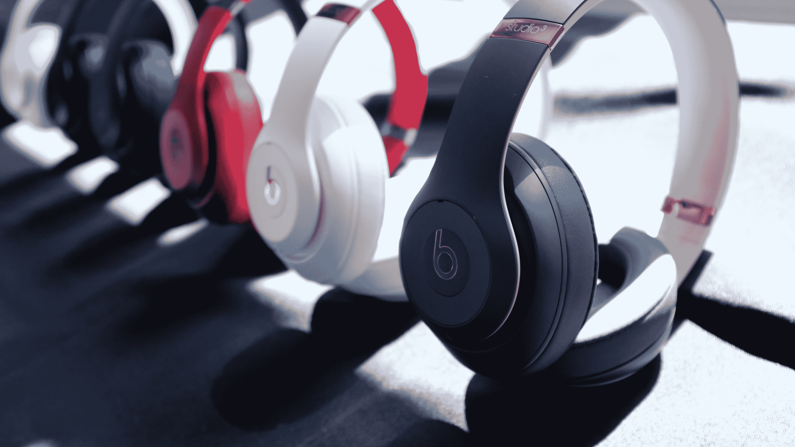

# Beats 为其 Studio 3 耳机带来自适应降噪技术 

> 原文：<https://web.archive.org/web/https://techcrunch.com/2017/09/04/beats-brings-adaptive-noise-cancelling-to-its-studio-3-headphones/>

# Beats 为其 Studio 3 耳机带来了自适应降噪功能

去年的重大 Beats 公告围绕着 W1 芯片的[添加，这是自该公司于 2014 年被苹果收购以来，硬件产品线的第一次真正的合作添加。快速同步无线芯片又回到了新发布的 Studio 3 耳挂式耳机上，但主动降噪是 Beats 真正想在这里讲述的故事。](https://web.archive.org/web/20221209071800/https://beta.techcrunch.com/2016/11/04/powerbeats-3/)

我最近有机会试用了这款耳机，该公司明确表示，这一次它打算追求一个特定的品牌。虽然公司可能不会马上说出来，但我很有信心它和“鼻子”押韵。当然，那恰恰是太空中每个人追逐的白鲸。毕竟，在噪音消除耳机领域有很多玩家，但其中一个真的真的被锁定了。

然而，Beats 从一开始就与众不同的一点是，该公司一直把自己想象成一个更广泛的生活方式品牌。因此，它将寻求提供噪音消除，超越波音 737 相对受控的嗡嗡声。耳机上的噪音消除实际上是自适应的，使用板载麦克风来听环境声音，并“使用高级算法”，相应地将其屏蔽。

我得到了一个使用各种不同声源的耳机演示，工作室的表现令人钦佩。当耳机主动监听环境变化时，大约有五秒钟的时间，然后它慢慢开始工作。这项技术并没有完全淹没声音，但它做了一个坚实的工作，即使有风从附近的桌上风扇打麦克风的静态声音。当然，这些都还是相对受控的 demoes，所以我不能说这些东西在现实世界中是如何工作的。

从美学角度来看，耳机也在不断发展。这一次，颜色变得更加微妙，这或许是对一家公司的认可，这家公司希望人们能更认真地看待它，因为它是从夸夸其谈的根源中成长起来的。Beats 还努力提供比早期更平衡的声音，当时它倾向于过度补偿提升的低音。

其他亮点包括 22 小时的电池续航时间，这应该足以让你完成世界上最长的飞行。Studio 3 从今天开始发售，售价高达 350 美元。