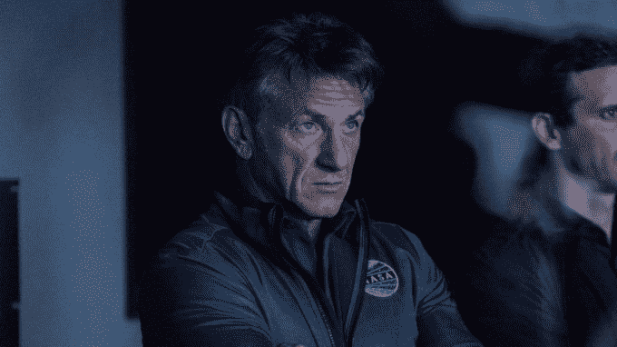
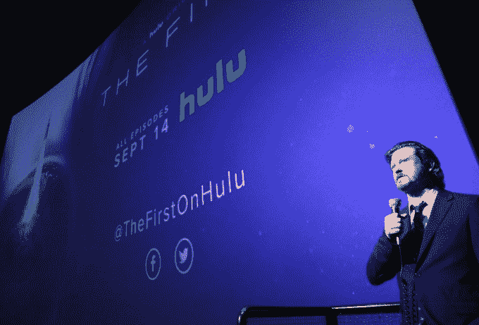

# 鲍尔·威利蒙在 TechCrunch 上向我们展示了通往火星的道路

> 原文：<https://web.archive.org/web/https://techcrunch.com/2018/09/23/beau-willimon-the-first-interview/>

创作了网飞《纸牌屋》的编剧兼剧作家鲍尔·威利蒙，在他的最新系列电影《第一次》中，将注意力从华盛顿特区转移到了外太空。

这些节目比我想象的有更多的共同点。当然，“第一部”是关于未来的火星探险，而不是当今的政治阴谋。《纸牌屋》以第四段打破常规的独白而闻名，而新系列依赖于长时间几乎无声的序列，在这些序列中，人物思考他们的决定，沉思过去。

但是“第一部”(9 月 14 日推出了第一季的全部八集)并不是一部充满特效的外太空冒险。事实上，大部分故事发生在新奥尔良，重点是该团队(由西恩·潘饰演的宇航员汤姆·哈格蒂领导)在起飞前面临的政治、财政和技术挑战。

当我采访威利蒙和执行制片人乔丹·塔皮斯时，我暗示这部剧似乎更多地是关于地球，而不是火星——但威利蒙不太同意。

“我实际上认为这完全是关于火星的，”他说。首先，他有一个多季节的计划，可能最终会带我们去红色星球。虽然威利蒙承认，“直接进入任务是一个更安全的叙事选择”，但他想探索其他角度，比如“到达火星这样的地方的现实是，甚至到达起跑线都非常困难。”

部分困难在于要面对太空怀疑论者，他们怀疑这项任务是否值得付出代价和承担风险。在传统的科幻故事中，这些反对者可能会被描绘成执迷不悟甚至彻头彻尾的恶棍，但在《第一部》中，他们似乎真的有道理。

“我个人的态度是，我绝对认为我们应该去火星，”威利蒙说。“任何形式的探索的价值，无论是在太空还是在地球上，都体现了人类长期以来对了解和面对未知的深切渴望”——这是物质和科学利益之上的。

尽管如此，他说他希望“第一部”能够“反映我们生活的世界，以及我们 13 年后可能生活的世界”，这意味着讲述“那些不认同这一信仰的人的故事，他们从哲学或情感的角度挑战这一信仰。…任何去火星的宇航员都必须面对他或她可能会死的事实。对他们中的任何一个人，或者任何一个所爱的人来说，问题是:这值得吗？”

最终，威利蒙说，“我们不想在这里创造一个幻想。我们对科幻小说不感兴趣。我们对科学事实感兴趣。”

这意味着为我们如何到达火星创造一个合理的路线图。在“第一部”中，任务由一家名为 Vista 的私营公司组织，但资金来自美国政府，威利蒙表示，这种公私合作可能是必要的。

加州洛杉矶——9 月 12 日:(L-R)2018 年 9 月 12 日，在加州洛杉矶举行的 Hulu“第一次”洛杉矶首映式上，创作者/编剧/执行制片人鲍尔·威利蒙在舞台上发言。(图片由托马索·博迪/Getty Images for Hulu 提供)

随着目前围绕 SpaceX 和蓝色起源等公司的兴奋，他说，“私营部门在加速这样的任务并使其具有成本效益方面可以提供很多东西。”但是他不认为私营部门会独自带我们去火星。

威利蒙说:“实际上，无论你猜测的版本是什么，去火星的成本都是巨大的。”“我不认为一个纯粹的私营部门企业会筹集到那么多的资金……在我们的概念中，这笔钱来自美国宇航局，这意味着它实际上来自纳税人和美国政府，而实际的执行，建造硬件和完成任务，都外包给了 Vista。”

《第一》也描绘了 2031 年的日常生活。Tappis 解释说，制作团队“与该领域的少数顾问和专家密切合作”，以开发其未来技术版本——这看起来很像 2018 年的技术，但在自动驾驶汽车、增强现实和语音通信等领域有一些关键的进步。

“当你想到 13 年前，世界看起来与今天非常相似，但你会发现一些优雅的音符展示了从那时到现在的演变，”塔皮斯说。

在过去的十年中，电视领域发生了巨大的变化，我认为通过创作和播放《纸牌屋》，威利蒙基本上开启了向流媒体内容的转变。

“老实说，我认为不管《纸牌屋》如何，这种情况都会发生，”威利蒙回答道。“我们是第一个这样做的节目，因为我们在正确的时间出现在正确的地方，并且足够聪明地说是。但我认为这种趋势已经开始，并且会以某种方式发生。”

[https://web.archive.org/web/20221025222220if_/https://www.youtube.com/embed/ngl2W_VLp1o](https://web.archive.org/web/20221025222220if_/https://www.youtube.com/embed/ngl2W_VLp1o)

视频

至于电视的未来，他说，“如果这么大的变化发生在不到十年的时间里，谁知道 15 年后会发生什么。也许……观众不会在手持设备上观看节目，而是在 AR 眼镜上观看它在他们面前浮动。”

对近期未来的猜测很有趣，这是威利蒙和塔皮斯似乎非常认真对待的一项任务。尽管如此，如果“第一个”最终运行数年，似乎存在一个真正的风险，即它可能被太空旅行在现实世界中的表现或消费技术的发展所超越或抵触。

威利蒙说:“虽然我们认为我们的推测是明智的，而且就它可能看起来像什么而言肯定是合理的，但我们首次执行火星任务的时候将会到来，它要么非常准确，要么不准确。”然而，就像我们仍然在看表面上已经过时的《2001:太空漫游》一样，他认为，“这里面有一个更深层次的故事，那就是生活混乱的人们试图完成伟大事业的人类故事。这是一个基本的真理，我们希望它是永恒的。”