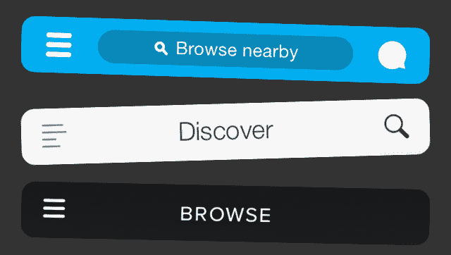
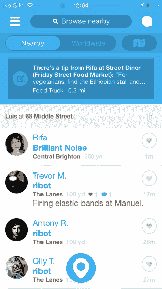
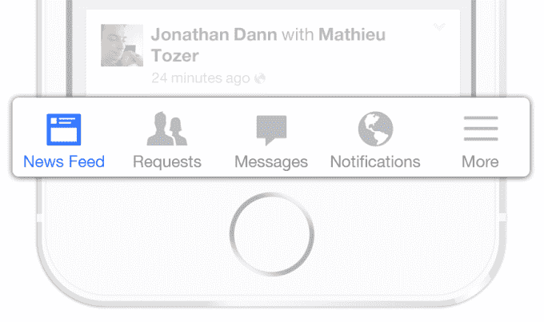
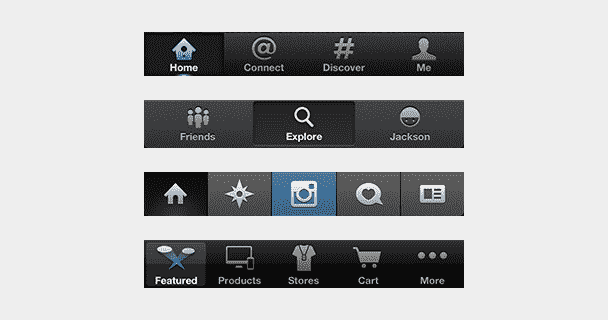
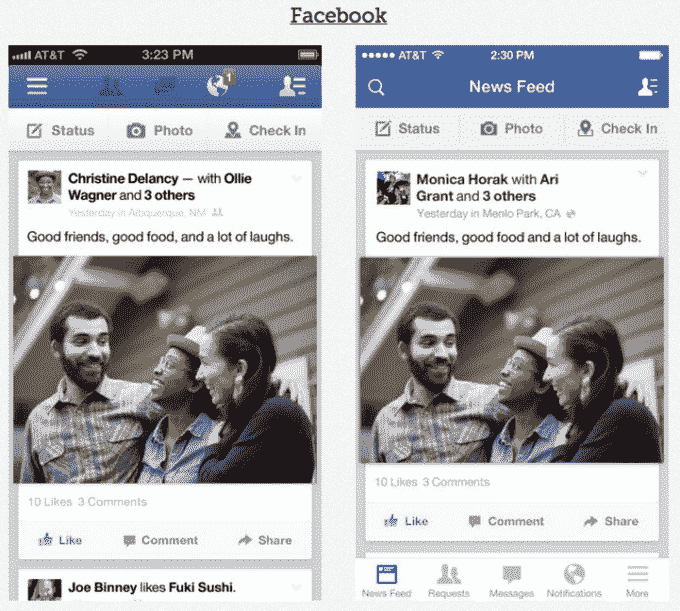
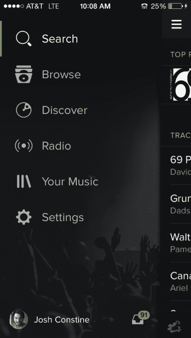
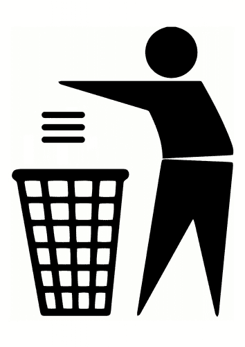

# 杀死汉堡按钮

> 原文：<https://web.archive.org/web/https://techcrunch.com/2014/05/24/before-the-hamburger-button-kills-you/>

那个小小的三线按钮是魔鬼。无论你称它为侧菜单、导航抽屉还是汉堡包，将你的功能隐藏在屏幕外角落里一个毫无特色的图标后面通常是一个糟糕的移动设计选择。交互理论、A/B 测试以及世界上一些顶级应用的发展都支持同一个论点:汉堡按钮不利于参与，你可能应该用标签栏或其他导航方案来取代它。

即使你不是设计师，我也强烈推荐阅读 Luis Abreu 的精彩的、充满 GIF 的深度解读:[为什么以及如何避免汉堡包菜单](https://web.archive.org/web/20230406013919/http://lmjabreu.com/post/why-and-how-to-avoid-hamburger-menus/)。以下是他的分析摘要[加上](https://web.archive.org/web/20230406013919/http://mor10.com/hamburger-bad/) [几个](https://web.archive.org/web/20230406013919/http://jxnblk.tumblr.com/post/36218805036/hamburgers-basements-why-not-to-use-left-nav-flyouts) [其他](https://web.archive.org/web/20230406013919/http://jxnblk.tumblr.com/post/82486816704/an-update-on-the-hamburger-menu)研究以及一些关于这是如何在最流行的应用中展开的背景。有关于网络汉堡的争论，但我把重点放在移动设备上，以 iOS 为例，这在很大程度上适用于 Android。

本质上，**眼不见为净**。你藏在汉堡包后面的任何导航选项都将被遗忘，或者至少很少被使用。更糟糕的是，按钮经常被放在左上角——这是你只用右手使用手机时最难够到的地方。

汉堡按钮的效率更低，因为你必须轻击一次才能看到你想要的选项。它们与许多移动应用的导航模式相冲突，迫使你在多个屏幕之间滑动或“后退”才能到达汉堡按钮。它们不易被浏览，防止你在没有打开侧边菜单的情况下看到应用程序特定区域的通知，如通知、信息或新内容。

然而，尽管有这些缺点，许多应用程序仍然使用汉堡包，因为它是一种将大量功能塞进应用程序的简单方法。如果你想把一个全功能的网络应用程序翻译成移动应用程序，它们尤其诱人。但是最终，他们掩盖了你产品的特别之处。

## 一个解决方案是:标签栏。

标签栏是一排持续可见的按钮，通常位于屏幕底部，用于打开应用程序的不同部分。

你不是把导航选项藏在抽屉里，而是把它们展示出来。这让用户不会忘记他们的存在，只需一次点击就可以使用多个核心功能，允许在功能之间快速切换，而无需退回到应用程序的主屏幕，并允许你在每个标签上显示通知。

你牺牲的是一点屏幕空间，但可能是值得的。Next Web 展示的移动应用 zeebox 的 A/B 测试显示了这些缺点对应用的参与度有多大的损害。六个月前，zeebox 试图从标签栏切换到汉堡，并看到其指标下降。最近，它对两种导航方案进行了同步 A/B 测试，发现**标签栏的平均周使用频率为 55%**，平均日使用频率高出 8.7%。

还有一些巧妙的方法可以让标签栏在不用的时候消失。如果主屏幕是一个滚动提要，当人们向上滑动以展示新内容时，标签栏可以隐藏，如果他们开始向下拉以返回顶部，标签栏就会显示。在像地图这样的界面中，最大化屏幕空间是关键，当用户点击或拖动时，标签栏可以隐藏。它并不适合所有的情况，但是许多信息架构以这种方式表达会更好。

## 为什么是时候进化了

用户似乎希望单一用途的移动应用程序能够快速确定特定的用例。这就是为什么我们正处于“2014 年的大分拆”之中。庞大臃肿的应用程序正试图通过将一些功能推入独立或配套应用程序来瘦身和加速。[脸书的信使](https://web.archive.org/web/20230406013919/https://techcrunch.com/2014/04/09/facebook-messenger-or-the-highway/)和 [Foursquare 的蜂群](https://web.archive.org/web/20230406013919/https://techcrunch.com/2014/05/15/foursquares-swarm-and-the-rise-of-the-invisible-app/)就是两个最好的例子。

但是如果目标是减轻核心功能的负担，让它们更突出，更容易访问，抛弃汉堡按钮是明智之举。当脸书推出 Messenger 时，它还在使用一个汉堡按钮。幸运的是，随着 iOS 7 的升级，[脸书切换到标签栏](https://web.archive.org/web/20230406013919/https://techcrunch.com/2013/09/18/facebooks-new-mobile-test-framework-births-bottom-tab-bar-navigation-redesign-for-ios-5-6-7/)经过大量的测试表明这是正确的选择。

左:脸书的老汉堡按钮导航。右图:新的标签栏样式

脸书的功能比底部的五个按钮多，所以它仍然使用最后一个标签栏空间来放置“更多”汉堡，显示您的个人资料、活动、群组等。但这是一个更好的妥协。另一种选择是水平滚动的选项卡栏，其中的选项卡比屏幕上显示的要多。

其他在 iOS 上展示标签栏的流行应用包括 Twitter、Instagram、Pinterest、优步、Skype、WordPress、Quora 和 App Store。他们中的许多人曾经背负着汉堡包，但现在他们清醒了。Gmail、谷歌地图、Pocket、TechCrunch 自己的应用程序，以及更多的应用程序仍然在使用诺姆·考克斯在 1981 年左右为施乐公司发明的可怕图标。

有时候，如果一个应用程序已经非常单一，在侧边栏中隐藏真正无关的功能是有意义的。以 Lyft 为例，在那里你通常只是预订一辆车，很少需要访问你的个人资料、支付信息或发送邀请。但是 Spotify 把它重要的浏览、发现、广播、播放列表和收件箱藏在汉堡包后面，这是搬起石头砸自己的脚。

所以，为你的工程师们做吧，他们工作太辛苦了，以至于你不能把他们塞进柜子里。为了你的业务团队，他们需要你失去的参与度，因为人们甚至不记得你的应用提供了什么。但最重要的是，为你的用户而做。他们下载了你的应用，因为他们遇到了问题。不要把解决方案排斥在菜单之外。

*【图片鸣谢:[卡利伍德设计实验室](https://web.archive.org/web/20230406013919/http://caliwooddesignlab.com/gallery/graphic-design/)，[路易斯·阿布瑞尤](https://web.archive.org/web/20230406013919/http://lmjabreu.com/post/why-and-how-to-avoid-hamburger-menus/)，[布兰特·杰克森](https://web.archive.org/web/20230406013919/http://jxnblk.tumblr.com/post/36218805036/hamburgers-basements-why-not-to-use-left-nav-flyouts)，*